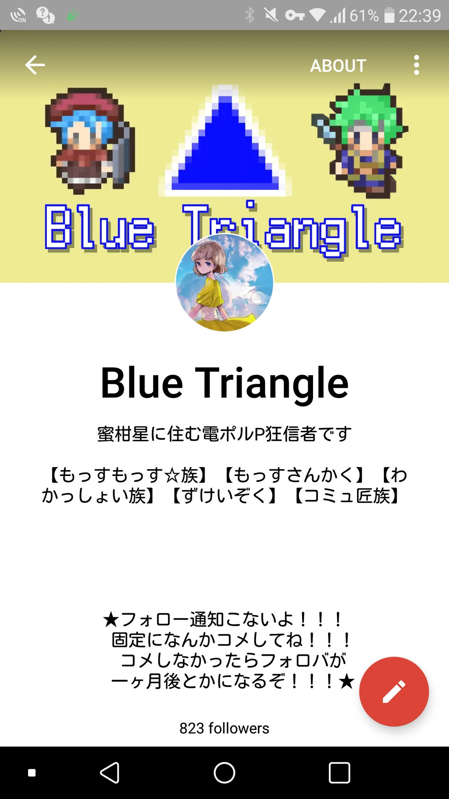
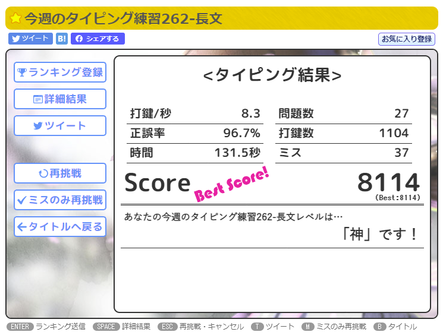

# ようこそ

最終更新日：2023/05/21

【くだらないお知らせ】  
もしもあなたが裏アカウント特定サービスの調査員なら、[この声明文](/blog/s-toku)をご一読ください。重大なプライバシーの侵害行為を、私は一切許容しません。

## 簡単な自己紹介
Blue Triangleと名乗っています。省略して「ぶるとら」と呼んでもらうことが多いです。  
学生で英語や外国語を中心に勉強をしています。趣味でプログラミングもしています。このホームページは[このテンプレ](https://github.com/sungik-choi/gatsby-starter-apple#readme)をパクって自分好みに改造しました。  
アークナイツと平沢進が好きです。

ちなみにぐぐたす(Google+)難民です。将来の夢は自由でぐぐたすライクなSNSを作って安住することです。  
最近はよくわからないくせにWeb3やCryptoの勉強をしています。

## Brief Self-Introduction
I'm Blue Triangle, an upper-intermediate English speaker.  
I developed a web application named "#Compass resume generator" with HTML, CSS, and JavaScript.  
Also I used to create games using Woditor(Wolf RPG Editor).  
I love Susumu Hirasawa and his songs. I play Arknights and I'm completely into their music!!

All my profiles below are written in Japanese, but feel free to ask questions, contact me in English or Japanese, and follow me on Twitter :-)

(I can't talk in English so fluently and naturally since I'm still in the middle of learning. I'm not sure if you know what CEFR means, but please note that I'm certified to be at the level of CEFR B2)

## 基本プロフィール
* HN：Blue Triangle（あおさんかく）
* 呼称：ぶるとら、あおさん等（好きに呼んでください）
* 性別：図形なので存在しません🤔
* 年齢：お酒が飲める年です
* 職業：学生

### 使ったことある技術
#### Web系フロント
* HTML
* CSS
* JavaScript
* TypeScript
* React
* MUI
* styled-component
* Gatsby
* GraphQL
#### バックエンド
* GAS
#### バージョン管理
* Git
* GitHub
#### その他
* Python
* Markdown

（特定が怖いので全部は書いていません）

## 趣味とか

### 開発（プログラミング）  
公開作品としては[#コンパス履歴書ジェネレーター](/blog/cps_resume_introduction/)を開発しました  
作りたいものがあるときに気まぐれで作るスタイルです

ホームページはめんどくさかったのでテンプレートを拝借しましたが、いつか1からReact+Gatsbyでホームページ作ってみたいですね

### 動画編集
ウディタ講義や、気が向いた時に他の動画も作成しています  
最近は忙しいのでお休みしています（順調に行けば春頃に復活したい）

### タイピング
[wpm572（2022/12/03現在）](https://twitter.com/Ao_Sankaku/status/1598956197461524482)、寿司打18700円、マイタイピング最高評価王評価（7073点）ぐらいの実力です（自慢）  
タイピングチョットデキルを目指しています  

追記：最近[8000点を通過して神になりました](https://twitter.com/Ao_Sankaku/status/1644601263575928834)ので、よかったら崇めてください

### アークナイツ
マゼラン、ヴァルカン、カーネリアン、ビーズワクスが好きです、かわいい、褐色は正義

### マインクラフト
プレイ歴8年経過してようやくバニラでエンドラ倒しました（一人でとは言ってない）  
一応コマンド勢で、アドオンも作ります  
MODも少し改造したことあります

### 音楽
好きなアーティストを掘り下げて聴くスタイルです

#### 【好きなアーティスト】
平沢進（ソロ、核P）、歩く人（Pedestrian）、koyori、西島尊大（Ravenworks）、yukkedoluce、n-buna、MARETU、HarryP、OrangeStar、Guiano（敬称略）

#### 【特に好きなアルバム】
「現象の花の秘密」「ホログラムを登る男」「賢者のプロペラ」「Gipnoza」「Sim City」「変弦自在」「回=回」「救済の技法」「Nostalgic Lover」「Youthfull」「月を歩いている」「花と水飴、最終電車」「ENDEAVOUR」「未完成エイトビーツ」

#### 【少しかじった】
Eddy、ピノキオピー、niki、ダイナミック自演ズ、ジグ、P-MODEL

## 尊敬している人（敬称略）
他己紹介が苦手なので名前だけ列挙します。順番に意味はありません。
* 西成 活裕　http://park.itc.u-tokyo.ac.jp/tknishi/nishinari.html
* 堀元 見　https://ken-horimoto.com/profile/
* やしろあずき　https://twitter.com/yashi09
* 山﨑 圭一（ムンディ先生）　https://mundisensei.com/profile/
* 上で上げたアーティスト全員

## 地雷

### 歌い手とそれに準ずる人が歌唱する作品全般
生理的に無理です  
セルフカバー、自分で作曲したもの、公式アレンジ、結成したグループ内での作曲歌唱は可  
でもヨルシカに飽きた前科があるので、そういうのはあまり好きじゃないです

### ポップス（特にJ-POPとK-POP）
具体的にいうとXXXX XXXXXXとかXxxxxxxxXXxxxxみたいな声/作風の曲が大嫌いです

### 思想の押し付け
私は過去に女装をするように迫られて大変不愉快な思いをしたことがあります。  
__こういったものに限らず、思想や趣味の押しつけは最悪ですので（私以外にも）絶対にしないでください。__

## Twitterのフォローバック基準
### 繋がりたい人
こんな人と繋がりたいです！喜んでフォロバします👍
* ゲームの趣味が合う人（特にMinecraft、#コンパス）
* 趣味ぷよぐらまー
### 繋がれないかもしれない人
以下に一つでも当てはまる人はフォローを __返さない__ ことがあります。  
当てはまらない場合にフォローを返すことを確約するものではありません。  
ほとんどの項目はこのページを読んでくれるような人なら当てはまらないと思います。
* 宣伝を主とするアカウント（自作ゲーム等を除く）
* 上に挙げた地雷に当てはまるツイートが日常的にある人
* 知り合い以外で、以下のいずれかに当てはまる人
  1. RT、BOTを除くツイートが週に8回以下程度の人
  1. アカウント作成から3日が経過していない人
  1. RT、BOTを除くツイート数が25件以下の人
  1. フォロー数がフォロワー数の1.4倍を超えており、かつフォロバ目的ともとれる人
  1. 趣味趣向が全く合致しない人
  1. 自称意識高い系偽エンジニア、投資系詐欺（仮想通貨含む）等、私を騙す意図があることが明らかな人
### ブロックする人
以下に当てはまる人はこちらからブロックする場合があります。
* 上に上げた地雷を分かっていながら積極的に踏んでくる人
* コンパス履歴書ジェネレーターの利用者で、生成した画像の上部あるいは下部、またはその両方を意図的に削除する人
* いいねがしつこい宣伝、スパムアカウント（エロ、宣伝偽エンジニア、詐欺含む）
* 広告を発信するアカウント
* 公式アカウント（青色）で、知り合いではなく、リプ欄を汚染（他人のツイートに乗じて宣伝）し、かつ以下のいずれかに当てはまるアカウント
  1. フォロワーが1000人以下
  1. フォロワーが10000人以下で、YouTuber、インスタグラマー等他SNSでのインフルエンサー事業者、政治家、活動家、団体（個人・法人問わず）のいずれにも当てはまらない
  1. フォロワー数に関わらず、アダルトコンテンツ、アフィリエイト、資産形成、スピリチュアル（占い等）、その他の私が不愉快に思うコンテンツの宣伝を行っている

## おことわり（Disclaimer）
Blue Triangleが発信する情報については細心の注意を払っておりますが、その正当性について一切保証せず、またその事によって被った損害について一切責任を負いません。  
私がTwitter上で行う「いいね」「リツイート」などの行為は、必ずしも拡散することを目的とせず、同時に直後に明示的に意見を表明していない「いいね」とコメントのない「リツイート」については賛同、中立、反対のいずれの立場も表しません。  
（ホントはこんなしょーもないこと書きたくないんだけど[こんなこと](https://140over.com/%E7%84%A1%E8%A8%80%E3%81%AErt%E3%83%AA%E3%83%84%E3%82%A4%E3%83%BC%E3%83%88%E3%82%84%E3%80%8E%E3%81%84%E3%81%84%E3%81%AD%E3%80%8F%E3%81%AF%E3%80%8C%E8%B3%9B%E5%90%8C%E3%80%8D%E3%81%A8%E8%A6%8B/)があった以上書いておきます）
 

I'm carefully paying attention to what I publish, however, I do NOT guarantee the validity of the information, and should there be any inconveniences, I do NOT take any responsibilities.  
I do NOT necessarily mean to express being for, against, or neutral to what I just liked or retweeted.

