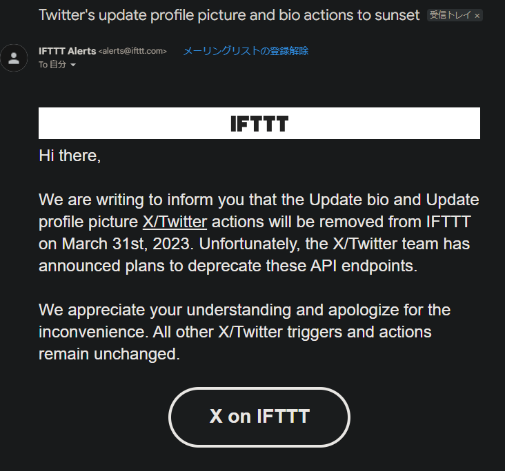

## 蛇足―近況

この記事を見てくださっている方は、多分このブログに対して技術的に興味があるか、私のことを個人的に知ってくださっている方のどちらかだと思いますので、後者の方に向けて近況を完結に記しておきます。「興味ねえよ！」という方は、次の見出しまで適当に飛ばしてください。

ブログやTwitter（旧X）の更新頻度は減りましたが、元気に過ごしています。最近は[みすてむず](https://misskey.systems)というなぞのばしょに定住をはじめました。技術系の話がメインのmisskeyです。

これまでも別のMisskeyサーバー（インスタンス）にアカウントはあったのですが、全く使いこなせていませんでした。このサーバーはSTL（ソーシャルタイムライン、そのサーバーに属している人とフォローしている人の投稿が流れてくるタイムライン）がとっつきやすく、すぐに馴染めた…ような気がします。

新しい人と関わる機会が減った昨今、面白くて私にあっている場所だと感じています。不慣れなため、多分超迷惑をかけてしまっていますが…

他のMisskeyやMastodonインスタンスにいる方は、`@ao_sankaku@misskey.systems`宛にフォローを飛ばしてくだされば高確率でフォロバします。フォロバ基準は[プロフィールの中にあるここ](/profile/#twitter%E6%97%A7x%E5%90%84%E7%A8%AEsns%E3%81%AE%E3%83%95%E3%82%A9%E3%83%AD%E3%83%BC%E3%83%90%E3%83%83%E3%82%AF%E5%9F%BA%E6%BA%96)に準じます。知り合いであればだいたいフォロバするので、あまり気負わなくて大丈夫です。

## いままで

本当にありがたいことに、複数の方からプロフィール画像を描いていただいています。そのため一つに固定するのがもったいなく思え、IFTTTを使って月に3回自動でサイクルさせる、ということをこれまで行っていました。

周知のことと思いますが、Twitter社はあんなこんなであれやこれやなことになっており、地獄の様相を呈しています。

経費削減のためか、特にAPIや自動化、BOTの削減などに力を入れており、ついにこんなメールが届いてしまいました。

要約すると、**プロフィール画像とbio（概要欄）のアップデートの自動化が不可能になる**、というものです。

手動で更新するのはあまりに負担なので、この機会に止めてしまうことにしました。プロフィール画像を描いてくださった方には大変申し訳なく思っていますが、何卒ご宥恕いただければと思います。

## Twitterの今後の更新頻度について

最近Twitterに顔を出していないのは、純粋にみすてむずが楽しいからです。そこからつまみ出されるか過疎になって飽きるかサーバーが潰れるまでは、この状況が続くと思います。

そもそも、私はTwitterが得意ではなく好きでもありません。一時期は頻繁に更新していましたが、正直に言うとあの時期は心を病んでいたか、Google+が消滅して行き場がなくなったことによるものです。

## そもそも

そもそも、私は**7年前からTwitterがずっと大嫌い**です。以下は思想の話になります。

私は、言論は民主的な方法により定めた法律によってのみ制約を受けるべきものである、と強く信じています。

Twitterに限らないことですが、あらゆるプラットフォームは「過激」な言論・表現を抑制し、トラブルを事前回避するように利用規約を設定し、運用しています。それは仕方のないことであり、プロバイダ責任制限法などを鑑みればサービス提供者にとって当然の権利ですが、どうしても強い嫌悪感がずっと私の中で燻っています。

理由の一端は、Google+が自由すぎたことにあります。Google+は、R18コンテンツに対してだけはなぜか異様に厳しかったのですが、他のことに対しては8年程前のSNSであることを考慮しても、驚くほど寛容でした。

かつてのTwitterは、少しでも過激な表現があるとすぐに凍結の対象になりました。その中には、虫に対して「死ね」と発しただけで、永久凍結の対象となった人もいます。本当にくだらないことです。

だからといって、変なSNSにはそもそも人がいませんし、人がいても政治的な思想が強く、雑談用途に適していないものだったりすることが往々にしてあります。

そのため、分散型Web技術やMisskeyにはかなり個人的に期待しています。今後の発展が楽しみです。