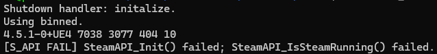
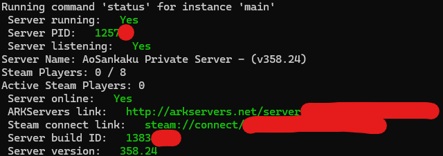

## 経緯

Steamcmdで普通に入れようとしたら、



このエラーで詰まり、しかも画面が更新されないのでサーバーが開いているのか閉じているのかもわからず…という状態だったので、投げ出して別の方法を探しました。

## 結論

https://github.com/arkmanager/ark-server-tools

これ使えばすべて雑に解決します。英語が読める人はREADME.mdのとおりに進めてください。読めない人や読めるけどめんどくさい人は、以下の記事で内容を補ってください。

### 注意

色々コマンドが出ますが、私を含め知らない人に教わったコマンドをそのまま実行しないようにしましょう。公式のREADMEも読みながら進めてください。

## やり方

### 1. 鯖にログイン

Linuxの前提で進めますが、Windowsでも多分いけます。

### 2. 依存関係のインストール

#### 共通

基本的には入っているはずですが、特殊なOSを使っている人は一応確認しておいてください。

```
>=bash-4.0
>=coreutils-7.6
findutils
perl
rsync
sed
tar
```

#### CentOS、RHEL

以下をインストールしてください。

```
perl-Compress-Zlib
curl
lsof
glibc.i686
libstdc++.i686
bzip2
```

#### Ubuntu、Debian

ほとんどの方は以下のコマンドで大丈夫なはずです。

```bash
sudo apt update && sudo apt install perl-modules curl lsof libc6-i386 lib32gcc-s1 bzip2 -y
```

Debian BusterまたはUbuntu20.04以下の方は、代わりにこのコマンドを実行してください。

```bash
sudo apt update && sudo apt install perl-modules curl lsof libc6-i386 lib32gcc bzip2 -y
```

### 3. `arkmanager`のインストール

以下を実行します。ユーザー名が`steam`ではない場合、これを自分のユーザー名に書き換えてください。それだけで私の環境では問題なく動きました。

#### 特権ユーザー（root）

rootではない場合はcurlの前にもsudoを忘れずに。

```bash
curl -sL https://raw.githubusercontent.com/arkmanager/ark-server-tools/master/netinstall.sh | sudo bash -s steam
```

#### 非特権ユーザー

```bash
curl -sL https://raw.githubusercontent.com/arkmanager/ark-server-tools/master/netinstall.sh | bash -s -- --me
```

これだけです。

### 4. サーバーインストール

以下を実行します。

```bash
arkmanager install
```

ディレクトリ名を決めたい場合は、そういうオプションがあったような気もします。やり方はごめんなさい、わかりません。

実行すれば、おそらく`/home/ユーザー名/ARK`にサーバーが入っているはずです。特に名前をつけていない場合、このサーバーは`main`という名前になります。

### 5. サーバー設定

以下を実行します。

```bash
arkmanager printconfig
```

そうすると、こんな感じの文字が出るはずです。

```
Running command 'printconfig' for instance 'main'
/etc/arkmanager/instances/main.cfg => arkserverroot
/etc/arkmanager/instances/main.cfg => serverMap
/etc/arkmanager/instances/main.cfg => ark_RCONEnabled
/etc/arkmanager/instances/main.cfg => ark_RCONPort
/etc/arkmanager/instances/main.cfg => ark_SessionName
/etc/arkmanager/instances/main.cfg => ark_Port
/etc/arkmanager/instances/main.cfg => ark_QueryPort
/etc/arkmanager/instances/main.cfg => ark_ServerPassword
/etc/arkmanager/instances/main.cfg => ark_ServerAdminPassword
/etc/arkmanager/instances/main.cfg => ark_MaxPlayers
/etc/arkmanager/arkmanager.cfg => arkstChannel
/etc/arkmanager/arkmanager.cfg => install_bindir
/etc/arkmanager/arkmanager.cfg => install_libexecdir
/etc/arkmanager/arkmanager.cfg => install_datadir
/etc/arkmanager/arkmanager.cfg => steamcmdroot
/etc/arkmanager/arkmanager.cfg => steamcmdexec
/etc/arkmanager/arkmanager.cfg => steamcmd_user
/etc/arkmanager/arkmanager.cfg => steamcmd_appinfocache
/etc/arkmanager/arkmanager.cfg => steamcmd_workshoplog
/etc/arkmanager/arkmanager.cfg => arkserverexec
/etc/arkmanager/arkmanager.cfg => arkbackupdir
/etc/arkmanager/arkmanager.cfg => arkbackupcompress
/etc/arkmanager/arkmanager.cfg => arkwarnminutes
/etc/arkmanager/arkmanager.cfg => arkprecisewarn
/etc/arkmanager/arkmanager.cfg => arkNoPortDecrement
/etc/arkmanager/arkmanager.cfg => arkautorestartfile
/etc/arkmanager/arkmanager.cfg => arkAutoUpdateOnStart
/etc/arkmanager/arkmanager.cfg => arkBackupPreUpdate
/etc/arkmanager/arkmanager.cfg => arkMaxBackupSizeMB
/etc/arkmanager/arkmanager.cfg => msgWarnUpdateMinutes
/etc/arkmanager/arkmanager.cfg => msgWarnUpdateSeconds
/etc/arkmanager/arkmanager.cfg => msgWarnRestartMinutes
/etc/arkmanager/arkmanager.cfg => msgWarnRestartSeconds
/etc/arkmanager/arkmanager.cfg => msgWarnShutdownMinutes
/etc/arkmanager/arkmanager.cfg => msgWarnShutdownSeconds
/etc/arkmanager/arkmanager.cfg => msgWarnCancelled
/etc/arkmanager/arkmanager.cfg => logdir
/etc/arkmanager/arkmanager.cfg => appid
/etc/arkmanager/arkmanager.cfg => mod_appid
/etc/arkmanager/arkmanager.cfg => mod_branch
/etc/arkmanager/arkmanager.cfg => defaultinstance
```

なんとなく察しが付くと思いますが、この`/etc/arkmanager/instances/main.cfg`をいじればmainサーバーのconfigを変更できます。

### 6. ポート開放

開放する必要のあるポートは以下のとおりです。

- 7777/udp
- 7778/udp
- 27015/udp

ちなみにarkmanagerのREADMEには「27016を開けろ」と書いてありますが、**あれは嘘です**。何も起こりません。なぜなら、Steamはデフォルトで27015番ポートを探すからです。

このポートは変更可能ですが、無駄な手間がかかることになります。27015を使っておきましょう。

ちなみに、「32330も開けろ」と書いてありますが、RCONポート（リモートコマンド実行用）なので詳しくなければ逆に開けないほうがいいです。バレれば荒らし放題なので。

また、「TCPも開けろ」と書いてありますが、ARK SEが使うのはUDPだけなので開ける必要はありません。なんか変ですね、このREADME。

### 7. サーバーの起動

以下を実行します。

```bash
arkmanager start @main
```

`@main`が今作ったサーバーです。「start」とすることで、バックグラウンドで動いてくれます。代わりに`run`でも動きますが、Ctrl+Cで止まらないのでおすすめしません。

メッセージに出ている通り、起動完了までには10分程度かかります（私の環境だと平均2分です）。バックグラウンドで動いているため、この状態でサーバーからログアウト（セッションを切断）しても問題ありません。

### 8. サーバーの状態確認

以下を実行します。

```bash
arkmanager status @main
```



だいたいこんな画面になればOKです。

それにしても、`arkservers.net`ってなんでしょうか。もしかしてサーバーを開くと勝手に載るのか…？

### 9. サーバーの停止

以下を実行します。

```bash
arkmanager stop @main
```

---

以上で完了です。あとは好き勝手に設定をいじって好みのサーバーに仕立て上げてください。良いサバイバルを。

## 番外1：BattlEye（アンチチート）の無効化

`/etc/arkmanager/instances/main.cfg`（main以外を弄りたい場合はmainを書き換えてください）に、以下を追加します。多分どこでもいいです。

```cfg:title=main.cfg
arkflag_NoBattlEye="true"
```

これだけでOKです。

- 身内でやるからアンチチートがいらない
- MODの導入予定がある

という方は、これ1行いれるだけでOKなので入れておきましょう。

## 番外2：ホワイトリスト

ホワイトリストが欲しい人は、また`/etc/arkmanager/instances/main.cfg`（main以外を弄りたい場合はmainを書き換えてください）に1行加えます。

```cfg:title=main.cfg
arkflag_exclusivejoin="true"
```

ホワイトリストは、cfgではなくサーバーフォルダの`ShooterGame/Binaries/Linux/PlayersJoinNoCheckList.txt`に書きます。AIに聞いたら「Win64に入れろ」と言われてまんまと騙されたので、みなさんもAIの言うことを信じるのはほどほどにしておきましょう。

改行区切りでSteamのIDを入れればOKです。SteamのIDは、Steamアプリまたはブラウザでプロフィールを開き、上のURLの末尾の数字を見ればわかります。


プライベートなものじゃないと思いますが、念の為隠しています。結構長いのでコピペが賢明です。

## 参考文献

https://github.com/arkmanager/ark-server-tools/blob/master/README.asciidoc

READMEってasciidocでもいけるんですね。初めて見た。