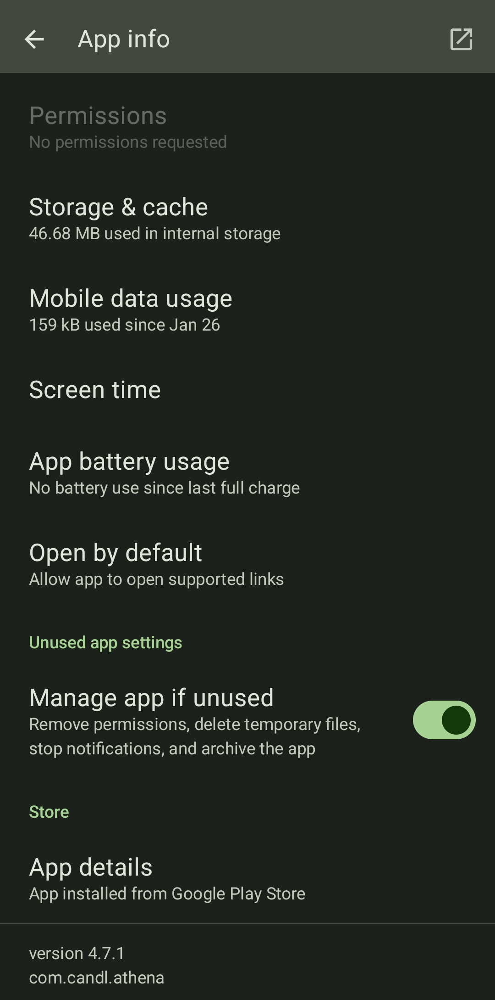

BitWardenのパスワード自動入力補助機能、便利ですよね。でも、さすがの私でも**電卓**を使っていてパスワードを入れたい場面は流石にありません。

というわけで、アプリ単位で無効化していきます。

※こういう記事はパスワードを貼るのが筋だと思いますが、BitWardenは流石にパスワードマネージャーなのでスクショが撮れませんでした。暇な人は画像を提供してくれたら大感謝します。

## 結論

設定→自動入力→一番下にスクロール→「自動入力をブロック」→新しくブロックするURI

と進み、対象のURIを入れると解決します。

### URIって何？

調べた感じ、おそらくは**URLの上位存在**です。我々が普段目にしているこういうURL

```
https://example.com
```

は、URIという表記方法のうちの一つに過ぎないということです。例えば、私が使っているCALCUという電卓アプリのURIは

```
androidapp://com.candl.athena
```

です。電卓にBitwardenの入力保管が出てきて「？」となったときは、これを指定すれば解決します。

アプリのURIは、アプリ情報の一番下にあります。



この文字に「androidapp://」とつけるだけです。

### 特定のサイトだけ無効化

その他、普通に`https://`から始まる文字列を指定すれば、特定のサイトに対する自動入力を切ることもできます。