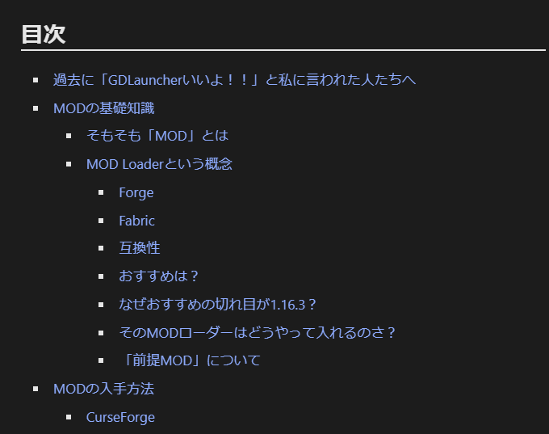
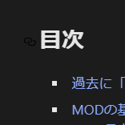

今日は下書きを含め、ブログを7記事も更新してしまいました。私はそういう気まぐれで出力が不安定な人間なのだと、つくづく自覚させられます。

というわけで、前回の記事から更に進歩した点について解説をしていきます。といっても1年前の作業内容なんかも含んでいますが、まあそこは目を瞑っていただいて。

## Push時に自動更新するように

親元のプロジェクトにもあるようですが、エラーが頻発していたりスクリプトが古くて正常に動作しなかったので、使っていませんでした。今回改めて勉強し、完全自動化に成功しました。こちらの記事に詳しく書いてありますので、気になる方はどうぞ。

[【Gatsby】GitHub PagesでBuildを自動化したら、ビルド結果がおかしくなった](../auto_gatsby_build/)

## CSSの調整

見出しが分かりにくかったので、調整しました。既存のWordPressサイトや~~アフィカス~~ブログを勝手に参考にしました。

また、日本語文が自然な場所で改行するようになりました。時々ちゃんとできていないところはあるかもしれません。

箇条書きのスペースがおかしい問題も解決しました。

- こんな
  - かんじで
    - 段組みになっていると、以前は
      - ↑のスペースが
    - おかしくなって
  - しまっていました。

## Gatsby v4→v5にアプデ

特に問題が起こることもなく、ググった手順に従ったらすんなり行きました。適当でもちゃんと動作したので驚きました。

ちなみに、Pagespeed Insignts上のパフォーマンスは落ちました。なんでやねん。

## YouTubeの自動埋め込み

youtubeが自動でいい感じに埋め込めるようになりました。レスポンシブデザインにも対応しています。

ところで、

```
`youtube:https://www.youtube.com/watch?v=dQw4w9WgXcQ`
```

と書くとエラーになってしまいますが、

```
`youtube:https://www.youtube.com/embed/dQw4w9WgXcQ`
```

と書けばエラーにならないようです。謎。自動変換してくれるように改造してPRしようかな。

https://rpf-noblog.com/2020-05-07/gatsby-youtube/

ここを読んで解決しました。

## 時々目次が出るように

いくつかの記事で目次が出るようになりました。長ったらしくなりそうな記事には目次を付けています。

なぜか目次を最後に付けないと一生ビルドに失敗するという酷いバグがあります。このプラグインを使う方はお気をつけて。



## タイトルからリンクがコピーできるように

例えば下の画像のように、ヘッダーの左に鎖のアイコンが現れるようになりました。これを押すとその見出しまで移動でき、URLをコピーするとその場所までのリンクを手に入れることができます。



これは途中で失敗して、ダークテーマなのにリンクが黒くなってしまったものです。現在は修正済みです。

## 予定

相変わらず、リンクを適当に貼ったときに埋め込みになるアレはうまく実装できていません。今夜モチベがあるうちに作業をしようと思います。

## 余談―若干PRした

このプロジェクトの本家に対して、Pull Requestなるものをいくつかしてみました。幸いにして開発者がいい人で、本当に軽い修正だったのですが、快く受け入れてくださいました。結構嬉しかったので、また余裕のあるときに貢献したいと思います。

https://github.com/sungik-choi/gatsby-starter-apple/pull/59

https://github.com/sungik-choi/gatsby-starter-apple/pull/60