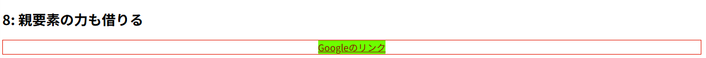

CSS、使ってますか？私はイキってReactを使っていますが、結局CSSの知識は必要です。

## margin: autoで中央にならない

ところで、なんでもかんでも中央にできる`margin: auto;`って便利ですよね。

```html

```

こう書くと、こうなります。

<br>


<br><br><br>

手元にあった画像を適当に貼ってみました。ちゃんと中央になっています。

ところが、中央にならないものもあります。例えば、

```html
<a style="margin: auto;" href="https://google.com">Googleのリンク</a>
```

はこうなります。

---

<a style="margin: auto;" href="https://google.com">Googleのリンク</a>

---

```html
<button style="color: #990000;" style="margin: auto;">押しても特に何も起きないボタン</button>
```

これも中央になりません。

---

<button style="color: #990000;" style="margin: auto;">押しても特に何も起きないボタン</button>

---

なぜでしょうか。

## 解決法

こうしてみてみると、「中央にすることができるヤツと、そうじゃないヤツ」がの2種類がありそうです。

この2つを決定づけているのが、要素の**種類**というやつです。実はHTMLの要素は**ブロック要素**と**インライン要素**と**インラインブロック要素**に分けることができ、この3つが違いを作っています。

https://developer.mozilla.org/ja/docs/Web/CSS/display

我らがMDNのサイトで試してみるとわかると思います。めちゃくちゃ雑に言えば、例えば[こういうリンク](https://developer.mozilla.org/ja/docs/Web/CSS/display)はp要素ではなくa要素ですが、それはいちいち文章の中で改行せずに存在できます。それは、リンクがインライン要素だからです。

こういったインライン要素に対して「中央に揃えろ！」と言われても「中央ってなにの？？？？？？？？？？」ということになり、計算不能になるため意味をなさなくなります。

もしもa要素がブロック要素だったら、ちょうどこんな感じになります。特に改行や`<br />`はありませんね。

---

<p>テキストテキストテキストテキスト<a href="https://google.com" style="display: block;">リンク</a>テキストテキストテキスト</p>

---

ちなみに、これは無理やり再現しているのではありません。実は、CSSを使うことでブロック要素・インライン要素・インラインブロック要素に**上書きすることができる**のです。

```html
<p>テキストテキストテキストテキスト<a href="https://google.com" style="display: block;">リンク</a>テキストテキストテキスト</p>
```

`display: block;`がソレです。逆に言えば、普通はインライン要素であるものに`display: block;`をつけることにより、結構簡単に`margin: auto;`を効かせることができるということです。こんなふうに。

…といいたいところですが、ブログエンジンの関係で勝手に`button`がpの中に入ってしまい中央揃えできないので、Codepenでお送りします。

<iframe height="500" style="width: 100%;" scrolling="no" title="Untitled" src="https://codepen.io/aosankaku/embed/XJbyoYP?default-tab=html%2Cresult" frameborder="no" loading="lazy" allowtransparency="true" allowfullscreen="true">
  See the Pen <a href="https://codepen.io/aosankaku/pen/XJbyoYP">
  Untitled</a> by Blue Triangle (<a href="https://codepen.io/aosankaku">@aosankaku</a>)
  on <a href="https://codepen.io">CodePen</a>.
</iframe>

---

4と5を見てみてほしいのですが、差が出ていますね。4（a要素）は中央揃えに失敗していますが、5（button要素）はちゃんと中央になっています。

### a要素は勝手に横に広がる

a要素は実は、幅を指定しないと**勝手に横に広がる**という問題点を抱えています。

「いや広がってないじゃん」とおもうじゃないですか。試しに背景色を変えてみましょう。


びよーんと伸びてしまいました。勝手に伸びるのでは中央揃えできません。

解決法としては、

1. 親要素に`text-align: center;`をつけることで中央揃えする
2. 幅を指定する（例：`width: 6em;`）

のどちらかになります。基本的に、アクセシビリティの関係上リンクに飛ばすボタンは`<button>`ではなく`<a>`が好ましいので、この状態で「リンクボタン」を作るのはちょっと難しいものがあります。ボタンみたいに勝手に伸縮してくれればいいのに…

という人のために、`inline-block`というものもあります。7を見ていただければわかるように、ちゃんと長さが自動で調整できています。


しかし、中央にはなっていません。困りました。

```html
<h2>8: 親要素の力も借りる</h2>
<div style="border: 1px solid #ff0000; text-align: center;">
  <a href="https://google.com" style="color: #990000; background-color: #00ff00; margin: auto; display: inline-block;">Googleのリンク</a>
</div>
```



親要素の力も借りると、いい感じに中央になります。もっといい感じに設定したい場合はflexboxなどを使ったほうがいいと思います。これにて一件落着です。

### 疑問：無理やりブロックにするのはアクセシビリティ上問題ないのか？

結論から言えば、CSSでいくら何を操作してもTTSなどを使う人には生のHTMLしか見えていないので、そちらの構造をちゃんとしていれば大丈夫です。

## ブロック要素とインライン要素とインラインブロック要素をうまく使おう

ブロック要素・インライン要素・インラインブロック要素を（なんとなくでも）知って使い分ければ、CSSで「うん、なんで？」となることは減ると思います。活用してみてください。