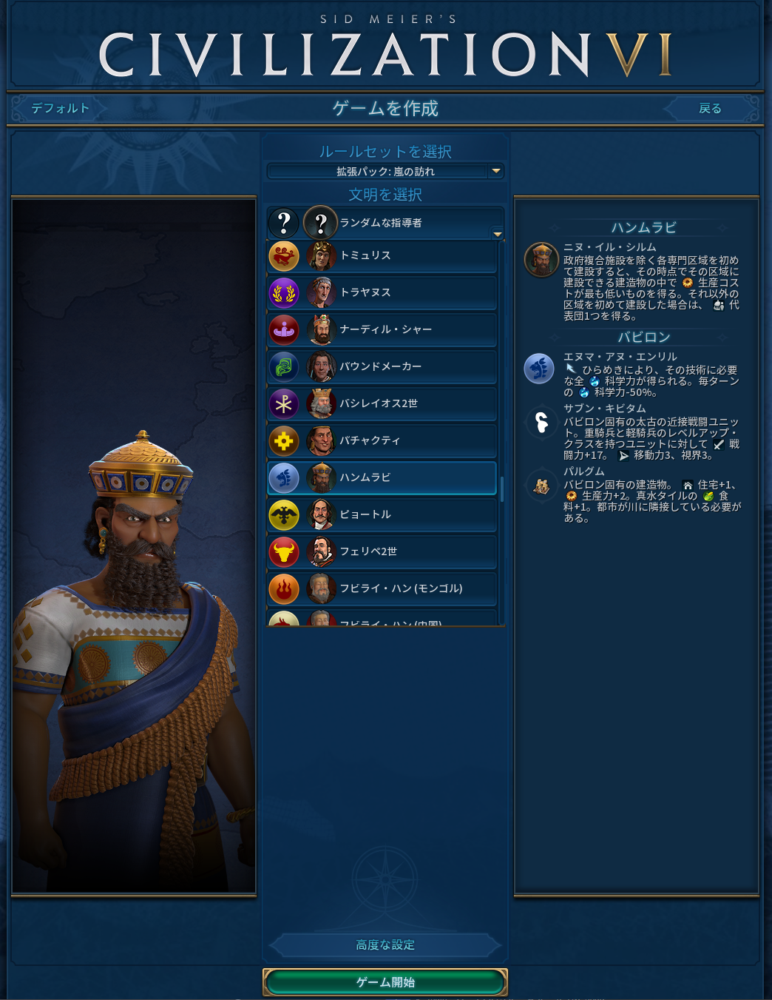

```toc
```

## 第1節　文明と指導者

### その0　プレイ時間

ゲームそのものに関係ありませんが、大事なことなのでここで扱います。

例えば6人程度で対人マルチプレイを行う場合、概ね**100ターンで2～3時間**かかります。勝利（ゲーム終了判定発生）までやるのであれば、最速で150ターン、平均で250～300ターンぐらいじゃないかなあ…と思います。

ルールによりますが、基本的には全員の操作が終了するまで次のターンに進むことはできません。考えるのが早い方は、別のゲームでも横で起動させておきましょう。

### その1　勝利条件

「しび6って結局何をするゲームなの？」というと、結論は

- 自分の国に属する**都市**を作り、
- 目標に向けて**生産・購入・開拓・戦争・布教・研究**を行い、
- 複数ある勝利条件農地の一つを目指す

というゲームです。

生産や購入については後ほど解説しますが、ひとまず勝利条件を並べます。

#### 制覇勝利

他の国の **首都を武力で制圧（奪取）** することで達成できます。**首都**を制圧（奪取）すればよいため、すべての都市を滅ぼす必要はありません。

首都は、最初に建てた都市のことだと思います。

なにかのポイントを貯めたりするわけではないので、一番わかり易い勝利方法です。

#### 科学勝利

地球以外の惑星に入植すると達成できます。「地球の次は火星でCivilizationが始まる」というわけではありません。

そのためには、「太陽系外惑星探査船」というプロジェクト（後に解説）を実施する必要があります。これを開始すると毎ターンポイントが溜まり、それが最大になると科学勝利となります。

#### 文化勝利（観光勝利）

文化勝利という呼び方は語弊があります。これは**観光勝利**です。

- 施設の建造
- 遺物・聖地・国立公園の建造
- 秘宝・遺産の所有・展示

を行うことで、**観光力**を貯めると達成できます。

このゲームには**文化力**という概念がありますが、「文化力＝観光力」ではありません。気をつけましょう。ただし、文化力の高さは観光力の高さに関連はします。

> 文化勝利は他文明の累積文化値を累積観光値で抜くのが目的ですから、なるべく早く積み上げるべきです。
> 引用元：https://iigame.fun/civ6/conquest-culture-victory/

ということらしいです。文化勝利はやったことも目指したこともないので、これ以上のことはよくわかりません。

#### 宗教勝利

国（文明）には「主流宗教」という概念があります。この「主流宗教」を自分の国の宗教にすることで達成できます。

詳しくはまたまた後述しますが、宗教は「勝手にできて、勝手に広がる」ということはありません。自分で条件を満たし、宗教を作り、適切に広める必要があります。

#### スコア勝利

このゲームでは、ターン数の上限を決めることができます。ターンが上限になったときに誰も勝利条件を満たしていない場合、**スコア**の合計で勝敗が決定します。

> スコアは、社会制度の数、人口、都市の数、技術の数、「未来技術」の数、遺産の数、軍事的成果、偉人の数、信仰の数から算出されます。

らしいですが、計算式は不明です。順当にやっていれば増えていきます。

ここで気をつけたいのは、

- 今持っている兵士の戦闘力
- 生産力（後述）
- 所持金

などは、総合スコアに入らないということです。つまり、「こいつ総合スコア低いから戦争仕掛けたろ！ｗ」と突撃すると、痛い目を見ることがあります。気をつけましょう。それに、ゴールドが5000兆あったとしてもスコアでは勝利できません。

スコアは基本的に最重要視するものではないため、脇見する程度でいいと思います。ただし、「友達と比べて2～3倍スコア差が付いている」という場合は相当ゲームスキルに差があるため、こっそり練習しましょう。

#### （補足）チーム戦の勝利条件

基本的に、チーム全体でポイントを共有するということはありません。例えば科学勝利を目指す場合、田所くんと木村くんがそれぞれ勝利に向けて5ずつのポイントを貯めていたとしても、敵チームの三浦くんが一人で8ポイントを貯めていた場合は三浦くんのほうが有利です。

そのため、チーム戦を行う場合は個別に研究をするよりも片方が資材を提供したほうがうまくいく…のかもしれません。

### その2　文明・都市・生産

このゲームは、まずキャラを選びます。わかりやすいですね。



このゲームには**文明**という概念が存在します。わかりにくいですね。基本的には1文明に1国家だと思えばいいです。

例えば日本文明のリーダーには北条時宗と徳川家康がいます。拡張パックやMODを入れれば他にももっと増えていきます。

文明が被ったからと言って、その文明同士が融合してチームになったりすることはありません。

ただし、表示が紛らわしいため可能であれば被らないほうがいいです。例えば、国と国が戦争した情報が入ったときは、「プレイヤーがプレイヤーに宣戦布告しました」ではなく、「文明が文明に宣戦布告しました」と出てきて結構わかりにくくなります。デフォルトルールでは「同じ文明は禁止」「同じ指導者は禁止」となっています。

#### 指導者の能力

指導者の能力には、文明によるものとその人物固有のものがあります。


と思いきや、同じ文明でも文明単位（画像では「ノルウェー」部分）の能力が違います。何やねん。

ちなみに、**ゲーム中に相手の文明・指導者の能力を知る方法はありません**（UIうんちポイントその1）。自分で毎回ググりましょう。

#### 強い指導者、弱い指導者

基本的に、このゲームはどの指導者を選んでも「絶対負ける」というレベルのものはいない…はずです。多分。

「何をしてもずっと強い化け物指導者」はいることにはいますが、基本的に個性があります。指導者により戦い方がかなり変わるため、キャラ別に解説はしません。これは備忘録なので、今後は「どのリーダーにもほとんど共通する常識」を扱います。

下のような噂はあります。

- ハンムラビはチート
- 北条時宗はかなり強い
- 趙氏貞は弱い？

ただし、ハンムラビはクセがあり、定石通りにやるとちょっとおかしくなってしまいます。初めての場合は「とりあえず北条」でもいいかもしれません。続く記事は北条時宗を選んだ前提で進めますが、それ以外の指導者を選んでも使える知識しか言いません。

#### （補足）AIについて

「ゲームの難易度」を変更すると、AIの強さが変わります。なんの強さが変わるかというと、この値によって**AIのステータスにブーストが掛かります**。別に賢くなるわけではないんですね。でも舐めて適当にプレイすると普通にボコボコにされます。

具体的に何にどう補正がかかるかは、今述べても伝わらないので省略します。ただし、言っておきたいのは**AIは結構好戦的**ということです。プレイヤーが弱すぎたり、逆に（軍事以外で）強すぎると、すぐにこっちに突撃してきます。「AIで練習しようと思ったら滅んで負けちゃった(泣)」とならないように、警戒しながら進めていきましょう。

## 第2節　初期設定

ここまでは、Civ6をつけていなくても読めることしか書きませんでした。ここからは、実際に手を動かしながら学ぶ人に向けて「最初にやっておくべき設定」を解説します。「とりあえず読むだけ」というひとは、この節を飛ばして第3節に行っちゃってください。

### ゲーム


変更したほうがいいところだけ解説します。

#### クイック戦闘

戦闘アニメーションを早くします。「初プレイだからせっかくだしゆっくり見たい」というのでもなければ、有効にしましょう。

#### クイック移動

移動アニメーションを早くします。上に同じです。

#### 助言者

この記事を読めば助言者はいらないと思います（個人的に助言者はほとんど役に立ちませんでした。センスがないのかもしれません。）。無効にしちゃいましょう！★

#### オートセーブ周り

オートセーブのデータは、

```
C:\Users\お前のユーザー名\ドキュメント\My Games\Sid Meier's Civilization VI\Saves
```

または

```
C:\Users\お前のユーザー名\OneDrive\ドキュメント\My Games\Sid Meier's Civilization VI\Saves
```

にあります。私の環境（AI戦・6人・マップデフォルトサイズ）の場合だと1ファイルあたり2MB程度でした。最近のWindowsはこれを勝手にOneDriveに保存してくれやがりますが、これを変える方法は簡単に調べた感じだとありませんでした。

### グラフィック

飛ばします。好きに設定してください。

### オーディオ


#### ウィンドウ非アクティブの場合ミュート

同じパソコンでCiv6の画面と別ゲーの画面を切り替えたい場合、チェックを外しておきましょう。

### 言語

好きにしてください。好みです。ヒンディー語にしたって構わない。

### インターフェース


このゲームは、戦略を決めるのに超大事なステータスが初期状態で非表示になってしまっています（UIうんちポイントその2）。そのため、表示させていきましょう。

#### HUDリボンに算出を表示

**必ずオンにしましょう**。すでに遭遇したプレイヤーの

- スコア（設定でターン制限をしている場合）
- 戦闘力（戦闘ユニットの合計力？）
- 科学力
- 文化力
- ゴールド
- 信仰力
- （拡張パック）外交的支持

が常に見えるようになります。これが見えないとずいぶんと困ります。


### （補足）MODについて

Steam経由の場合、MODを入れるのは超簡単です。Civilization6のワークショップに行き、「サブスクライブ」を押すだけです。なぜ「ダウンロード」や「インストール」ではなく「サブスクライブ」なのかは、誰にもわかりません。月額課金されるわけではないので大丈夫です。

`youtube:https://www.youtube.com/embed/_2-LmO_3yRA`

ただし「これが初プレイ！」という場合は、別に入れなくても問題ありません。2回目から入れて理解度を深めていきましょう。

ちなみに、マルチプレイ時には**全員が同じMODを入れておく必要があります**（入れていなくてもマルチプレイはできますが、ホストが入れていないMODは自動的に無効になります）。

### ゲームの開始

ここまで来たらゲームを開始していきましょう。やっとです。ここまでの説明で3000文字ぐらいありますよ。怖いですね。

シングルプレイヤー→ゲームを作成　と進んでいきましょう。ランダムなリーダーを選ぶとかなりやり方が変わってしまうので、よく読んだうえでお気に入りのリーダーにしましょう（先述の通り、この記事では北条時宗を選んだ状態で進めます）。


#### ゲームの難易度

初めての場合「王子」で大丈夫だと思います。どうしても不安な場合は、難易度を下げてもOKです。

https://civilization.fandom.com/wiki/Difficulty_level_(Civ6)

今知ったのですが、「王子」の場合でも少しだけAIにボーナスがかかるみたいです。大丈夫です、この記事に忠実にやれば多分勝てます。

#### ゲームスピード

基本的に「オンライン」で大丈夫です。サクッとやりましょう。本当に長いですよ、このゲーム。

#### マップタイプ

「七つの海はバランスが取れている教」という宗派もありますが、別に大陸でいいと思います。

#### マップサイズ

マップサイズに応じてデフォルトの人数が変わります。理由がなければ「小」にしておきましょう。初めての場合は「極小」でもいいと思います。

#### 災害の激しさ

皆さんは、このようなボタンはないと思います。なぜなら、これは拡張パック（公式MODのようなもの）による追加要素だからです。無視で大丈夫です。

### 高度な設定


高度な設定と言っても、特に高度なものはありません。設定しちゃいましょう。

#### プレイヤー

敵のリーダーを変更・削除できます。

人数に対してマップが広くても無駄に時間と手間がかかるだけなので、理由がなければ初期人数にしましょう。

#### 都市国家

都市国家とは、対人戦でもAIとして動作する、プレイヤーではない小国家のことです。従属させたり、戦争して制圧することもできます。

都市国家がなんの理由もなく突然戦争を仕掛けてきたり、新しい都市を作成することはありません。

#### 資源（の豊富さ）

「豊富がいい教」という宗派もありますが、高級資源と戦略資源はマップ上から削除できない（後述）ため、「普通」でもいいんじゃないかなとは思います。好みによります。

ただし、マルチプレイ時は戦力差がつく理由になってしまうので「豊富」のほうがいいかもしれません。運ゲー要素をつけたいかどうか、で決めるとよいのではないでしょうか。しらんけど。

#### ターン制限

任意です。現実世界ではターン数を制限して対人戦をすることもありますからね。

ちゃんと条件を満たして勝利してみたい！という場合は「ターン制限なし」にしましょう。

---


以上を踏まえて、こんな感じになりました。「ゲーム開始」…のまえに、「設定をセーブ」しておくことで、次の練習のときに同じ設定をベースに行うことができます。もちろん変更可能。

※指導者を追加する系のMODを導入した場合、設定ロード時に「設定をセーブしたときにあったMODの指導者」からしか選択できないバグ？があります。拡張パックの場合は知りません。「もう何が何でも絶対にMODを入れるんだ！！！！」という場合は、あらかじめ入れておきましょう。

※拡張パックを抜いたらクラッシュしてゲームが開始できなかったため、ここからの解説はMODおよび拡張パックが入った状態で進めます。