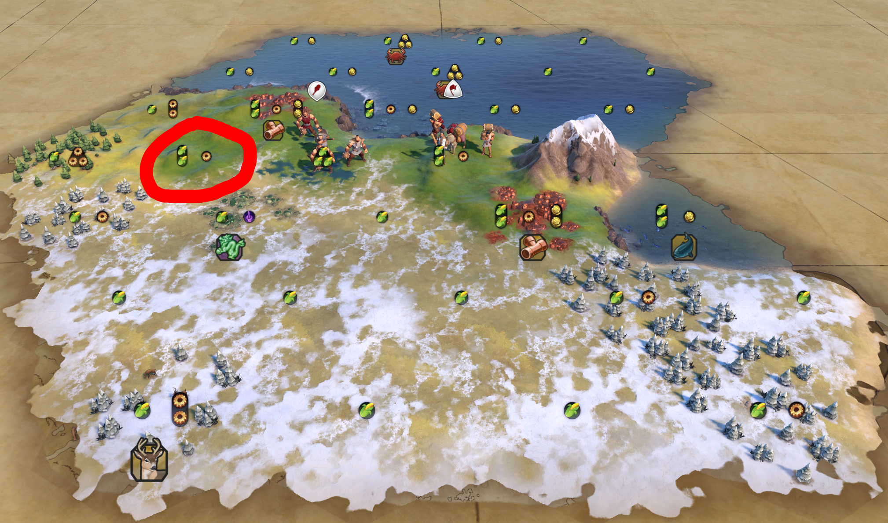

```toc
```

## 第0節　【絶対やれ】初期設定の続き

ゲームに入らないと設定できない設定もあります。さっさとやってしまいましょう。


このうち、

- 算出アイコンを表示

は、**必ず**ONにしましょう。それ以外は任意で大丈夫です。

また、その右にある現在地みたいなアイコンから「ピン」を刺すことができます。「ここに〇〇を作りたい！でも忘れそう！」というときに刺しておきましょう。MODを入れると、ピンを刺したときに「ここには建てられない」という警告があるときに教えてくれる気もしましたが、MODなしの環境でそれが出たかどうかはわかりません。MODは入れましょう。

## 第1節　地形

キャラを移動！…する前に、ちょっと待ってください。地形を見渡してみましょう。


この下の線は、「ここがマップの下の端である」ことを示しています。なお、特に変な設定をしていなければマップの左右はつながっています。

もっと拡大してみましょう。


マップの下端に近いこともあり、下は不毛の地になっているようです。とうもろこしのアイコンが少ないことがわかります。

また、緑色の龍のアイコンや銅・鹿のアイコンも目につきます。一つずつ理解していきましょう。大切なことです。

### 真水

Civilization VIにおいて、真水は重要な概念です。なぜならこれから都市を作るに当たり、**真水の配置によって都市の人口の上限が変わる**からです。

このマップの上にある水は、真水でしょうか、海水でしょうか。そのマスにマウスを乗せて、しばらくすると情報が出てくるはずです。


「磯」とか「北極海」とか書いてありますね。おそらく、これは真水ではないのでしょう。

この付近には真水がなさそうです。ちなみに、水は湖ではなくても川でもOKです（このマップはたまたま付近に川がないだけです）。とはいえ、「真水が見つかるまで10ターンぐらい探索するぜ！」とか、そんな悠長なことをやっていると開拓者（旗アイコン）を取られてそのままゲームオーバーです。早ければすぐに、**遅くとも5ターン以内**には最初の都市を建てたいところですね。

とはいえ、諦めるのはまだ早いです。現在、操作できるユニットは2つあります。これらの使い方については後述します。

### とうもろこしと歯車

さて、やっと地形の話ができます。土地にはとうもろこしと歯車のアイコンがありますが、他にも地形の起伏や砂漠かどうかなどがあります。それぞれ解説します。

「とうもろこしと歯車」と書いていますが、実際はそれ以外のアイコンも出ます。解説していきましょう。

- とうもろこし…食料です。人数の増減に関係します。
- 歯車…**生産力**です。都市を作ったあとに生産を行うときの速度に関係します。
- 羽…**信仰力**です。宗教ユニットを購入するときに使います。
- ト音記号…**文化力**です。**社会制度ツリー**の進行に影響します。
- ビーカー…**科学力**です。**技術ツリー**の進行に影響します。

基本的には、土地にはとうもろこしと歯車しか書いていないはずです。そうではない場合、大抵その土地には特別な特徴があります。

### 草原、平原、ツンドラ、砂漠

海も含めればもうちょっとありますが、地上タイルのみ解説します。

- 草原…緑のタイルです。食料が2もらえます。
- 平原…ちょっと色の薄いタイルです。食料が1、生産力が1もらえます。
- ツンドラ…食料が1もらえます。雑魚タイルなので、避けたほうがいいです。
- 砂漠…何ももらえません。雑魚タイルなので、避けたほうがいいです。
- 雪原…何ももらえません。雑魚タイルなので、避けたほうがいいです。

### 平地、丘陵、山岳

| 特徴名 | 内容                                                                                               |
| ------ | -------------------------------------------------------------------------------------------------- |
| 平地   | 平らな地形です。早く移動できます。ちなみに、「平地」は俗称であり、正式な用語ではありません。       |
| 丘陵   | 移動が大変な地形です。生産力が1もらえます。                                                        |
| 山岳   | 通過できません。後述しますが、「単に邪魔なので山からは逃げたほうがいい」ということでもありません。 |

### 特徴

ここまでは地形の話でした。地形の上に何かが乗っている場合、それを**特徴**と呼びます。

色々ボーナスなどがありますが、私が今意識しているのは以下です。もっと考えたほうがいい要素とかもあるのかもしれません。

- 森…森です。特徴を削除すると生産力が**一時的に**もらえます。
- 熱帯雨林…でかい森です。特徴を削除すると食料と生産力が**一時的に**もらえます。
- 湿原…濡れている地面です。特徴を削除すると食料が**一時的に**もらえます。

宗教勝利を目指す（信仰力がほしい）場合、他の地形も注目する必要がありそうです。

https://civ6wiki.info/?%A5%C7%A1%BC%A5%BF/%A5%BF%A5%A4%A5%EB/%C3%CF%B7%C1

## 第2節　都市をどこに出すか

このゲームは、都市を出さないと始まりません。これ以上の解説もできません。

### 結論

このブログのモットーの一つは、結論を先に述べることです。しかし、このゲームは複雑すぎるのでどうしても説明が長くなります。なので、ここに結論を記し、気になる人は下の長ったるい説明を読んでもらうことにします。

結論です。都市は、

1. 真水（川、湖）の隣で
2. 高級資源、ボーナス資源、戦略資源、の真上または近くで
3. 周りが砂漠・ツンドラ・雪原ではなく
4. 可能なら丘陵の上（生産力と防御力狙い）

に建てましょう。

### 解説

上記の地形の特徴を理解したところで、さてどうやって出せばいいでしょうか。ここで、**宮殿**について説明しておきましょう。

https://www.civilopedia.net/ja/rise-and-fall/buildings/building_palace

「自分が持っている最古の都市」には、宮殿というものが勝手に付属します。略奪を受けたり、機能不全になったりすることはありません。

先ほど、砂漠と雪原は「何ももらえません」と言いました。それでは、そこに都市を出してしまうと何もできずにゲームオーバーになるかといえばそうでもありません。この宮殿が最低保証の役割を果たします。宮殿は、

- 文化力+1
- ゴールド+5
- 生産力+2
- 科学力+2
- 住宅+1
- 娯楽による快適性+1

をもたらします。ここで、+1というのは**毎ターンもらえるという**ことです。つまり、荒れ果てた土地に首都を構えても、このステータスは最低限もらえるということになります。

つまり、都市を出すのが遅れるとこの「毎ターンもらえるはずだった5ゴールドや文化力、科学力」などがもらえないということになります。急ぎたいですね。

さらに、宮殿以外の都市も

- 食料+2

を最低保証するようです。なぜかシヴィロペディアには書いてありません。

https://civ6wiki.info/?%A5%B2%A1%BC%A5%E0%A5%B7%A5%B9%A5%C6%A5%E0/%A5%EB%A1%BC%A5%EB/%C5%D4%BB%D4

ただし、宮殿からは**食料と信仰力はもらえません**。食料がないと人口が伸びないため、結果として詰んでしまいます。少なくとも序盤は避けましょう。

ところで、さっきマップの特徴の話をしました。



例えば、ここに都市を出すことを考えてみましょう。

ここは、草原の丘陵です。したがって、

- 草原により、食料が2
- 丘陵により、生産力が1

もらえます。

また、まだ説明していなかったのですが、丘陵は**防御ボーナス**が付きます。簡単に言えば、この上にいるユニットに対するダメージは減少するということです。そのため、都市を丘陵に立てるのはいい選択と言えます。

先ほど、「食料+2を**最低保証**する」と書きました。これは、「食料が2より少なければ、2にする」ということなので、ちょっと損をした気になるかもしれませんね。でもそれぐらいの損は無視していきましょう。

さらにさらに、覚えておくべき重要な話を3つしていきます。

- 都市を作る（都心を設置する）と、その場所の**特徴**（森、熱帯雨林、湿原）**は消滅します**。**そのボーナスももらえません**。
- 都市を作ると、その場所の**高級資源・ボーナス資源**を回収することができます。この場合、ボーナスを獲得できます。
- 都市を作ると、その場所の**戦略資源**を回収することができるらしいです。この場合、その戦略資源を獲得できます。

ちなみに、資源の説明は以下のとおりです。

| 名前         | 効果                                                                                                                                       | 削除     |
| ------------ | ------------------------------------------------------------------------------------------------------------------------------------------ | -------- |
| 高級資源     | その都市の快適性を上げます。快適性が上がると、都市が活性化してボーナスが付くらしいです。同種のものをたくさん持っていても効果はありません。 | **不可** |
| ボーナス資源 | 追加効果をもたらします。開発（例えば、そのタイルに農場をつくる）することで、もっと効果が増えます。                                         | 可能     |
| 戦略資源     | それ自体がボーナスを出すわけではないですが、上の段階の兵士などを作るために必要です。                                                       | **不可** |

上記を踏まえて、このタイルに都心を作ることについて考えてみましょう。


ここには鹿（ボーナス資源）がいます。ボーナスは生産力+1です。

https://www.civilopedia.net/ja/rise-and-fall/resources/resource_deer

タイルを見てみましょう。ここはツンドラの平原で、上に森があります。したがって、

- ツンドラにより、食料が1
- 森により、生産力が1
- 鹿により、生産力が1

となり、画像の通り（食料1、生産力2）になります。

ただし、ここに都市を立てると**森（特徴）が消滅します**。本来であれば森を削除することで手に入ったはずの生産力がなくなってしまうことになります。

ところが、鹿は**見かけ上なくなりますが、効果を獲得できます**。そのため、ここに都市を立てると

- ツンドラにより、食料が1
- 都心の最低食料保証は2のため、食料は2になる
- 森は消滅するので、生産力は0
- 都心の最低生産力保証は1のため、生産力は1になる
- 鹿により、生産力が1（ボーナス！）→合計生産力は2

となります。ただし、周りがツンドラなので最初の都市出しには適していません。

鹿の上にキャンプを作ると、ゴールドが毎ターン+2入ります。また、将来にわたって他の追加効果ももらえます。長期的には、この鹿も有効活用したいところです。

https://www.civilopedia.net/ja/gathering-storm/improvements/improvement_camp

### で、結局どうするの？

いずれにせよ、真水が近くにないのは問題です。真水が近くになければ、住宅（人口の上限）が減ります。人口の上限が減れば、都市の成長が遅くなります。

そのため、戦士（棍棒のアイコン）にちょっと探索をしてほしいところです。草原（食料が美味しい）が広がっていそうなので、そっちに向かいましょう。ここはマップの下端に近いので、下向きに探索するとしんどい思いをすることになると思います。


丘陵なので、移動が遅いです。ちなみに、森なども通過するときに移動が遅くなります。そのため、可能であれば平地を移動したほうがいいですが、今はしょうがないです。


ボーナス資源の小麦が見つかりました。この上や付近に都市を立てるのもいいですね。ボーナス資源の効果は、めんどくさい（暗記していない）のでシヴィロペディアで確認してください。


更に探索を進めた結果、どうやらここは絶海の孤島っぽいことがわかりました。情報に「大陸」と書いてあるので、横方向に大陸がある可能性はありますが、これはきついです。ただし、日本帝国文明は海戦も強いのでナシではありません。

真水も見つからないため、今回はこの銅の上に都市を立ててしまいましょう。銅はゴールドをもたらすボーナス資源ですが、その効果を発揮するためにはもう少しゲームを進めなければなりません。それを待つのであれば、今都市を作って取ってしまいましょう。

なお、この出し方が最良なのかどうかについては自身がありません。あくまで一つの目安です。さっきも言った通り、下に都市を出すときつくなると思います。


このボタンで都市を建設できます。どう見ても海なのに、何故か真水もあります（右下の「+3」表記）。なんで？


ちなみにですが、このオススメ表示はあまり当てにしすぎないほうがいいです。自分の作りたいものをしっかり決めて進めるほうが何杯も強いので、**このゲームの「おすすめ」表示は基本無視しましょう**。このゲームを始めたての頃、おすすめをポチポチ押してひどい目にあいました。何も考えずにプレイするのが悪いんですけど。


ということで、都市ができました。土地のゴールドも消えていませんね。

## 第3節　ステータス

このゲームのステータスについて説明します。左上のものと、右上のHUDリボンの2箇所を見ます。


左上は、各ステータスの増加（減少）ペースを見ることができます。将来的には、戦略資源の数も見えるようになります。

このゲームの初期所持金は5です。そこに、宮殿のゴールド+5、銅によりゴールド+2、謎パワーにより+1です。謎パワーの理由は調べてもわかりませんでしたが、最低保証？都市のデフォルト？の可能性があります。

### 科学力と文化力

科学力と文化力（左の2つ）は、都市から産出し、毎ターン蓄積します。（都市を建てるまでずっと0のままです！）


必要な科学力が書いてありますね。今は毎ターン2.5増えるので、12になるまで5ターンかかります。


必要な文化力が書いてありますが、科学ツリーと違い、最序盤は操作する必要はありません。この「法典」というものが自動選択になるからです。

つまるところ、このゲームは

- 科学力を上げ、ユニット・建造物・区画を開放する
- 文化力を上げ、都市に特殊な効果をつけるカードや、同盟などの制度を開放する

ことがとても重要になります。ただし、**科学ツリーによってしか開放できない特殊効果や、社会制度ツリーによってしか開放できないユニット・区画も存在します**。例えば、日本文明の侍はなぜか社会制度ツリーにあります。


「全く研究をしない」ということになると、当然産出量などで遅れを取って負けます。「文化は適当に」と怠っていると、例えば「戦闘ユニットのアップグレードコストが-50%」などの非常に強力なカードが手に入らなくなります。優先順位はつけども、どちらもバランスよく進めていくことが非常に肝要です。

### 信仰力とゴールド

この2つは消耗品です。ただし、ゴールドは**区画（建物）や強い兵士などにより毎ターン減少します**。そのため、考えなしに兵士を出しまくると財政危機に陥り、兵士が勝手に消滅したりします。見るところが多いですね。

ゴールドを使用することで、ユニットや一部の都心の設備を購入できます。

信仰力は毎ターン勝手に減少することはないと思います。信仰力の使い道は限られていますが、研究・社会制度やその他の行動により使い道が増えていきます。宗教に関係するユニットは、信仰力でしか変えないことも多いです。

※その右にある謎の茶色いものは、追加コンテンツのため無視してOKです。

### HUDリボン


自分一人しかいませんが、「この世界は俺一人」というわけではありません。遭遇すると見えるようになります。

繰り返しになりますが、**戦闘力が低いからと言って、その国が弱いわけではありません**。気をつけましょう。

## 第4節　研究

都市を作ったら、研究を選択することになります（都市を作る前にも選択はできますが、科学力が+0のため意味がありません）。


結論から言えば、

- 海を開拓するなら、帆走術
- 宗教を優先するなら、占星術
- 周りが湿原まみれなら、灌漑
- 近くに山や地面に穴があるなら、筆記
- 周りに家畜・羊・馬・鹿があるなら、畜産
- 急いで戦闘を行う必要があるなら、弓術
- 近くが急稜や森だらけで、生産を急ぎたい場合は、採鉱
- 周りが熱帯雨林まみれなら、青銅器

が序盤の動きだと思います（もちろん違う意見もあると思います。自分でも考えてみてください）。

今回は断崖絶壁にいそうなので、「造船」を優先したいところです。


ただし、造船までは「48ターン」…これは、「このまま何もしなかった場合」のターン数です。科学力を上げることで短縮可能です。

科学力は（多分）消費するものではないので、あらかじめ他の研究を進めておくのもありでしょう。丘陵だらけなので「採鉱」が適しているんでしょうか。どうなんでしょうね。

上の画像でもわかると思いますが、先のことを見据えて、右にある研究を選んでおくこともできます。むやみに遠いところに行くと他の研究に足を引っ張られるので、欲しいものから取りに行きましょう。

### ブースト（ひらめき）

ブーストはかなり強力です。書いてある条件を満たすと、その研究に必要なターンが約半分（40%減少？）になります。

なお、ひらめきは他にも

- 偉人
- 研究同盟
- 外国から窃取

などから開放できることもありますが、後半の話です。序盤は条件をよく読み、文字通りに進めていきましょう。

### 原住民の集落


適当に探索していたら、減収民の集落を発見しました。この上にユニットが乗ると、ゴールドやユニットなどを無料で獲得できます。積極的に踏みましょう。

なお、「原住民の集落ってどこだよ💢見失ったわ💢」という方も安心してください。左下の「レンズ」から見れます。


斥候を選ぶと、ピンク色で浮かんできます。見失っても安心ですね！


## 第5節　生産


都市を作ったら、生産するものを選ぶ必要があります。Civilization VIでは、都市ごとに何かを生産しなければなりません。

序盤に作れるユニットの特徴は、**ターンごとの維持費が無料**ということに尽きます。そのため、近くで明らかに戦争が起きそうな場合は戦士や投石兵を序盤に作っても構いません。でも、そうでないことのほうが多いと思います。

推奨おばさんは

- モニュメント
- 斥候
- 戦士

の3つをおすすめしてきています。

モニュメントはなんだかそれっぽいですが、文化力を高める必要がなければ優先して作る必要はありません。最初にモニュメントを作る人もいますが、出だしが遅くなりがちです。

斥候は、とても移動が早いユニットです。地形の偵察にもってこいです。**基本的に優先して一体作りましょう**。

戦士は、普通の近接戦闘ユニットです。近くに敵がうじゃうじゃいるときに作りましょう。維持費は無料です。ただし、研究ツリーの「弓術」のブースト条件は、「投石兵で敵を倒す」ことです。つまり、「戦士でうまいこと壁を作り、投石兵で敵を倒す」事が非常に大事です。そうすることで、強力な長距離戦闘ユニット「弓兵」が作れるようになります。


ここでは、斥候を出しても地形が狭い気がしますが…偵察用に一応作っておきましょう。

### 市民の配置

「次のターン」を押す前に、ちょっと待ってください。都市をクリックすると、このような表示が出るはずです。


この「とうもろこし+2」「歯車+4」の部分はクリックすることができます。**これが非常に重要です**。なぜなら、ここを押すことで**都市ごとに優先する分野が決まるから**です。

市民は、都市のタイルに配置します。まだ人口が全然いないので適当でもいい気がしますが、何故か食料をクリックすると若干変わります。市民が一人しかいないはずなのに。怖いゲームですね。


食料にチェックをいれると

- 都市の成長が加速し、
- 生産力が1減り、
- ゴールドが1減り

ました。これをどう捉えるかは皆さん次第です。

## 第6節　戦闘


お邪魔ユニット、**蛮族**と遭遇しました。蛮族は、全方向に喧嘩を売る妨害ユニットです。

- プレイヤーの都市を斥候が見つけると、一度前哨地（蛮族拠点）に帰還し、大量の戦闘ユニットを引き連れて襲ってきます。
- 全プレイヤーの中で、最強のユニットを出してきます。
- 区域や施設の略奪（無力化）をしてきます。
- こちらの都市を占領することはない…はずです。

早めに潰してしまいましょう。ここで、「攻撃だ！」と適当に操作するのも愚策です。というのも、なんとこのゲーム、戦闘の結果が実行前にわかってしまいます。


「大勝じゃん！勝てる勝てる！」ちょっと待ってください。右に盾のアイコンが見えます。これは防御コマンドであり、**向こうから攻撃してきたときの戦闘力を上げてくれます**。対人戦であればともかく、AI戦であれば防御して惹きつけるのも得策でしょう。

さらに、この戦士がいるところをよく見てください。


実は、森など一部の地形には防御補正がつきます。つまり、**守るほうが有利**なのです。

### HPと弱体化

戦闘力という話をしましたが、このゲームは「攻撃力」「防御力」のような判定はなく、単に戦闘力で勝敗が決まります。計算式は知りません。

**HPが減ると、戦闘力が直接減少します**。ただし、**その場所から動かなければ、ユニットは自然回復します**。そのため、ガンガン攻めるよりも適切に引きながら戦うことが対人戦でも重要です。

ただし、**移動力が残っていないと回復しない上に効果がない**ので気をつけましょう。


なお、実は守りを固めたあとに更に守りを固めることができます。効果があるかは知りませんが、YouTubeを適当に見ている感じおそらく効果があります。おまじないとしてやっておくといいかもしれません。


次のターンです。蛮族の斥候がこちらの都市に気づきやがりました。このままだと大量の兵士が攻めてきますが、兵士を今から右上に送ったとて間に合いません。

このとき、斥候の生産を**中止**して他の生産に切り替えることができます。今回はひとまずしません。生産を中止した場合でも、ペナルティなどは発生せず、次の機会に途中から生産を再開することができます。

この状況だと、**投石兵**を作るのがおすすめです。研究「弓術」の解除が早くなります（ブーストがもらえます）。

## 第7節　社会制度


法典を開放しました。法典を開放したあとは、社会制度ツリーを選択しなければなりません。


社会制度ツリーには、明らかに変なものがあります。「政治哲学」のところにあるものですね。

社会制度ツリーを進めると四角形のカードがもらえますが、これを手に入れたらすぐに使えたり、自動的に有効になってくれるわけではありません。**政府**を解除し、**スロット**にカードをはめる必要があります。

記号の形などを見れば、大体勘で補えると思います。そのため、ここでは強いカードをいくつか紹介するだけにします。

### 交易商

交易商は、

- 都市と都市を道でつなぎ、
- お互いの都市または交易路が出ている都市に、いろいろなボーナスをもたらし、
- 繋いだところに道を作成する（移動しやすくなる）

ユニットです。強いですね。私、最初は道を作るユニットとしか思ってませんでしたよ。

実は、生産力は都市ごとに異なります。交易商を使うと、例えば生産力の強い都市から、その都市の生産力を減らすことなく新しい都市生産力を加えてあげることができます。

当然、新しく都市を出そうとしているときには有力な選択肢です。

### 植民地化


開拓者（都市を出せるユニット）が、半分の時間で出せるようになります。強い。

ただし、**開拓者は出すときに都市の人口を1減らします**。そのため、最序盤にとっても特に意味がないまま終わってしまいます。タイミングには気をつけたいですね。

### 農奴制


新しくできた労働者（畑などを作れるユニット）が、2回多く建設アクションを実行できるようになります。強い。

もともと労働者は2回までしか建設アクションを実行できないので、実質2倍です。しかも、労働者は**金で買えます**。金で買っても、生産しても強い労働者の完成です。

### 総合娯楽施設


都市の快適度を上げるのに必要です。快適度が下がりすぎると相当重いペナルティ生産量ペナルティを受けるので、「絶対優先！」とはいかないまでも意識したいところです。中盤～終盤になると重要になります。

---

この3枚はどんな状況でも強いと思います。うまく使っていきましょう。

## 第8節　都市のステータス

都市もステータスを持っています。

| ステータス名称 | 説明                                                                                                                             |
| -------------- | -------------------------------------------------------------------------------------------------------------------------------- |
| 生産力         | ユニットの生産、区域の建設の速度に関わります。計算式？知らん。                                                                   |
| 快適性         | 高いと生産力などにボーナスが付きます。低いとペナルティが徐々にかかり、あまりにひどいと都市内に蛮族（反乱ユニット）が生まれます。 |
| 科学力         | 都市に固有ではなく、すべての都市の科学力の合計が科学力になります。                                                               |
| 文化力         | 都市に固有ではなく、すべての都市の科学力の合計が文化力になります。                                                               |
| 信仰力         | 都市に固有ではなく、すべての都市の科学力の合計が信仰力になります。                                                               |

ここでは、特に快適性に重点を置いて話をします。

### 快適性について

都市の快適性は、「知らないと死ぬ」というレベルではないものの、意識しておくべき重要な概念です。

https://civil6.com/happiness/

快適性が「-1」になった時点で、食料と生産性（とか？）に10%のデバフがかかります。**-10%が毎ターン続く**ので、これがかなり痛いです。

※公式拡張パック（どの拡張パックかは忘れました）では、快適性が低いと**都市ごと反乱を起こします**。文字通り「知らないと死ぬ」レベルになってしまいます。

---

次は施設と区画の話をしようと思います。この記事にまとめても良かったのですが、10000文字をとっくに超えているため次の記事に回します。