```toc
```

## 第1節　施設の種類

### 区画とは？

このゲームにおいて、区画と施設は別物です。ちなみに、どちらも基本的に山岳の上には建てられません。


引用元：https://www.civilopedia.net/ja/gathering-storm/districts/district_campus

区画は、**都市が生産力により建造する設備**のことをいいます。六角形なのが特徴です。

重要なこととしては、

1. 一つの都市に、同じ区画は2つ建てられない
2. 建てた区画は、削除できない
3. 戦略資源の上には建設できない

ということでしょうか。

つまり、**適当に区画を建てるとあとからリカバーできない**ということになります。他方で区画は強力なステータス源となるため、**ずっと区画を建てないでいると、その間に敵との差が随分ついてしまう**ということでもあります。

ちなみに、都市（都心）も区画の一つです。

### 施設とは？


引用元：https://www.civilopedia.net/ja/gathering-storm/improvements/improvement_farm

施設は、**労働者が労働力**（労働者がそれぞれ持つ固有ステータス、「アクション」とも言う）**を使用して建造する施設**のことです。

施設はあとから削除することができます。また、上に区画を立てることでその施設を自動的に削除できます。

そのため、**あとから区画を置くであろうところに施設を一旦置いておく**という戦略は有効です。

## 第2節　隣接ボーナス

隣接ボーナスは、区画と施設の両方にあります。

### 施設の隣接ボーナス

**ほぼない**と思っていいです。ただし、

- 農場をバラバラに作ると非効率
- 鉱山は、ないよりマシ
- リーダーに固有の施設は、強いことも結構ある
- どちらかというと、施設は隣接ボーナスを与える側

ということは覚えておきましょう。

### 区画の隣接ボーナス

区画のほうがよっぽど強力な隣接ボーナスを持っています。ただし、区画同士を闇雲に隣接させればいいわけではなく、また地形により隣接ボーナスを得ることもあります。（北条時宗は適当に区画を隣接させても強いですが、それは例外というやつです）

例えば、キャンパスは以下のような隣接ボーナスを保有しています。

- 隣接する草原 (山岳)タイル1つごとに、科学力+1。
- 隣接する平原 (山岳)タイル1つごとに、科学力+1。
- 隣接する砂漠 (山岳)タイル1つごとに、科学力+1。
- 隣接するツンドラ (山岳)タイル1つごとに、科学力+1。
- 隣接する雪原 (山岳)タイル1つごとに、科学力+1。
- 隣接する熱帯雨林タイル2つごとに、科学力+1。
- 隣接する区域タイル2つごとに、科学力+1。
- 隣接するグレートバリアリーフタイル1つごとに、科学力+2。
- 隣接する政府複合施設タイル1つごとに、科学力+1。
- 隣接する地熱孔タイル1つごとに、科学力+2。
- 隣接する礁タイル1つごとに、科学力+2。
- 隣接するパムッカレタイル1つごとに、科学力+2。
- 隣接するレイライン資源タイル1つごとに、科学力+2。

最後の2つは固有区画のため、無視して大丈夫です。また、「政府複合施設」は確か追加コンテンツだった気がします。

簡単な例を見てみましょう。

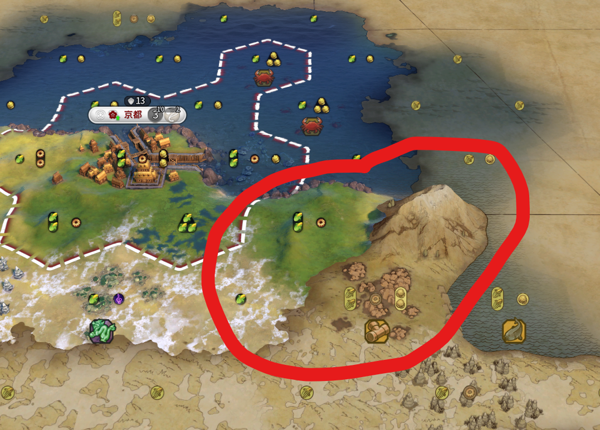

このエリアにキャンパスを作ることを考えてみましょう。右に山岳がありますので、山岳の左にキャンパスを置くと、**隣接ボーナスが科学力+1**です。

…うーん、弱い！w

それでも、**長期間全くキャンパスを作らないよりよっぽどマシ**です。他にまともな地形がなければ、
さっさと建ててしまいましょう。

### 【超重要】隣接ボーナスの公式

一般的に

- [キャンパス](https://www.civilopedia.net/ja/gathering-storm/districts/district_campus)は、山岳の隣に
- [聖地](https://www.civilopedia.net/ja/gathering-storm/districts/district_holy_site)は自然遺産、山岳の隣に
- [工業地帯](https://www.civilopedia.net/ja/gathering-storm/districts/district_industrial_zone)は、鉱山と用水路の隣に
- [港](https://www.civilopedia.net/ja/gathering-storm/districts/district_harbor)は、沿岸資源（多分カニや魚とか？）の隣に
- [商業ハブ](https://www.civilopedia.net/ja/gathering-storm/districts/district_commercial_hub)は、川、港の隣に

置くのが基本的な考え方です。**これを意識するだけで、適当に置きまくるより随分マシになります**。超大事なので、しっかり覚えてください。

これに加えて、これらの区画は**他の区画がたくさん隣りにあると、それだけで相互に隣接ボーナスをもたらします**。**区画は密集させるほうが得**、ということです。

読めば分かる通り、山岳は通過できないにも関わらず大事だし、キャンパスと聖地は競合します。ピンを立てて、都市計画を作りましょう。

## 第3節　都市計画

ここまで基本を語ってきました。でも、基本だけだとうまく都市を計画する方法を決めるのは難しいものです。そのため、いくつか公式や例を紹介します。

### キャンパスの例

この初期地形は結構終わっているので、手書きの例を出してみます。

六角形の画像はこちらからお借りしています。

https://kohacu.com/20170128post-435/

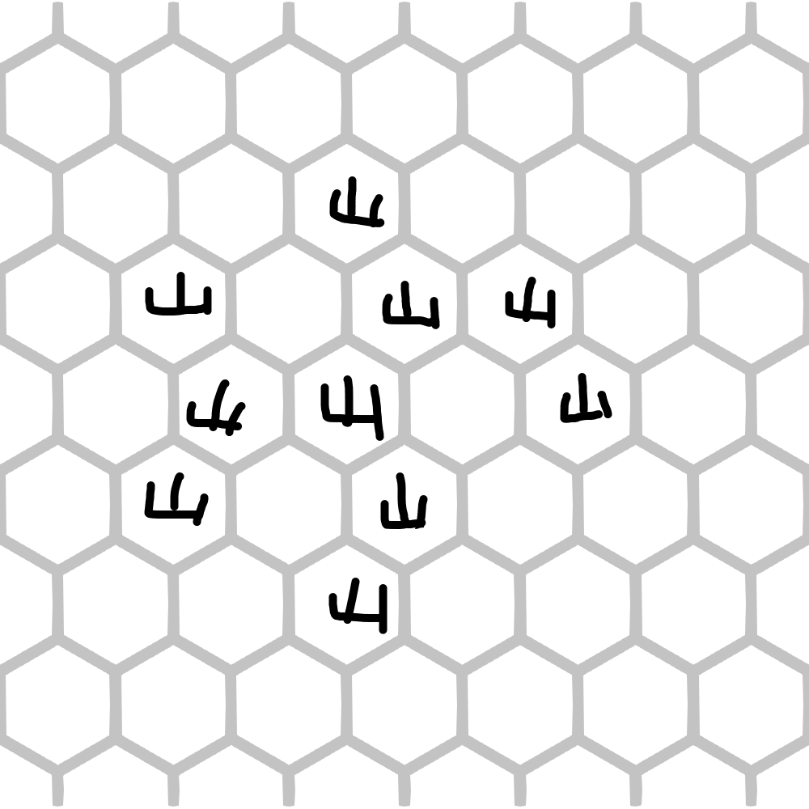

こんな地形があったとします。山ばっかりで邪魔ですね。

しかし、これは控えめに言って神地形です。なぜなら、

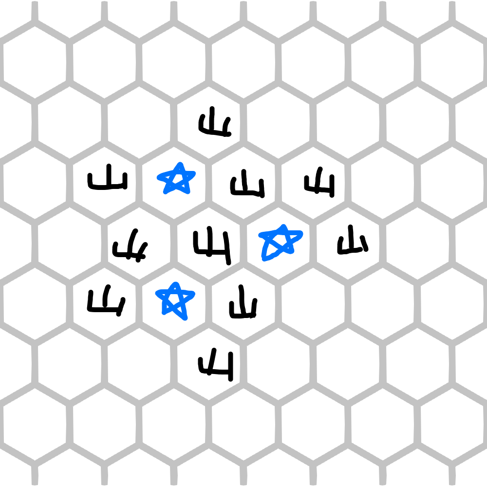

この☆のところにキャンパスや聖地を設置すれば、

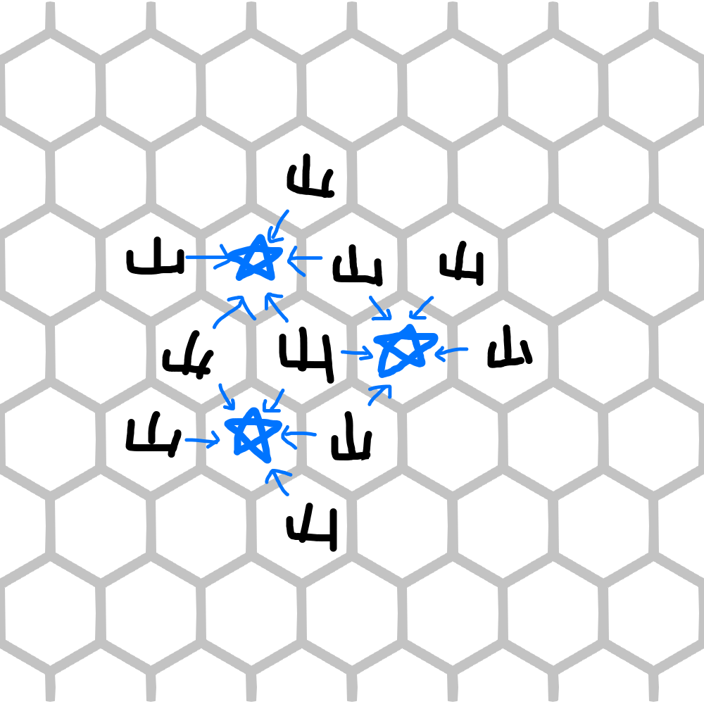

この矢印1つにつき、隣接ボーナス+1が入ります。つまり、この3箇所全てに

- キャンパスを置いた場合、タイルに科学力+2（**市民を配置しないと科学力を生み出さない**という意味）、山岳が5あるので5×3=**科学力+15**
- 聖地を置いた場合、タイルに信仰力+2（**市民を配置しないと信仰力を生み出さない**という意味）、山岳が5あるので5×3=**信仰力+15**

となります。市民を1人配置してやっと+2になることを考えると、**山奥にキャンパスを押し込むだけで科学力+15**というのはあまりに魅力的です。

### 都市同士は近くに置けない

さて、区画を置くために都市を作りましょう！

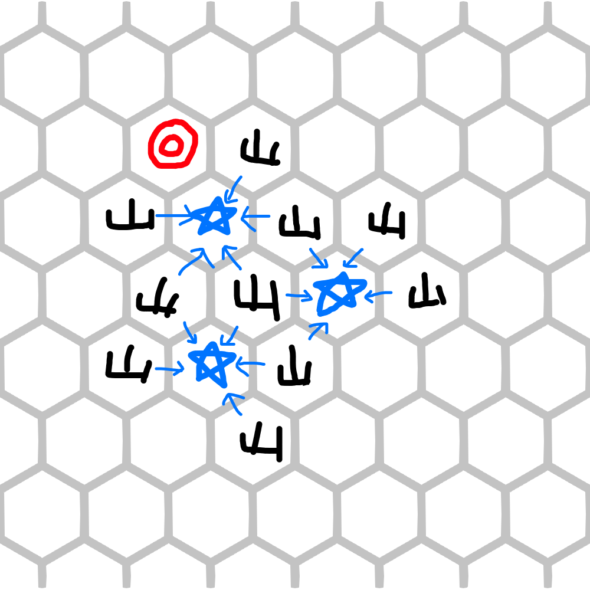

はい、ゲームオーバーです（厳密には詰んではいませんが、だいぶ面倒なことになります）。

なぜなら、**都市の近くには都市を建てられない**からです。「近く」がどれぐらいかというと、

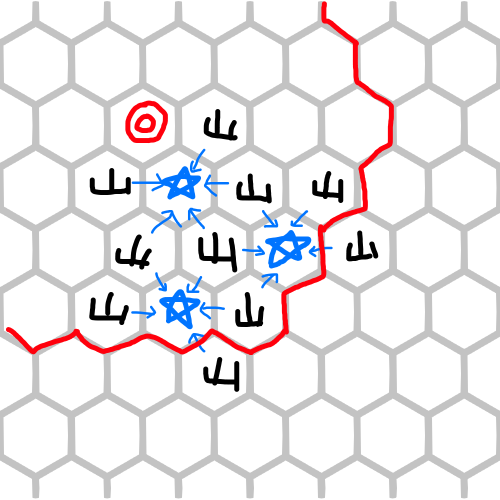

これぐらいです。**都心から数えて3マス**、と覚えればいいと思います。

ちなみに一度出した都市は、基本的には破壊できません（一応相手の国にわざと都市を乗っ取ってもらい、それをあとから取り返す際に破壊すればいいですが、相当面倒です）。あとから**都市同士で土地は交換可能**ですが、この全ての領域を広げきるまでには相当な時間がかかります。そのため、都市は適当に出さず計画的に出しましょう。それに、**都市を建てられるのは自分だけではありません**。敵がこの土地を見つけたら、優先して取りに来たり、自分が無理やり都市を立てても戦争で奪われるかもしれません。そこをどうするか考えるのが、Civ6の醍醐味というものではあります。

### 工場用水路の公式

この公式は非常に重要です。これをマスターすると、本当に神に勝てるようになります。私が実証したので間違いありません。

#### 用水路と工業地帯

さて、このゲームには**用水路**というものがあります。


引用元：https://www.civilopedia.net/ja/gathering-storm/districts/district_aqueduct

効果は、

> 隣接する川、湖、オアシス、山岳から真水を都市にもたらす区域。都市に真水がまだ供給されていなかった場合は最大で住宅6を獲得。真水がすでに引かれている都市は住宅+2。地熱孔に隣接している場所に築くと快適性+1。干ばつ中に食料が失われない。都心に隣接している必要がある。工兵はチャージ1を消費することで用水路を20%完成させられる。

基本的に真水がないところに都市は出さないと思うので（状況次第ですが）、住宅6の恩恵は受けられなさそうです。

※あとから用水路を置けそうな地形であれば、真水がないところに都市を立ててもいいと思います。

ところで、このゲームには**工業地帯**というものがあります。


引用元：https://www.civilopedia.net/ja/gathering-storm/districts/district_industrial_zone

工業地帯は、アイコンを見ての通り**生産力**を生み出す区域です。しかし、区域は建設に時間がかかる割に「市民を置いて、やっと生産力+2」というのはあまりにしょっぱいものです。

しかし、工業地帯には強力な隣接ボーナスがあります。

> 隣接する用水路タイル1つごとに、生産力+2。

つまり、用水路と工業地帯は隣接させる必要があります。ただし、用水路は都市の真隣にしか置けないので気をつけてください。

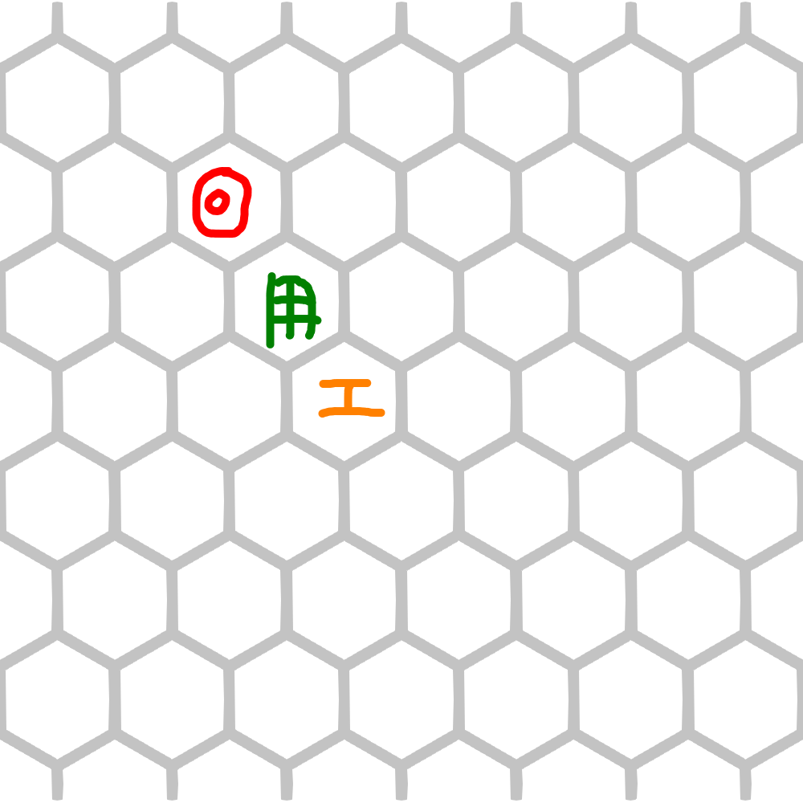

これで神に勝て…るほど甘くないです。この配置は、あまりに重要なことを大量に無視しています。

まず、用水路というからには**真水に接している必要**があります。要するに、砂漠のど真ん中にいきなり用水路を爆誕させることは不可能ということです。条件は、上に書いてあるとおり

> 川、湖、オアシス、山岳

です。地形次第では見た目そのままの水源だけでなく、山から真水を引くことも選択肢になります。

つまり、

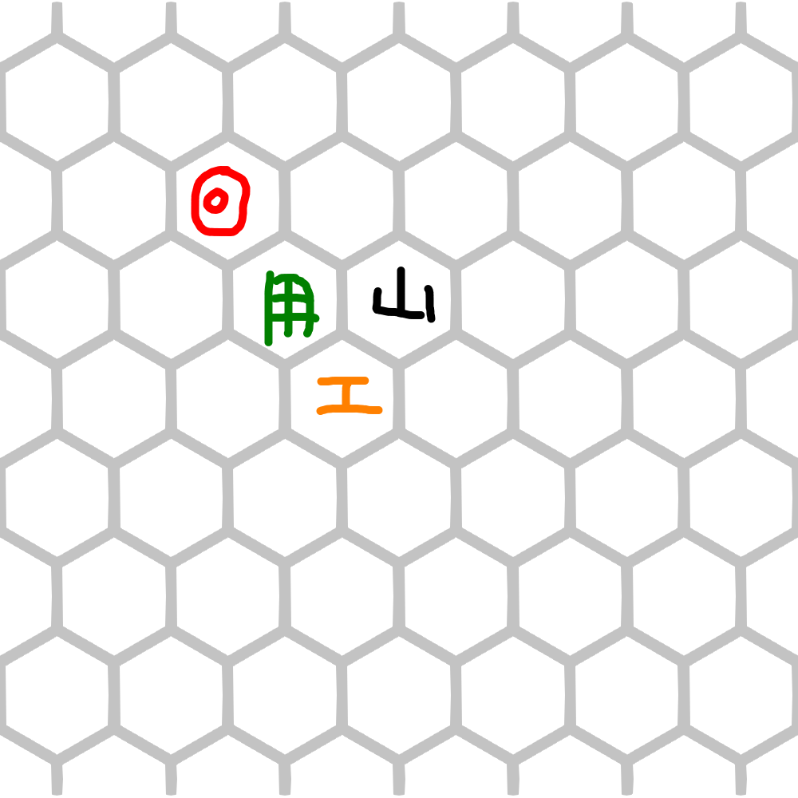

や、

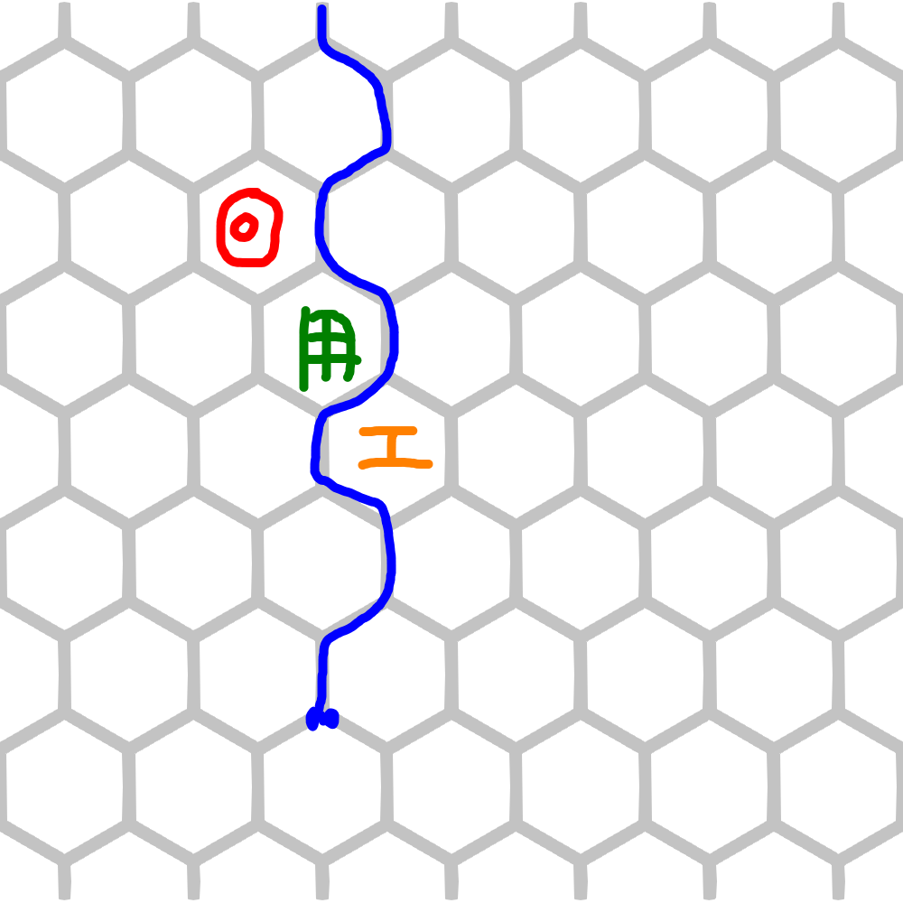

な地形を狙うといい、ということになります。ただしこの場合、上の地形だけだと「公式」が完成しません。この「用水路に工業地帯を隣接させる」というのは、公式の前提です。

#### 用水路と工業地帯のサンドイッチ公式

いよいよ公式に入っていきましょう。上の山岳から用水路を引いた画像の地形ではできないので（理由は自分で考えてみてください✨️）、下の画像でやってみることとします。

結論から言うと、こうなります。

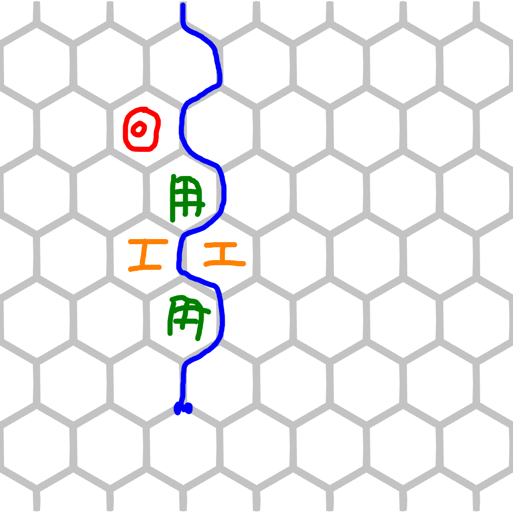

こうすると、

- 左の工業地帯は、上の用水路としたの用水路から生産力をそれぞれ+2ずつもらえる（合計4）
- さらに、区域が3つ隣接しているので、切り捨てで生産力+1がもらえる（合計5）
- さらにさらに、右の工業地帯も、全く同じ恩恵を受けられる（**合計10**）
- さらにさらにさらに、工業地帯の近くに適当に好きな区画を立てれば、区域が4つ隣接するのでそのたびに生産力+1がもらえる

という、**神公式**です。

ただし、この公式には落とし穴があります。先程、用水路は都市にも真水（をくれるタイル、具体的には川、湖、オアシス、山岳）にも隣接させなければならないと言いました。しかも、自分の都市はあとから移動させたり破壊したりできません。

つまり、

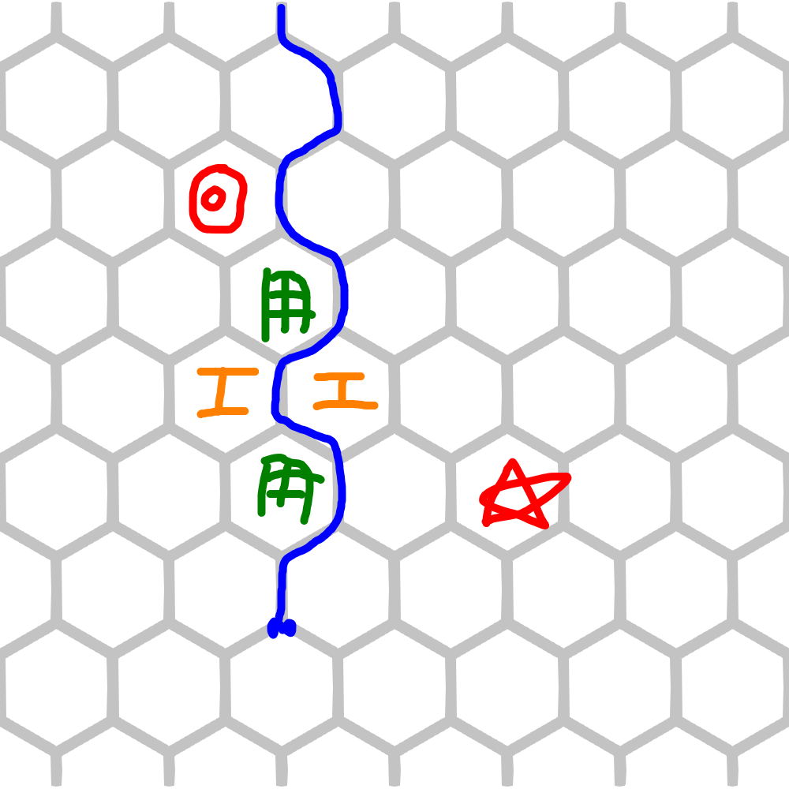

こんなところに都市があると、この公式は使えないわけです。だって、都心の隣じゃないと用水路は建てられないんだから。

敵が建ててきたならしょうがない（滅ぼせばいいだけ）にしても、自分がミスってここに建てると辛い思いをします。気をつけましょう。

さらに、仮に左上の都市がもうちょっと下にあったとしてもこの公式は使えなくなります。

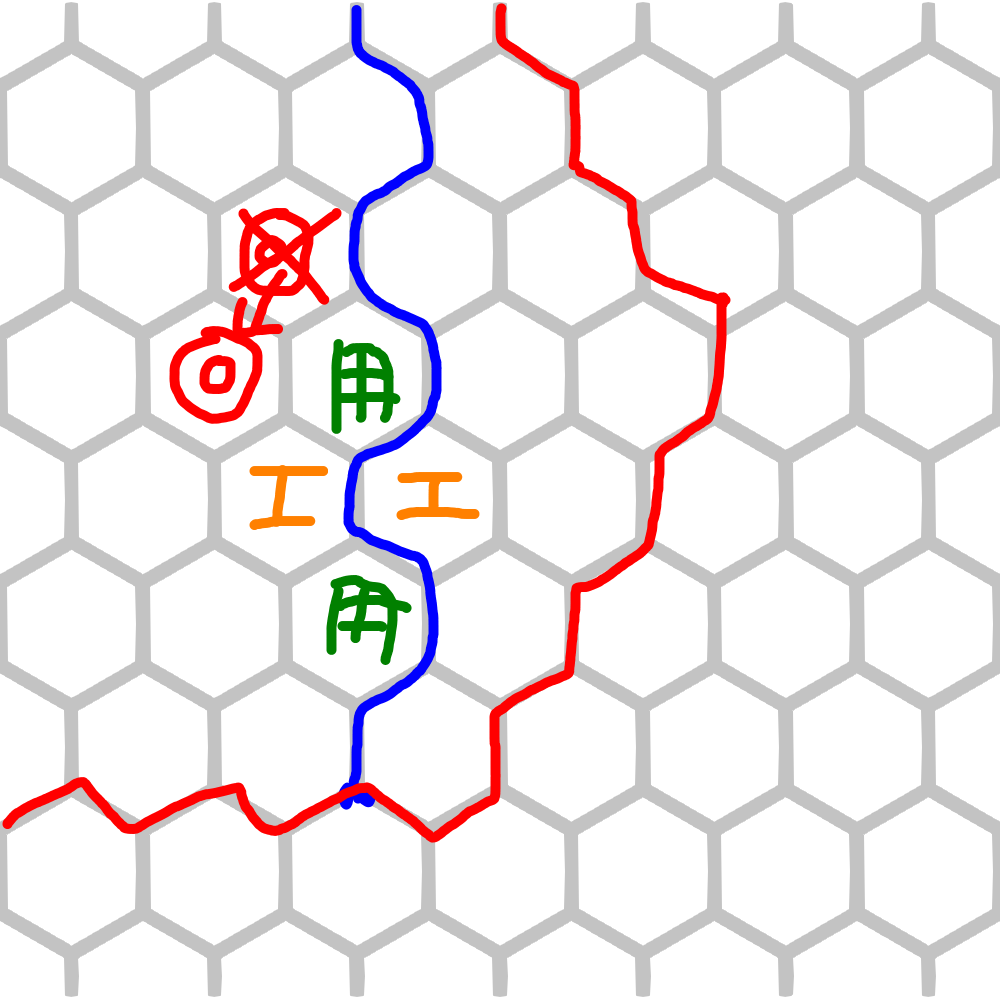

この赤い枠線の内部には都市が建てられない＝どんなにタイル交換をしても用水路が作れない＝†死†

ということです。この場合、せめて用水路を都市の右下に出しておけば、ずらして公式を作れたかもしれないですね。それでも、区域も都市も一度出したら取り消せません。涙をこらえていきましょう。

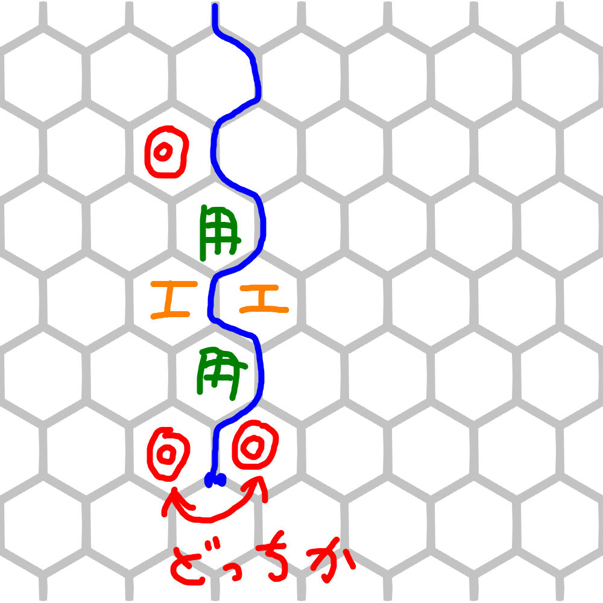

うまく行けば、この様になっているはずです。これで、晴れて莫大な生産力を得ました。

#### 商業ハブを隣接させよう


引用元：https://www.civilopedia.net/ja/gathering-storm/districts/district_commercial_hub

このゲームに「富豪勝利」というものは存在せず、1兆ゴールドを持っていたとしてもゲームには勝てませんが、それでもゴールドはゲームを有利に進めるうえで非常に重要です。

さて、先程

> さらにさらにさらに、工業地帯の近くに適当に好きな区画を立てれば、区域が4つ隣接するのでそのたびに生産力+1がもらえる

と書きました。

ところで、商業ハブは川に関連する隣接ボーナスがあります。

> 隣接する川タイル1つごとに、ゴールド+2。

さらに、

> 隣接する区域タイル2つごとに、ゴールド+1。

もあります。


…なんだか、とても面白そうな地形ですね。

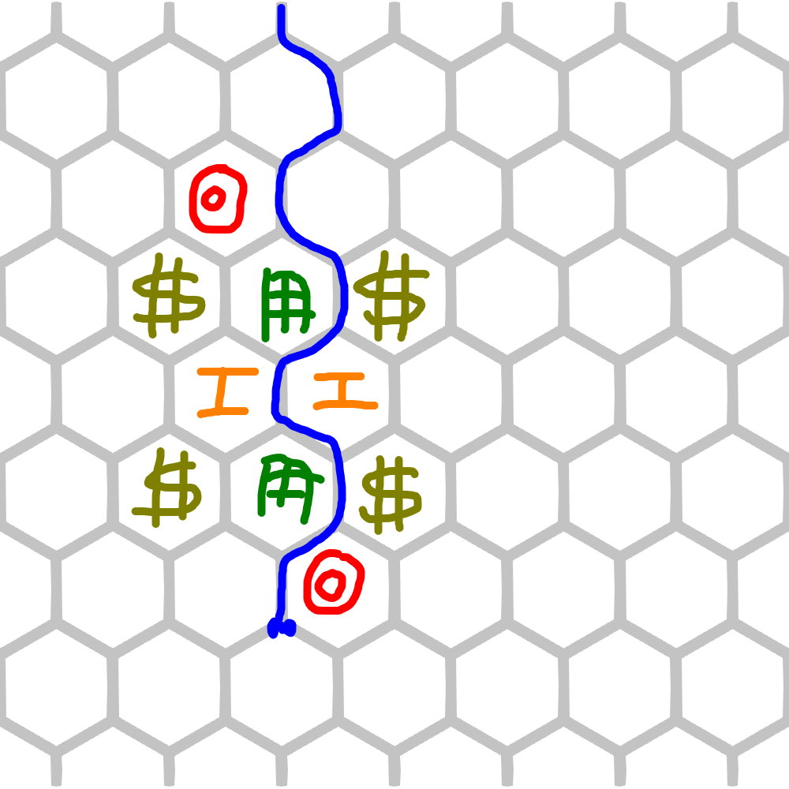

忘れないでください。同じ区域は1都市に1つしか置けないので、この4箇所全てを商業ハブにすることは不可能です。そのため、これは仮の選択肢です。

それでも、この公式を完成させた後に商業ハブをこの4箇所の何処かに置くだけで、

- 工業地帯に対する区域隣接ボーナス（生産力+1）
- 商業ハブに対する川の隣接ボーナス（ゴールド+2）
- 商業ハブに対する区域隣接ボーナス（ゴールド+1）

が手に入ります。美味しいね。ぜひやりましょう。

もっと欲を言えば、港との相互作用（ゴールド+2）を狙うと面白いことになります。

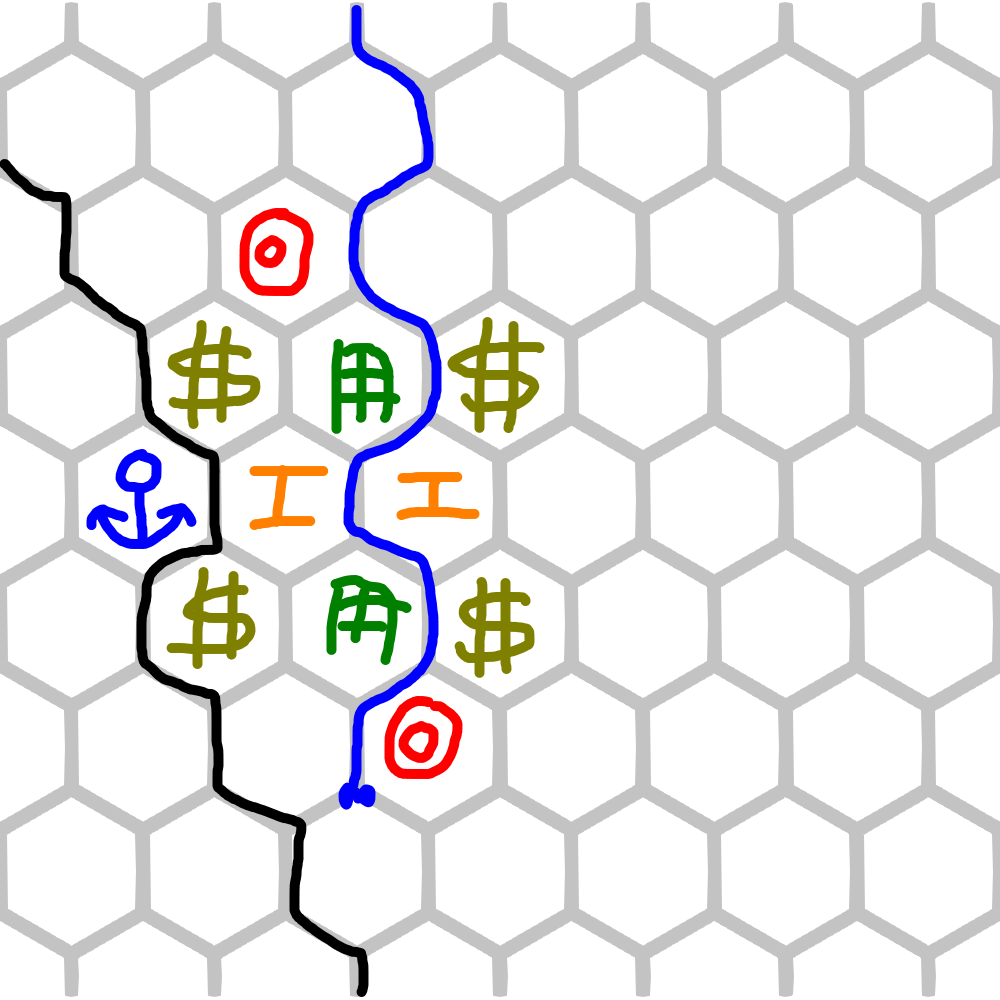

こんな**神地形**は早々存在しませんが、もしも見つけることができたなら莫大な富が虎のごとく降り注ぎます。

---

他にも区域と区域の隣接に関して考えることは山程ありますが、ひとまず

- キャンパスは、山で囲い込む
- 用水路と工業地域は、可能ならサンドイッチする

ことを心がければ、神ぐらいは余裕で勝てます。

もちろん、これはあくまで地形が理想的だった時の話です。**山やサンドイッチに固執しすぎて、全く研究や生産が進まないほうが損失**です。程々にしましょうね。あくまで狙えるときに狙っていきましょう。

なお、今回はたまたまサンプルの地形が終わっているので、これらの公式はしばらく出てこないと思います。でも重要なので、死ぬ気で覚えて帰ってください。

### ヒント―別に自分の区域じゃなくてもいい

ここまで、口を酸っぱくして隣接ボーナスの話をしてきました。

ところで、さっきから山岳や区域と隣接の話をしていますが、これらは実は**自分の領土である必要はありません**。つまり、敵の領土の山岳に囲まれているキャンパスでも科学力は上がるし、敵が用水路を適当においていたらそれを勝手に使ってサンドイッチ公式（とまではいかずとも、隣接適当な隣接ボーナスを獲得できるような区域）を作ることも可能ということです。なんちゅう機械的な計算。

区画は一度作ると破壊できないと言いましたが、それは**敵も同じ**です。利用していきましょう。