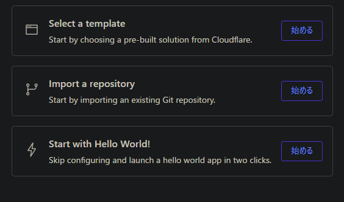
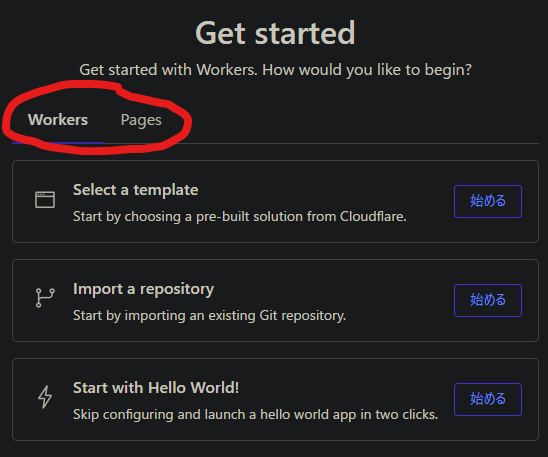
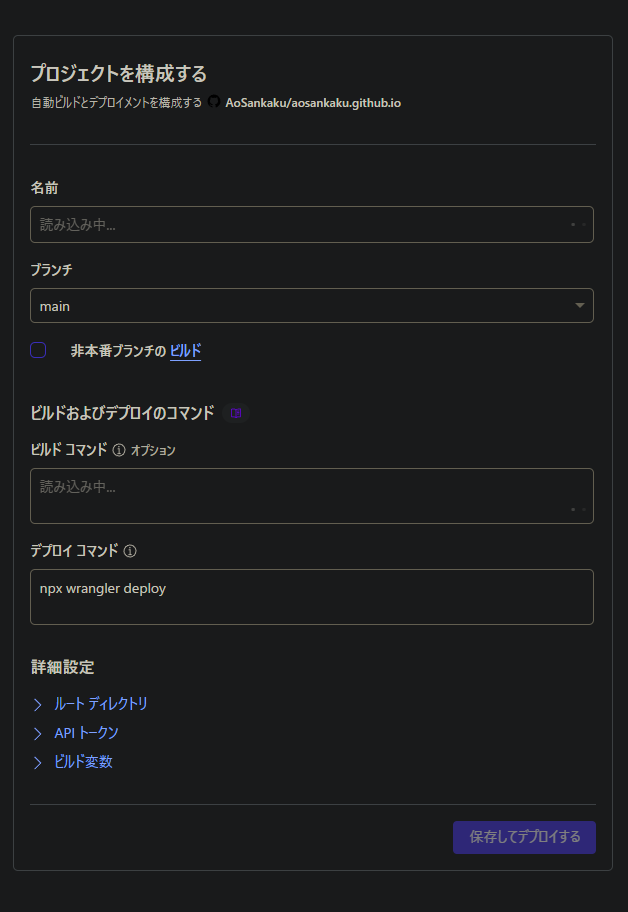
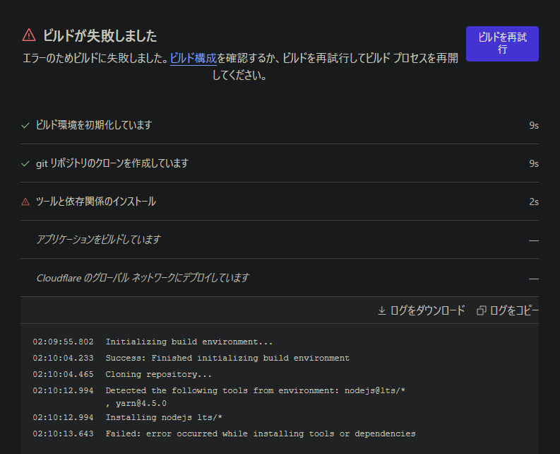
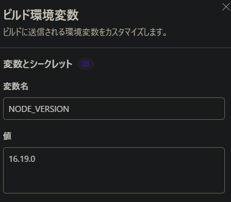
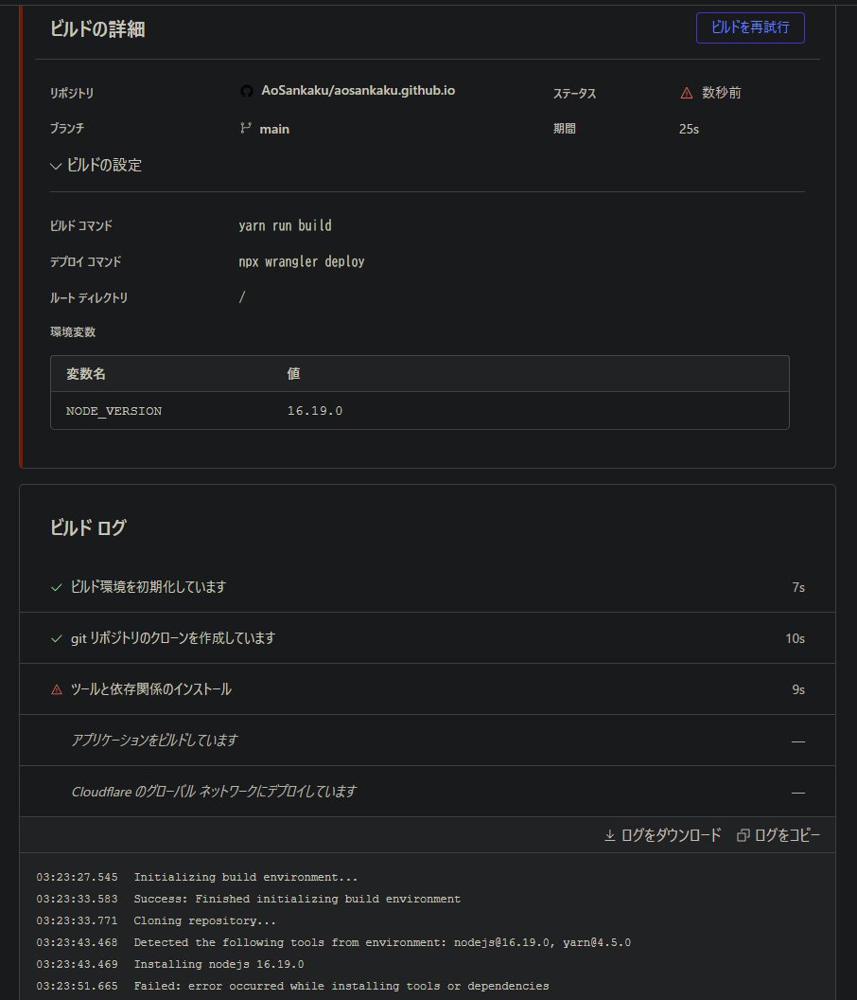
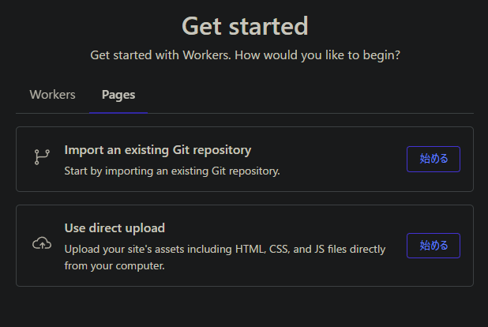
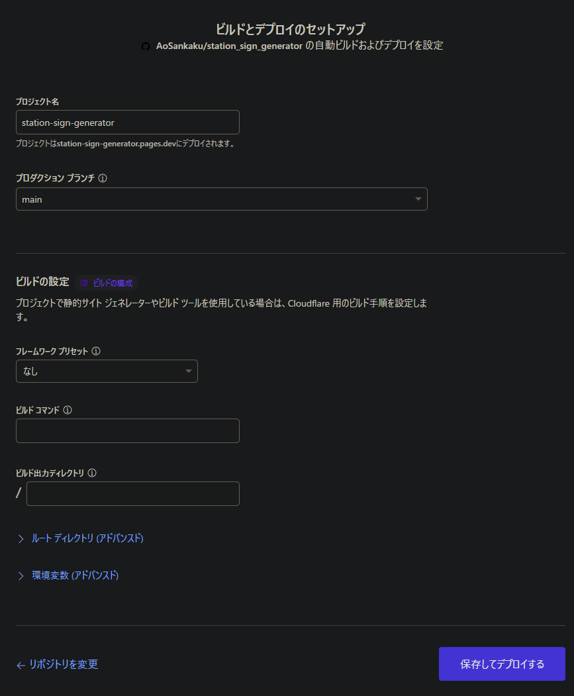
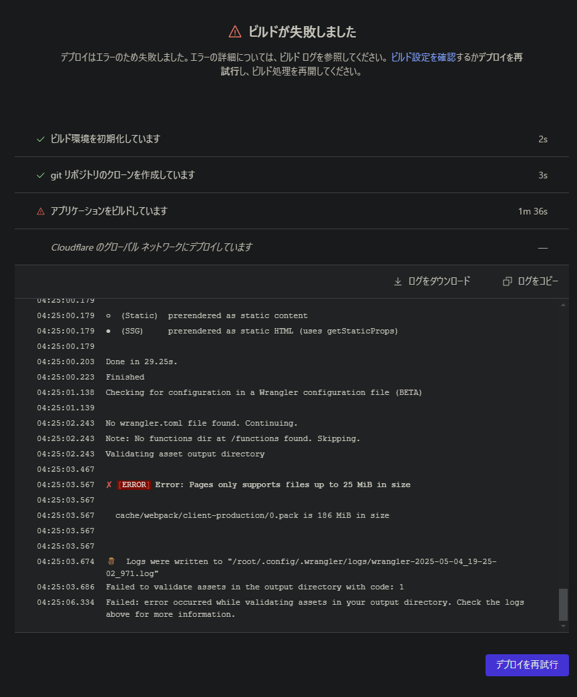

Cloudflare Pages、使ったことありますか？無料で使える範囲が広くて素晴らしいですよね。

というわけで、作成してみます。

お、import a repositoryがいいかな！

はい、**ゲームオーバー**です。

## WorkersとPagesがあまりに紛らわしい

理由は上にあります。

まさかの**タブ切り替え**がいります。この記事では視線誘導しましたが、正直私は気づきませんでした。

これに気づかないと、表示がだんだんおかしくなっていきます。それではこのまま進めてみましょう。

プロジェクトを構成する画面にそのままスムーズに進んでしまいました。適当に名前を決め、保存してデプロイしてみましょう。ちなみに、GatsbyとCloudflare Pagesは相性が悪い（自分調べ）ため、そもそもうまくいかない可能性はあります。

しかし、yarnのインストールに失敗したというのは致命的すぎます。なんとかしましょう。

ビルド構成とやらを確認してみます。

環境変数を追加してデプロイしてみましょう。

これでビルドしてみます。

同じエラーにより阻まれました。

ここから全く進むことができなくなりました。プレビューURLは何度見ても`Hello world`です。

しかも左上がこれなので、「Pagesではなく誤ってWorkersを選んでいる」事に気づきません。悪質。

## Pagesでやってみよう

というわけで、ここまで間違った方法（SSGなのに「Workers」）でやってきました。正しい方法である**Pages**をやっていきましょう。

ありゃりゃ、**さっきとぜんぜん違う画面**。それはそう。この2つ、同じところにまとめないでほしい。

`NODE_VERSION`だけは変えておかないと、デフォルトの謎の値を使ってビルドするため失敗します。ここだけは適当（ここでは私のパソコンに入っているものと同じ20.11.1）に変えましょう。

このとき、間違えて違うリポジトリをビルドしようとしてしまったのですが、このとき`YARN_VERSION`を1に指定しないとバージョン3を勝手に使い始めて超ビビりました。

ビルドには失敗しましたが、これは1ファイルが25MBを超えていたことによるものでこちら側の原因なので、成功と言っていいと思います。（Next.jsのStatic Exportを使った適当なほかのやつだとこれで行けました）

---

最後のコレのせいで説得力がなくなってしまいましたが、タブデザインの罠とNODE_VERSIONに気をつければだいたいなんとかなります。開発頑張ってくださいね。