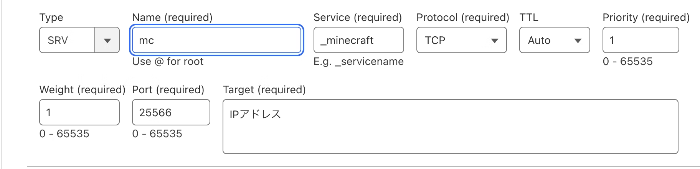

自宅サバでマイクラサーバーを複数立てたい！…となること、あると思います（ない）。

自宅サバに限らず、同じサーバー上で複数のマイクラサーバーを動かしたい場面はあると思います。ポート番号を変えれば解決しますが、参加者側がポート番号を指定するのはミスの原因になるだけでなく、それになんとなくカッコ悪い。

そこで役立つのが**SRVレコード**というわけです。早速調べてみましょう。

## 目標

- サブドメイン`mcfirst.example.com`から、マイクラサーバー1に接続できる。
- サブドメイン`mcsecond.example.com`から、マイクラサーバー2に接続できる。
- この2つは、物理的に同じサーバー上で動かし、異なるポートを使用する。
- 参加者は、ポート番号を意識せずにサーバーに参加できるようにする。

## 調べて出てくる情報

https://qiita.com/mono0218/items/9ac836728f218f61c573

この記事が最初に当たります。「SRVレコードでやってみたらサブドメインで接続に成功した」という内容ですね。

そして、こんな画像が出てきます。



引用元：https://qiita.com/mono0218/items/9ac836728f218f61c573

「こんなふうにすれば行けるんだな！よ～し、設定するぞぉ～！」と意気込んで、Cloudflareに行ったらこの画面が出ました。


> ？？？？？
> ？？？？？？？
> ？？？？？
> 
> —俺　心の俳句

## 解決方法

書き方が若干違うだけです。一度わかってしまえばカンタンです。

上の画面では、

- Service : **_minecraft**
- Protocol: **TCP**
- Name: **mc**

となっています。

これと同じ内容を実現するには、名前（必須）のところに、

```
_minecraft._tcp.mc
```

といれるだけです。もちろんexample.comはご自分のドメインにしてくださいね。

また、「ターゲット」というのも重要な値になります。直接IPアドレスをいれることもできるっぽいですが、Aレコード経由でIPアドレスを参照してからポートを振り分けることも可能です。お好きな方をどうぞ。

## 解決！

この方法だけ覚えておけば、同じサーバー機で同じゲームのサーバーを開き放題です。やったね！

## 余談

この「サービス名（今回は`_minecraft`）」ですが、実際なんの意味があるのかは正直わかりません。ゲーム側が参照するんでしょうか。

というわけで、ちょっと調べました。

https://serverfault.com/questions/1098283/what-are-valid-zone-name-or-valid-service-name-for-srv-records

https://en.wikipedia.org/wiki/SRV_record

**symbolic name of the desired service**ということは、「これはこのサービス向けだよ～ん」と単に言っているだけで、これを誤ったからと言ってなにか支障があるわけではない…のかもしれません。

https://www.reddit.com/r/dns/comments/kfouin/what_does_the_symbolic_name_or_service_name_in_an/

https://it-notes.stylemap.co.jp/webservice/srv%E3%83%AC%E3%82%B3%E3%83%BC%E3%83%89%E5%AE%8C%E5%85%A8%E3%82%AC%E3%82%A4%E3%83%89%E3%80%80%E5%9F%BA%E6%9C%AC%E3%81%8B%E3%82%89%E5%AE%9F%E8%B7%B5%E3%81%BE%E3%81%A7%E3%81%AE%E6%B4%BB%E7%94%A8/

他方で、「適当だとまずい」という情報もいくつか見つかりました。…しかし、マイクラJava版が「_minecraft」なら、統合版サーバーはどうするんでしょうね。

暇な方は実験してみるといいかもしれません。