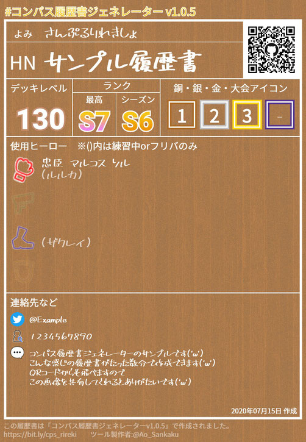

ブログをリニューアルしてから初の記事になります。  

## 「#コンパス履歴書ジェネレーター」ってなんだよ
#コンパスというクソゲーには [#コンパス履歴書](https://twitter.com/search?q=%23%E3%82%B3%E3%83%B3%E3%83%91%E3%82%B9%E5%B1%A5%E6%AD%B4%E6%9B%B8&src=typed_query) なる文化があるのですが、スマホで画像加工するのが面倒くさすぎて気がついたら衝動的に作っていました。  
一応プロフメーカーとかそういうのもあるのですが、何故か自分で作っていました。  

それにしてもこれ、公開してからもうそろそろ3年も経つんですね…  
このゲームがここまで続くとは正直思っていませんでした。

もちろん非公式なので、ずっと使える保証はありませんが3年持ったなら大丈夫じゃないんですかね（適当）

## リンク
### [コンパス履歴書ジェネレーター](https://aosankaku.github.io/cps_resume/)
  
こちらから作成できます。デザインにこだわらなければ3分ぐらいで完成します。  
最新のキャラがいないのは更新サボってるからです。ごめんなさい。

## サンプル
こんな画像ができます。右上のQRコードはちゃんと履歴書ジェネレーターに飛ぶようになっていますので、この画像を拡散するだけで履歴書ジェネレーターを布教できます。やったね！

## 注意
* パソコンからでも使えないことはないですが、キャラ選択が悲惨なことになっています。やめたほうが賢明です。  
* スマホの一部で、プレビュー画像を長押しするとクラッシュする不具合が発生しています。対処法は正直わかりません（preventDefaultも効かない）。タップで普通に保存できますので、その方法で保存していただけると助かります。

## ありそうな質問
### 記入可能項目は？
ハンドルネーム、ランク、デキレ、使用キャラ、ギルド、連絡先、コメントです。ギルド以下の項目は、入力しなかった項目は自動的に非表示になります。  
デキレについては「4～」って書いてるやつが死ぬほど嫌いなのでそういう事ができないようになっています。バカめ。
### 無料ですか？
金取ったら報復として運営が桃鍋と猫宮を上方するので一生無料です。プライム機能などの追加予定もありません。
### 履歴書を加工したりイラストつけても大丈夫？
好きにしてください。  
ただ上の「#コンパス履歴書ジェネレーター」か下のコンパス履歴書ジェネレーターのURLを消す奴は個人的にムカつくのでブロックします。イラストの都合上やむを得ない場合はOKです。  
「文字がダサいので消せるようにして欲しい」という要望の場合は[こちら][inquiry]からお知らせください。僕もこれもうちょっとかっこよくできないかなと思っているので前向きに対応します。
### ハッシュタグは何？
「[#コンパス履歴書ジェネレーター](https://twitter.com/search?q=%23%E3%82%B3%E3%83%B3%E3%83%91%E3%82%B9%E5%B1%A5%E6%AD%B4%E6%9B%B8%E3%82%B8%E3%82%A7%E3%83%8D%E3%83%AC%E3%83%BC%E3%82%BF%E3%83%BC&src=typed_query)」です。更新と宣伝をサボっているので過疎っています。
### 動作環境は？
Chrome、Firefoxで動作確認済みです。  
Safariは検証環境がないので動かなかったら[こちら][inquiry]からクレーム入れてください。  
スマホのFirefoxで何故か動かなかった気がします。  
昔「Edgeは非対応」と書いていたのですが、最近のEdgeは実質中身がChromeになったので問題なく動作します。
### 書いた内容はどこに保存されますか？
ご利用の端末に保存することができます。私がそれを読み出したりすることはありません。と言うかやり方を知りません。  
将来的にGoogle Driveとかと連携できないかな～と考えています。
### バグありました/要望があります/質問があります！
[こちら][inquiry]にぶっこんでください。

## 今後の展望
正直コードがむちゃくちゃ汚いのと、パソコンでの操作性が悪すぎる（逆レスポンシブ非対応）ので、暇な時間があるうちにReact+Gatsbyで1から作り直そうかと思っています。旧作品互換性はないかもしれませんが許してください。

あと端末が変わるとデータが消滅するので、Googleとかと連携して消えないようにできないかなとか考えています。流石に住所とかメールアドレス書くアホはいないと思うので適当なセキュリティでいいかなと思っています。  
でもDiscordのIDについては適当に保管するとやべーやつがスパムに悪用する可能性があるので悩みどころです。

[inquiry]: https://docs.google.com/forms/d/e/1FAIpQLSeXJZaiPBeYG2raNjZS-NbXX1gWkgYF_R7pdVQNDCVfYWHSjA/viewform
