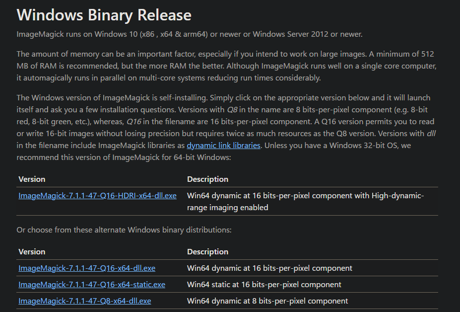
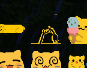
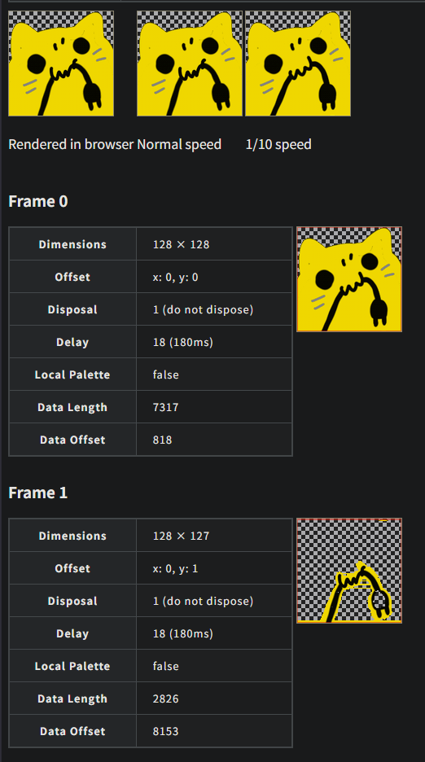
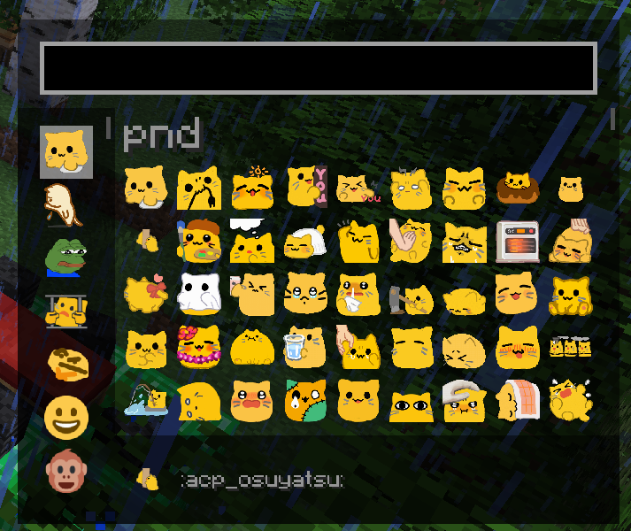
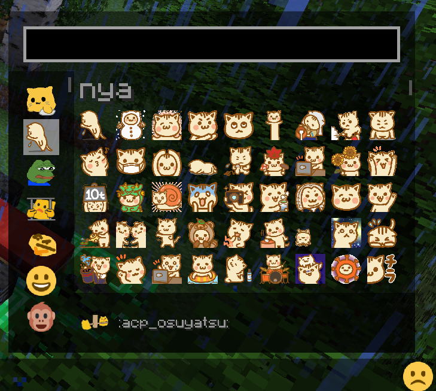

## 結論

ImageMagickを使ってください。

https://imagemagick.org/index.php

古い雰囲気のあるサイトです。GIF周り、こんなんしかない。

### ダウンロード

https://imagemagick.org/script/download.php

Windowsなら、Windows Binary Releaseまでスクロールしてください。



適当にexeをダウンロードします。普通にインストールする形式です。

## 発端―Emojifulで画像がバグる

マイクラに**Emojiful**というMODがあります。

https://modrinth.com/mod/emojiful

その名の通り絵文字を表示できるMODなのですが、時々GIFがバグるのです。



こんな感じで、**一部が透明**になります。なんだか奇妙ですね。

また、横長の絵文字が引き伸ばされるという問題もあります。そのため、「画像を1:1にリサイズし、この問題を解決する」必要が生じました。

### リサイズすると、Sharpが勝手にGIFを最適化してくる

Node.jsで使える画像処理関係で、有名どころなSharpというものがあります。

https://sharp.pixelplumbing.com

これを使って適当にスクリプトを組み、「フォルダ内のすべての画像をリサイズする」という作業を実施しました。面倒だったのでコードは全部AI（Gemini）に書かせました。

```js
// このファイルはESモジュールとして実行するため、.mjs 拡張子で保存してください。
// または、package.json に "type": "module" を追加してください。

import fs from 'fs/promises';
import path from 'path';
import sharp from 'sharp';

/**
 * 指定されたディレクトリ内のGIFおよびPNG画像を処理します。
 * - もともと1:1のアスペクト比であり、かつ、128px x 128px以下の画像は、そのまま出力フォルダに複製します。
 * - それ以外の画像は、128px x 128pxの1:1のアスペクト比にリサイズします。
 * - リサイズ時、画像は下揃えで配置され、上部（および必要に応じて左右）に透明なパディングが追加されます。
 * - GIFアニメーションは維持されます。
 *
 * @param {string} inputDir - 処理対象の入力ディレクトリのパス。
 */
async function processImages(inputDir) {
  // 出力ディレクトリは入力ディレクトリのサブフォルダとして作成されます
  const outputDir = path.join(inputDir, 'output_resized');
  const targetSize = 128; // リサイズ後の目標サイズ（例: 128px x 128px）

  try {
    // 入力ディレクトリが存在するかどうかを確認します
    const stats = await fs.stat(inputDir);
    if (!stats.isDirectory()) {
      console.error(`エラー: 指定されたパス "${inputDir}" はディレクトリではありません。`);
      return;
    }

    // 出力ディレクトリが存在しない場合は作成します
    await fs.mkdir(outputDir, { recursive: true });
    console.log(`出力ディレクトリ "${outputDir}" を作成しました。`);

    // 入力ディレクトリ内のすべてのファイルを読み取ります
    const files = await fs.readdir(inputDir);
    console.log(`"${inputDir}" 内に ${files.length} 個のファイルが見つかりました。`);

    // 各ファイルを並行して処理します
    await Promise.all(files.map(async (file) => {
      const filePath = path.join(inputDir, file);
      const ext = path.extname(file).toLowerCase(); // ファイル拡張子を取得し、小文字に変換します
      const fileNameWithoutExt = path.basename(file, ext); // 拡張子なしのファイル名を取得します
      const outputPath = path.join(outputDir, `${fileNameWithoutExt}${ext}`); // 出力ファイルのパス

      try {
        const fileStats = await fs.stat(filePath);
        // ファイルがディレクトリ、またはすでにリサイズされた出力ファイルの場合はスキップします
        if (fileStats.isDirectory() || file.endsWith('_resized' + ext)) {
          console.log(`"${file}" はスキップされました (ディレクトリまたは既存のリサイズ済みファイル)。`);
          return; // Promise.all のコールバックでスキップ
        }
      } catch (statError) {
        console.warn(`"${file}" の状態を確認できませんでした。スキップします。エラー: ${statError.message}`);
        return;
      }

      // ファイルがGIFまたはPNGであるかを確認します
      if (ext !== '.gif' && ext !== '.png') {
        console.log(`"${file}" はスキップされました (サポートされていないファイル形式)。`);
        return;
      }

      try {
        console.log(`"${file}" を処理しています...`);

        let imageProcessor;
        // GIF画像の場合は、animated: true オプションを指定して読み込みます
        if (ext === '.gif') {
          imageProcessor = sharp(filePath, { animated: true });
        } else {
          imageProcessor = sharp(filePath);
        }

        // 画像のメタデータを取得します (幅、高さなど)
        const metadata = await imageProcessor.metadata();
        const { width, height } = metadata;

        // メタデータが読み取れない場合はスキップします
        if (!width || !height) {
          console.warn(`"${file}" のメタデータが読み取れませんでした。スキップします。`);
          return;
        }

        const maxOriginalDim = Math.max(width, height);

        // 新しい処理ロジック:
        // 画像が既に1:1のアスペクト比であり、かつ、最大辺がtargetSize以下である場合
        if (width === height && maxOriginalDim <= targetSize) {
          // リサイズやパディングは不要なため、そのまま出力フォルダに複製する
          await fs.copyFile(filePath, outputPath);
          console.log(`"${file}" はすでに1:1のアスペクト比であり、${targetSize}px以下のサイズなので、そのまま"${outputPath}"に複製されました。`);
          return; // このファイルの処理を終了
        }

        // 上記以外のすべての画像はリサイズ処理の対象とする:
        // - 1:1だがtargetSizeより大きい画像 (例: 200x200) -> 128x128に縮小
        // - 1:1ではない画像 (例: 200x100, 50x100) -> 128x128の1:1にパディングして収める
        imageProcessor = imageProcessor.resize(targetSize, targetSize, {
          fit: sharp.fit.contain, // 元の画像の縦横比を維持します
          position: sharp.strategy.south, // 画像を下中央に配置します
          background: { r: 0, g: 0, b: 0, alpha: 0 } // 透明な背景色を設定します (RGBA形式)
        });

        // リサイズされた画像をファイルに保存します
        // GIF画像の場合は、animated: true オプションを指定して出力します
        if (ext === '.gif') {
          await imageProcessor.gif({ animated: true }).toFile(outputPath);
        } else {
          await imageProcessor.toFile(outputPath);
        }

        console.log(`"${file}" は "${outputPath}" に正常にリサイズされました。`);

      } catch (error) {
        console.error(`"${file}" の処理中にエラーが発生しました:`, error);
      }
    })); // Promise.all の map コールバックの終了

    console.log("すべての画像の処理が完了しました。");
  } catch (error) {
    console.error("スクリプトの実行中にエラーが発生しました:", error);
  }
}

// コマンドライン引数から入力ディレクトリを取得します
// process.argv[0] は 'node'、process.argv[1] はスクリプトファイル名です
const args = process.argv.slice(2);
const inputDirectory = args[0] || './'; // 引数があればそれを使用し、なければカレントディレクトリを使用します

// スクリプトを実行します
processImages(inputDirectory);

```

※Node.js初心者の方へ：実行前には「npm i sharp」または「yarn add sharp」を行う必要があります。

しかし、結果としては先述の一部が透明になる画像が増える結果となってしまいました。なんでや。

https://movableink.github.io/gif-inspector/

ここで急にひらめき、このサイトを使って適当にバグっているGIFを検査にかけてみました。



ここで、バグっている時の画像をもう一度見てみましょう。


**絶対これですやん。**

調べてみると、今どきのGIFは差分を記録して描画させることで容量を節約するのが主流らしいです。これがEmojifulにバグを引き起こしていると推定し、**逆最適化**の方法を探すに至りました。

## 逆最適化をするには？

さて、「GIF 最適化」「GIF 軽量化」の情報は出るものの、「GIF 逆最適化」「GIF 全フレーム生成」なんていう変なワードで検索をする人は少数派なようで、全然情報がありません。英語もありません。終わってます。

また、SharpにはGIFを毎フレーム前描画させる機能はないようでした。これはSharpが依存しているライブラリの仕様によるものらしく、ハードコーディングされているためこちらか解除する手立てはないようです。

### Geminiを問い詰めた

というわけで、AIを問い詰めて得たものが**ImageMagick**でした。

https://imagemagick.org/index.php

ImageMagickには「全フレーム強制再描画」のオプションがあり、これでできるようです。

```bash
magick convert taifu-nya.gif -coalesce output-taifu-nya.gif
```

このようなコマンドで、`-coalesce`オプションを付けるだけで作業完了です。めでたしめでたし。

### 一括書き換え

一括書き換え用のものも書いておきます。Windows PowerShell用です。

```ps1
# deoptimized フォルダが存在しない場合、作成します
$deoptimizedPath = Join-Path (Get-Location) "deoptimized"
If (-not (Test-Path $deoptimizedPath)) {
    New-Item -Path $deoptimizedPath -ItemType Directory
}

Get-ChildItem -Filter "*.gif" | ForEach-Object {
    magick $_.FullName -coalesce (Join-Path $deoptimizedPath $_.Name)
}
pause
```

実行すると「deoptimized」ディレクトリに逆最適化後のGIFが入ります。これをEmojifulに突っ込んで終わりです。



バグらなくなりました。いえい。



ネコチャン絵文字も入れました。

## 絵文字画像について

それぞれの絵文字の画像は、以下のサイトからダウンロードすることができます。著作権は作者の方に帰属します。

### pndシリーズ（黄色の猫の絵文字）シリーズ

https://kasakoso.lol/@admin/pages/1692410352359

### ネコチャン絵文字

https://note.com/shikamatsu/n/nd217dc0617db