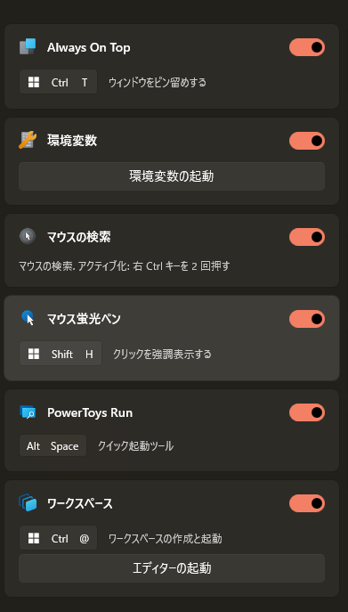
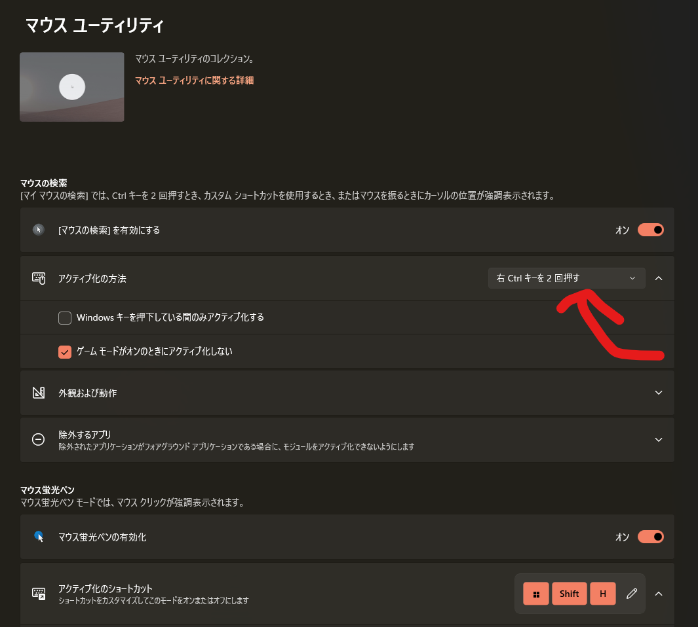

## 原因

原因は、**Microsoft PowerToys**です。

デフォルトでは、**Ctrlを2回押すと発生**します。知らないのにわざとやる動作ではないですが、うっかり2回押して画面が急に暗転！どうしよう！…はよくあるとおもいます。

何かしらの機能を有効にしているとおまけで付いてくるのか、デフォルトで誰でも有効になっているのかはわかりません。

## 無効化する方法

放置していても「マウスの周りが白くなり、他の部分は暗くなる」だけで特に害はないですが、Ctrlを間違えて2回押すことなんてよくありますので改造します。

Windowsキーを押し、「powertoys」と入れてEnterを押します。最初の画面にこいつがいるはずです。

使わないのであれば、これを無効化すれば終わりです。

## キーを変更する方法

…とはいえ、この機能、「100％絶対にいらない」というレベルのものでもないんですよね。モニターが大きかったり、マルチモニターだとマウスカーソルが迷子になるのは普通です。

「アクティブ化の方法」からすぐに変更できます。チョロい。「カスタムショートカット」なるものも使えるので、お好きなキーに割り当ててみてください。