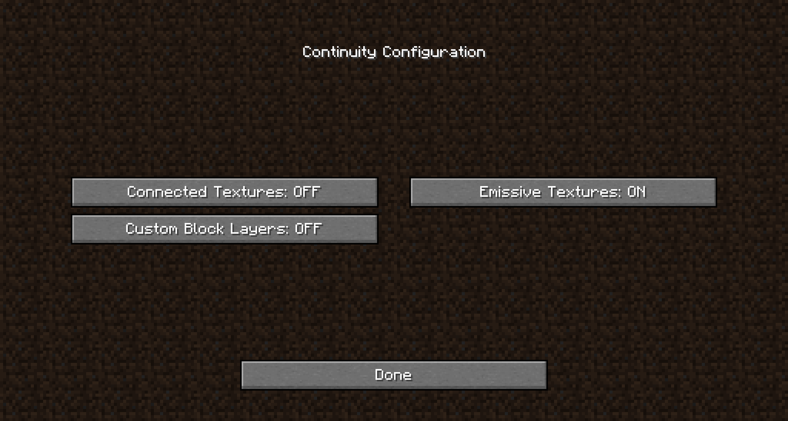

ここは別にMinecraftのブログではないのですが、英語の情報すらほとんど出てこないので書いてみることにしました。

# Sodiumとは？

## Sodiumの特徴
Sodiumは、Optifineよりも高パフォーマンスな軽量化MODです。Forge版はなく、Fabricのみで動作します。

バニラの状態と比較しても**3～5倍**程度FPSが向上し、Optifineと比べても優れた性能を発揮することで有名です。

かの有名なOptifineでももとの2～3倍FPSが上がるのに、それを上回る性能という恐ろしいMODです。
なお、Optifineは専用サイトからしか入手できませんが、Sodiumは普通に[Curseforgeから入手できる](https://www.curseforge.com/minecraft/mc-mods/sodium/files)のも良い点です。

## Sodiumの難点
しかし、いくつか難点はあります。

- Forge版がない
おそらく[今後の開発予定もありません](https://github.com/CaffeineMC/caffeine-meta/wiki/FAQ#where-are-the-forge-versions-of-your-mods)。
- 1.16.1以降しか対応していない
Curseforge上では1.16.1向けが最古となっています。なお、そもそもFabricは1.14～の対応なので、古いForge向けMODはもちろん使えません。
- Optifine標準機能がない
Optifineでは、それ単体を導入すると以下の機能が使用できます。
1. シェーダーパック（影MOD）の導入
1. ガラスなどの見た目をつなげる機能
1. **鉱石を光らせる機能**
Sodiumは軽量化の機能**のみ**を保持しており、Sodiumを導入するだけでは上記のいずれも使用できません。

# 鉱石を光らせる方法
さて、本題に入ります。鉱石を光らせる方法です。

結論から言うと、以下のMODが全て必要になります。

1. Fabric
1. Fabric API
1. Sodium
1. Indium
1. Continuity
1. Modmenu（任意）
1. 鉱石を光らせるリソースパック

順に見ていきます。

## Fabric API、Sodiumの導入
ググってください。この記事を見ている人でFabric APIとSodium入らない人いないと思います。

## Indiumの導入
Sodiumのアドオン（拡張）です。Sodiumが直接サポートしていない機能をサポートしています。

なお、あくまで拡張であるため**Sodiumの導入は前提**です。入っていないと動かないので気をつけてください。

[IndiumのCurseforgeページ](https://www.curseforge.com/minecraft/mc-mods/indium/files)からダウンロードできます。

## Continuityの導入
先程、Sodiumは「ガラスなどの見た目をつなげる機能」を持っていないと書きました。Continuityはその機能を持っているMODです。

そしてここが重要なのですが、このMODはガラスをつなげる機能だけで出なく、**鉱石を光らせる機能もサポートしています**。

[SodiumのGithubのIssue](https://github.com/CaffeineMC/sodium-fabric/issues/1370)を読んでいて気が付きました。

そして、このMODは**Indiumが前提**です。Sodiumは前提の前提ということになります。

[ContinuityのCurseforgeページ](https://www.curseforge.com/minecraft/mc-mods/continuity)からダウンロードできます。

## Modmenuの導入（任意）
導入しなくても特に問題ありませんが、入れておくと「ガラスのつなぎ目は別に繋がなくていい」とか設定できます。

デフォルトでは「ガラス・本棚のつなぎ目」「光るテクスチャ」「カスタムブロックレイヤー（効果不明）」が全てオンになっています。

## 鉱石を光らせるリソースパック
Optifineであれば導入直後に入れればいいのですが、Sodiumの場合modmenu以外上にあるMODをすべて導入して、ようやくリソースパックを入れる準備が整います。

「Optifine Required」と書いてあるものでもOptifineを入れなくて大丈夫ですので、そのまま入れましょう。私はこれを使っています。

[New Emissive Ores](https://www.curseforge.com/minecraft/texture-packs/emissive-ores-1-17)

### 注意
[OptifineとSodiumはおそらく互換性がありません](https://www.reddit.com/r/Optifine/comments/hzk9yd/is_sodium_a_performance_enhancing_mod_compatible/)。同時に入れないように気をつけてください。

# 完了！
ここまでやればしっかり鉱石が光っているはずです。実際にゲームを動かして確認してみてください。

ロードに時間がかかるかもしれませんが、正常な挙動です。スマホゲーでもやりながら待つのをおすすめします。個人的な印象としては割りと動作が重いな、という感じです。

お疲れ様でした！それではよいマイクラライフを！