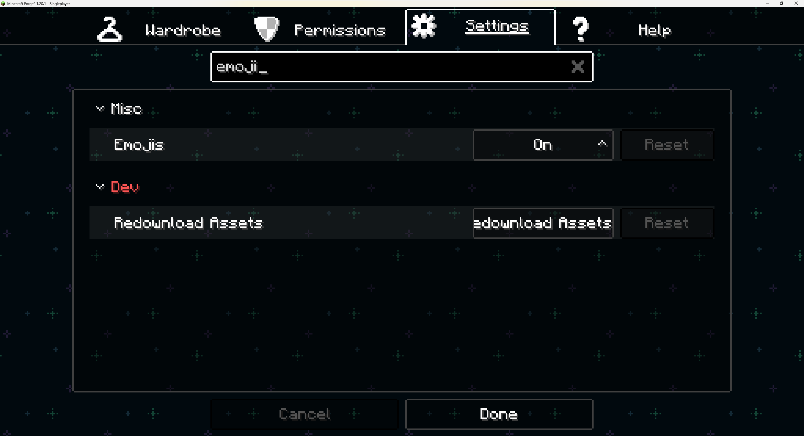
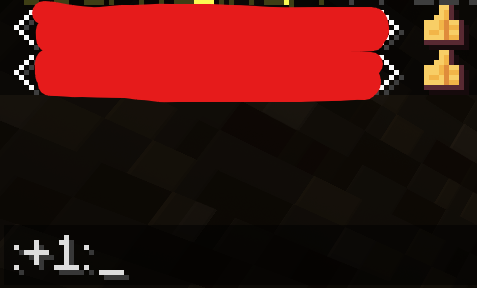

## Figuraとは

https://modrinth.com/mod/figura

こういうものです。キャラのアニメーションが増えたり、スキンのカスタムができたりします。クライアントサイドのMODのため、サーバー側で導入する必要はありません。

### 勝手に絵文字機能がついている…

マイクラに絵文字を増やすMODといえば、**Emojiful**が有名ですね。

https://modrinth.com/mod/emojiful

チャットで絵文字が使えるの、意外と楽しいものです。

しかし、Emojifulを入れてないのに勝手に絵文字が増えている、となればおかしいですよね。原因はおそらくFiguraかもしれません。

「Emoji」で設定検索をかけてみたら、確かに項目があります。MODの配布ページには一切書いてないのに。

`:+1:`といれるとたしかに絵文字になりました。ドットテイストでかわいい。

Tabキーでの入力補完には対応しているものの、それ以上のことは特に何もしてくれないようです。

## 注意：Embeddiumとは互換性なし

https://github.com/FiguraMC/Figura/issues/226

ちょっと古いIssueですが、Embeddiumとは互換性がないみたいです。手元で適当に作った構成で絵文字が出なかったため、「おろ？」となったのですが、こういうことだったらしいです。