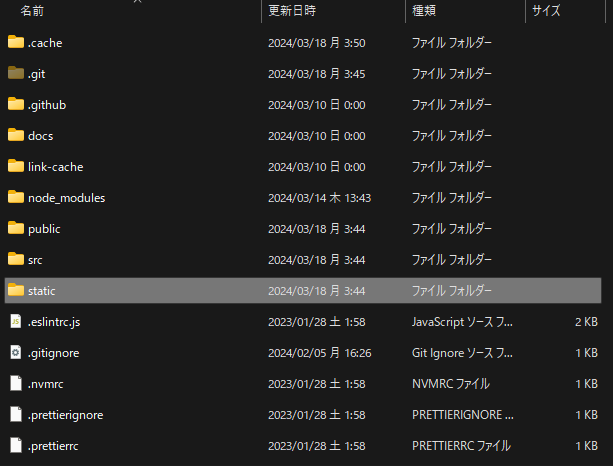

Keybase、使ってますか？日本では（多分日本以外でも）極めてマイナーなSNSですが、個人的には結構気に入っています。

さて、Keybaseでサイトが自分のものであると主張するには、例えば`https://yoursite.com/keybase.text`にテキストファイルを置かなければいけません。

Gatsbyでこれをやるのはすごく簡単なのですが、何故か手間取ってしまいました。備忘録として書いておきます。

## 結論

`static`という名前のフォルダをルートに置き、そこにファイルを入れてください。

このとき、srcの中ではなく、**ルートにおいてください**。つまりsrcと同じ階層においてください。

これ以外の場所に置くと失敗します。私のプロジェクトの場合はこの様になりました。

このstaticフォルダに適当に突っ込めばOKです。そうすると、サイトビルド時に`/public`に指定したファイルが出てきます。

エンジニアたるもの、手動でpublicフォルダにファイルをぶち込むなんてことはしないようにしましょう。ね。

### ファイル名に注意

…実は、この記事を更新してもなお承認できないままでした。

しかし、ファイル名が`keybase.txt`ではなく`keybase.text`になってしまっていることに気が付き、直しました。

バッチリ成功しています。皆さんもファイル名には気をつけてください。

## 他の用途

URLが変化してほしくない画像などを設置しておくのに便利です。ちょっとした画像素材、動画素材、テキストなどを保管しておくのにはいいんじゃないでしょうか。

このとき、リポジトリの容量上限にはくれぐれもお気をつけて。例えば、GitHubの容量上限は1リポジトリあたり10GBまでだったような気がします。

https://docs.github.com/ja/repositories/working-with-files/managing-large-files/about-large-files-on-github

…と思っていたのですが、別にそんなことはないようです。でも、良い子は常識の範囲内で使いましょうね。

## 参考文献

- https://www.gatsbyjs.com/docs/how-to/images-and-media/static-folder/