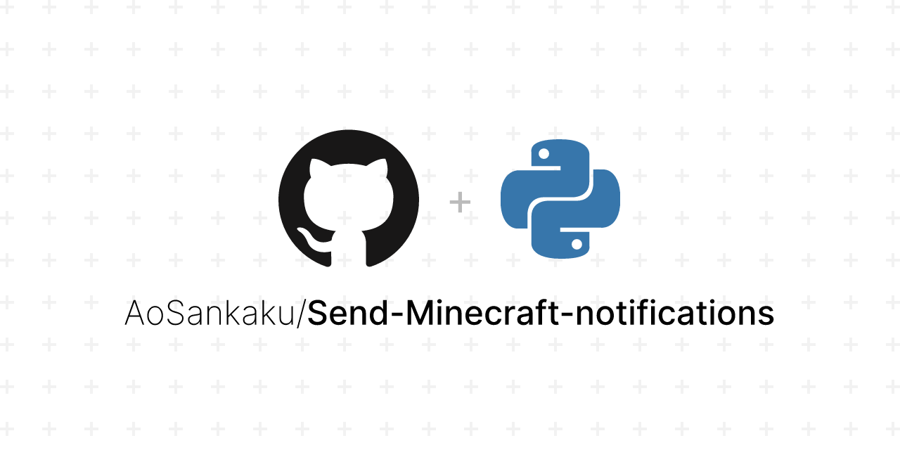

## 何故か日本語で情報が出ない

キーワードが思い当たらず、「github サムネイル」などのキーワードで悪戦苦闘し、見つけるのに20分程度を要しました。

「アレだよ！あの…アレ！思い出せん！」という方も、「そもそもそんなのあるの？」という方も、是非試してみてください。共有するときの見た目の良さが段違いです。

## 試作

こちらが試作です。




そしてこのリポジトリは、[マイクラサーバーの通知を自動送信する奴]()のものです（宣伝）。

こういう画像が、ポチポチするだけで作れます。パソコンすらいらず、スマホでも普通にできます。

なお、右側のプログラミング言語は自動検出です。

## 場所

https://socialify.git.ci/

このリンク先にあります。

言語は英語です。簡単に解説を加えておきます。

- Theme…ダークかライトか選べます。
- Font…フォント（文字の外見）を選べます。
- Background Pattern…よく見ると、背景にうっすら模様がついているのですが、それを変更できます。好みです。
- SVG Logo…SVG形式でロゴを指定できるらしいです。URLも行けるとのことで自由度は高いですが、著作権には気をつけましよょう。

### GitHubとは関係ある？

特になさそうです。サイト右上にあるGitHub猫のアイコンをクリックすると、以下のリポジトリに飛びます。

https://github.com/wei/socialify

Authorを見ても特にGitHub公式と関係があるわけではなさそうなので、ないと思います。リポジトリがGitHubにあるというだけです。

### 動的変化もイケる

例えば、PRやStarの数が変化したときに、APIを利用して動的に画像を変化させることができます。

```html

```

のように書くだけで、簡単に実装できます。なお、Markdownの場合も通常通り実装できます。


上の画像は、Starsが動的に動くようになっています。[このサイトのリポジトリ](https://github.com/AoSankaku/aosankaku.github.io)にStarをつけてからこのサイトをリロードすると、数字が変わっているはずです（露骨な誘導）。

ただし、GitHubはOGP設定時に静的画像しか受け付けないために、**この機能はOGPには使えない**ため注意しましょう。OGP画像には、Starの数などは含めないほうが賢明です。

他にもどうやら、URLで画像や内容を共有できるようです。すごい。間違えて保存せずに閉じてしまっても、履歴から遡れば同じ状態で復元できます。URLが共有できれば、同じ端末上である必要すらありません。

https://socialify.git.ci/AoSankaku/Send-Minecraft-notifications?font=Inter&language=1&name=1&owner=1&pattern=Plus&theme=Light

## なぜデフォルトにならないのか

これをGitHubの全リポジトリのデフォルトにすればいいのに…と思うのですが不思議です。なんででしょうね。

## 余談（もう一個あった）

たまたま似たようなサービス？サンドボックス？を発見しました。時々役に立つかもしれません。

https://og-playground.vercel.app

Playgroundと書いてあるため、カスタムをして使いたい場合はいいかもしれません。日本語フォントに対応しているかどうかなど全く検証しておりませんが、興味があれば試してみるのもいいかもしれません。