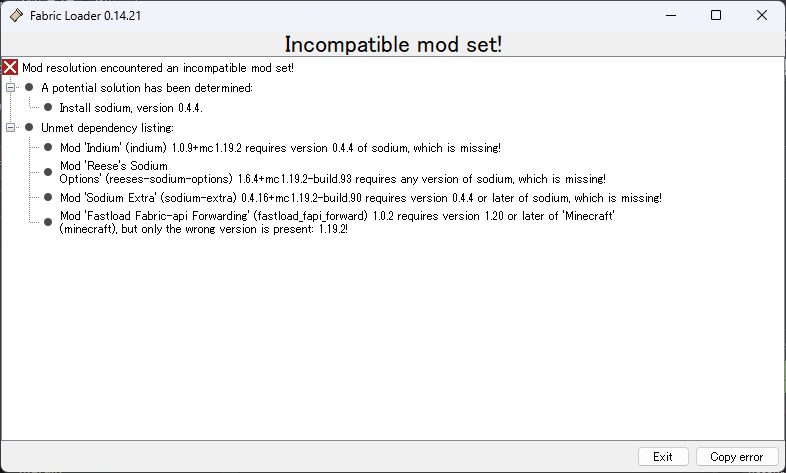

この記事ではMODを入れたことがない人向けに、MODを楽に入れる方法について説明しています。

「楽に」入れる方法に付いてのみ解説します。正攻法もありますが、面倒な上に非効率なので解説しません。（私もこの記事の書き方でしかやってません）

実は身内向け記事です。マイクラは持ってるけどMOD入れたことない、という人たちのために書きました。

<!--最後に入れること…エラー出るから…めんどくさ…-->
## 目次

```toc
```

## 過去に「GDLauncherいいよ！！」と私に言われた人たちへ
あのランチャーは以下の理由により、見限りました。必要なデータがなければアンインストールを推奨します。

- **たまにデータが消える致命的なバグが有る**（これが一番危険な要素）
- 動作がなんか全体的に不安定
- 勝手にログアウトする不具合がある
- マルチプレイ時に頻繁に認証に失敗する
- ランチャーの起動が遅い
- Modrinthに非対応（[今後も対応予定なし](https://github.com/gorilla-devs/GDLauncher/issues/768#issuecomment-886901324)）
- [今後クローズドソースになり、広告がつく可能性がある](https://gdlauncher.com/en/blog/curseforge-partnership-announcement/)
- これだけのバグが有るにも関わらず、半年間更新がない
- 日本語非対応

一応今回紹介するランチャーと比べてGDLauncherが有利な点もあります。

- 前提MODを勝手に入れてくれる（ただしバージョンが正確とは言ってない）
- Javaを入れるのが楽

でも基本知識があれば対処できることばかりです。なので特にこのランチャーに拘る必要はないかな、と思います。

## MODの基礎知識
「そもそもMODってなんだよ」という人向けに、簡単にMODの概要から説明します。  
「Forge」と「Fabric」について知っている人は読み飛ばしてください。

### そもそも「MOD」とは


もとは「Modification」という英単語から来ていて、広く「改造」を意味します。  
つまり、MODは別に**マイクラの専売特許ではありません**。  
PCゲームが好きな人達の間ではゲームを改造して遊ぶのが一般的であり、総称してMODと呼びます。もちろん、ここではマイクラMODについて説明します。

### MOD Loaderという概念
マイクラ（に限らず一般的なMOD）は、いくつかの理由があってそれぞれは直接ゲームをいじりません。「MODを入れるためのMOD」を介して、間接的にMODをいじります。  
これを「**モッドローダー**」と言います。「ビッグモーター」と響きがそっくりですね。

マイクラのMODローダーには大きく2種類あります。

#### Forge


言わずとしれた有名にして元祖MODローダーです。かなり昔のバージョンから存在しています。

かつてはForgeしかありませんでした。ゆえに、すべてのMODはForge向けだったのですが、ある日「Forge開発遅すぎィ！」という理由から他のMODローダーが爆誕しました。それがFabricです。

#### Fabric


「軽く、別バージョンへの移植が速い」という特徴を持ったMODローダーです。  
比較的最近に出たため、1.14～しか対応していません。

#### 互換性
ForgeとFabricは互換性がありません。  
つまり、「Forgeで動くMODはFabricで動かないし、Fabricで動くMODはForgeで動かない」ということです。

たまに例外はあります。
- 制作者が両方向けを開発している
- 特殊技術により、一つのMODファイルでどっちでも読み込めるようになっている
こういうときは使用できます。ありがたく使わせていただきましょう。

ただし、これは逆に言えば「Forge版しかないMOD」や「Fabric版しかないMOD」も、それなりの数で存在するということです。

#### おすすめは？
結論から言えば、使い分けてください。  
同時に合体させて使用することはできませんが、2つともインストールして使い分けることはできます。

それでも個人的なおすすめは、
- どうしても入れたいMODがある？
  - はい→そのMODの対応するMODローダー
  - いいえ→バージョンは？
    - 1.16.3以降→Fabric
    - 1.16.2以前→Forge

です。

#### なぜおすすめの切れ目が1.16.3？
Sodiumという優秀な軽量化MODが使える最小バージョンがそれだからです。  
軽量化MODといえばOptifineが有名ですが、この軽量化MODはその2倍以上の性能を発揮します。とんでもないですね。

#### そのMODローダーはどうやって入れるのさ？
この説明は省略します。これから入れてもらうソフトはForgeとFabricの両方を勝手にインストールしてくれるからです。

手動で入れたい人はググってください。なお、入れてもこれから下に書く作業は特に楽になりませんので注意してください。

#### 「前提MOD」について
MODは同じ人が何度も同じ処理を書くことを忌み嫌って、または他の人が開発した優秀なライブラリを使用したいと思って、前提MODを設定することがあります。

前提MODは **入れなければそのMODが動きません** 。

例えば、Sodiumという軽量化MODの拡張機能であるIndiumなどをSodiumなしで入れようとすると、以下の警告が出ます。



上の「A potential solution...」が解決法です（言語設定を日本語にすれば、ちゃんと日本語になります）。下の「Unmet Dependency Listing:」が問題の起きたMODになります。  
上にあるMODを導入するか、下にあるMODを消すかのどちらかでこのエラーは解消します。

なお、前提MODの必要ないMODも多く存在します。

## MODの入手方法
MODは基本的に配布サイトから保存することで入手します。

以下の2つが有名です。

### CurseForge


元祖配布サイトです。

注意してほしいのは、名前に「Forge」が入っているからと言って **Forge用MOD専用サイトではない** ことです。  
Fabric用のMODも普通にあります。

このサイトにMODを消されるなどして、運営方針に嫌気が差した人はModrinthに引っ越しています。

### Modrinth


ここ2、3年で人気が出てきた配布サイトです。  
このサイトにもForge用MODとFabric用MODの両方があります。

### 注意
基本的に、 **この2つのサイト以外からMODを入れてはいけません** 。  
いくつか理由はあります。

- 無断転載である可能性が高い
- ウィルスな可能性がある

CurseForgeやModrinthには掲載にあたり審査があります。

ちなみに、審査があると言っても100％ウィルスの混入を防げるわけではありません。**MODは全て自己責任**です。それを踏まえた上で読み進めてください。

ちなみに、ごく少ない例外もあります。

- Optifineは専用サイトでしか入手できません（CurseForgeにもModrinthにもありません）。
- Cocricot（オシャンティーな家具MOD）も同様です。
- 一部のシェーダー（影MOD）は、配布主のサイトにしかないことがあります。

## Prism Launcherの入れ方


### Prism Launcherって誰だよ
マイクラJava版にはランチャーというものがあります。簡単に言うと「マイクラ起動装置」ですね。

マイクラの公式ランチャーは、基本的にマイクラを改造しない人―つまりMODを入れない人―向けに設計してあります。  
MODを入れたデータと入れないデータを分けるためには、フォルダーを手動でコピーしなければなりません。相当面倒ですよね。

これを解決すべく生まれたのが「非公式ランチャー」です。非公式なのでMicrosoftやその他マイクラに関係する公式からのサポートは一切受けていませんが、MODを入れるのに最適な機能が多く入っています。

### インストールはどうやるの？

画像を貼って説明するのが面倒なので、以下の動画を参考に進めてください。

`youtube https://www.youtube.com/embed/UPxsCiMVaFE`

リンクと注意点、その他動画で触れていないところだけいくつか挙げておきます。

---

#### スペック足りる？
こればかりは一度起動してみないとわかりませんが、Sodiumがかなり優秀なのでそれだけで快適に動作する可能性はあります。  
5年前に買ったi3のノートPCとかじゃなければ大丈夫じゃないですか？

#### 必要な容量は？
Prism Launcher自体は超軽いです。ただし、MODを入れまくったマイクラで、調子に乗ってマップを探索しまくると容量が膨れ上がります。MODで遊び尽くしたい人はパソコンの容量にも目を向けましょう。  
マルチをするだけであれば、MODの容量もたかが知れているので対して確保する必要はありません。

#### Mac/Linuxでもいける？
いけます。Chromebookは無理です。

#### 日本語対応してる？
全部じゃないけど9割方対応してるっぽいです🗾

#### Prism Launcherのダウンロードサイトはどこ？
https://prismlauncher.org/
です。

#### Javaはどこから入れるの？
以下のサイトから入れてください。事情がなければ「64bit」版を入れましょう。

なお、両方入れても支障はありません。

##### Java 8（1.12.2など古いバージョンを遊ぶ可能性がある人）
https://www.java.com/en/download/
なぜこのURLからJava 8が入手できるのかは私もわかりません。

##### Java 17（最新版に近いバージョンを遊ぶ可能性がある人）
https://www.oracle.com/java/technologies/javase/jdk17-archive-downloads.html

#### Javaのデフォルトは8と17のどっちがいいの？
好みですが、17が個人的にはおすすめです。

#### 「インスタンス」って何？
「起動構成」とほぼ同じ意味です。  
インスタンスごとに、データはフォルダーごと分けてあり、そのインスタンスを消去したりワールドを増やす/消すなどしても他のインスタンスに影響が及ばないようになっています。便利。

なお、バニラのマイクラランチャーでは起動構成を変えてもフォルダーは（手動で変更しない限り）変わりません。

---

## MODマルチプレイの基礎
MODを入れたマルチプレイ、やりたいですよね。  
簡易的なやり方を紹介します。

### 前提知識

#### クライアントMOD
「ゲスト側で完結するMOD」の総称です。
- 軽量化系MOD全般
- 影MOD（シェーダー）
などが該当します。
#### サーバーMOD
これは「マルチをするときに、サーバー（ホスト）とゲストの両方に導入が必須」なMODのことです。
- アイテム、ブロック、MOBを追加するMOD
- その他マイクラの動作を変えるMOD全般
などが該当します。

つまり、MODを入れたマルチプレイをするためには
- すべてのサーバーMODを
- バージョンを全員で揃え
- 1つも抜けないように入れる
事が必要になります。

### MODを簡単に共有する方法
でもいちいち「MODとバージョン」を伝えて、リストにして、それを一つずつ入れてもらう作業を参加者全員にやってもらうのはあまりにめんどくさいものがあります。

そこで2つの解決法があります。

#### ModPack
MODの寄せ集めリストです。リストを共有すれば、これを元に勝手にMODを入れてきてくれます。

ただし、これには重大な欠点があり、MOD配布プラットフォームから消えた（消された）MODはエラーになり、手動で入れる必要があります。

#### Zipファイル共有
Prism Launcherは今のインスタンスをzipファイルに出力できます。  
バックアップにも役立ちます。

これを配布すればMODごと共有できるのですが、以下の点に注意してください。
- MODの再配布になる
  - MODはリストにならず、そのまま配布されます。二次配布を禁止しているMODもありますので、気をつけましょう。
- セーブデータを取り除かないと、ワールドごと配布される
- サーバーデータを取り除かないと、入っているサーバーごと配布される

### マルチができるようになるMOD


EssentialというMODがあります。これを導入すると、サーバーを立てなくてもマルチができます。  
詳しくは以下の動画を見てください。

`youtube:https://www.youtube.com/embed/bEtqq_DiNQc`

ちなみにこの動画ではForge版を入れていますが、Fabric版もあります。

## トラブルが起きたときは
以下に起きそうなトラブルをまとめておきました。困ったときに読んでください。

ただし、MODはそもそも自己責任なため、基本的にはググる習慣をつけておくと幸せになると思います。

### Prism Launcherでマイクラが起動しない
Javaのバージョンを間違えていませんか？現代のマイクラはめんどくさいことに、バージョンごとにJavaを変更しなければいけません。バニラランチャーでは自動で切り替えてくれますが、PrismLauncherはなぜか切り替えてくれません。めんどくさい。

| マイクラバージョン | 推奨Javaバージョン                                |
| ------------------ | ------------------------------------------------- |
| 1.7.10～1.16.5     | Java8またはJava11<br>※Java8とJava11は互換性がある |
| 1.17～1.17.1       | Java16                                            |
| 1.18～             | Java17                                            |

引用元：https://mcpoteton.com/mcserver/java-version-about

この表の通りバージョンを切り替える必要があります。

### MOD関係のマルウェアの情報ってどこで知るの？
Prism Launcherを起動したとき、下にニュースが出るようになっています。  
以下のような単語があった場合、MOD界隈でセキュリティ関係の問題が発生しています。

- Vulnerability（脆弱性）
- Warning（警告）
- Malware（マルウェア）

幸いにしてMOD配布プラットフォームが適正に審査をしてくれているので、こういう騒動は頻繁には起きません。  
しかし、直近では今年の6月に自己拡散型のマルウェアが発覚したりしています。  
自己防衛を怠らないようにしましょう。

### ModPack入れようとしたらエラーが出て入らないんだけど？
ModPackは実は中身はただのZipファイルなことが多いです。つまり、中身を覗いてMODだけ拝借できればどういうわけかModPackが読み込めなくても普通に導入できます。


### CurseForgeにもModrinthにもないMODを入れたい！
### パソコンを買い変える/初期化するので、データを引っ越したい

まず、マイクラの主要なファイルとフォルダーのリストは以下です。MODがフォルダーを作ることもあるため、同じ構造になっているとは限りません。

| 名前          | 種類       | 説明                                                               |
| ------------- | ---------- | ------------------------------------------------------------------ |
| config        | フォルダー | MODの設定が入っています。                                          |
| logs          | フォルダー | マイクラのログが入っています。                                     |
| mods          | フォルダー | MODが入っています。                                                |
| resourcepacks | フォルダー | リソースパック（テクスチャなど）が入っています。                   |
| **saves**     | フォルダー | ワールドのセーブデータが入っています。これが最重要フォルダーです。 |
| screenshots   | フォルダー | スクショが入っています。                                           |
| shaderpacks   | フォルダー | シェーダー（影MOD用）パックが入っています。                        |
| options.txt   | ファイル   | マイクラの設定が入っています。MODの設定はconfigに入っています。    |
| servers.dat   | ファイル   | 多分サーバーが入っています。                                       |

「data」とかいう名前のフォルダーは一見重要そうに見えますが、別に消えても構いません。多分。

データを移動させるときは、これらのフォルダーごと引っ越せば大丈夫です。というか、バラバラに管理するよりも`C:\Users\YourUserName\AppData\Roaming\PrismLauncher\instances`をまるごと圧縮してコピーしたほうが安心だと思います。

#### 注記
このサイトにあるクレジットなしの画像は、転載が許可されているか、またはこのホームページのサーバー上にない画像です。画像の著作権は、原則としてそれぞれの配信元または元サイトの掲載者に属します。

## 余談
上にある「ディレクトリ構造」のやつですが、ScrollHintを使いたいんですよね。

https://appleple.github.io/scroll-hint/

上の表はMarkdown文法で書いているんですが、これに`<div class="js-scrollable">`をかけると表ではなく文字の羅列になってエライことになってしまいます。

ここのMarkdownには最悪HTMLをベタ書きできるのですが、それは面白くない。なにかいい方法はないものか…と模索中です。  
普通に検索して「gatsby-transformer-remarkでmarkdownから生成したtableが横長だったときにscrollhintを自動的に適用する方法」なんて出てくるわけないんですよ。よかったら助けてください。

それと、上みたいにリンクをベタ貼りしたときもリンクじゃなくてブログカードで表示するようにしたいです。これは改造するしかないんですかね？

https://note.shironekoworks.com/gatsby-simple-blog-card/

神記事を発見しました。でも動きません。ぴえん。

他に、ZennやQiitaで見かける「警告」「注意」「情報」エリアも欲しいですね。
