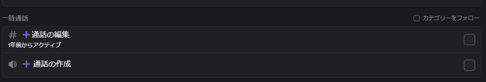
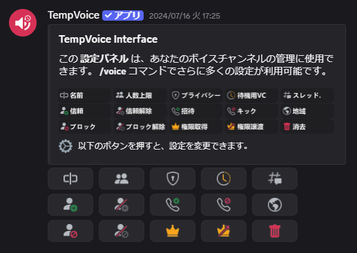
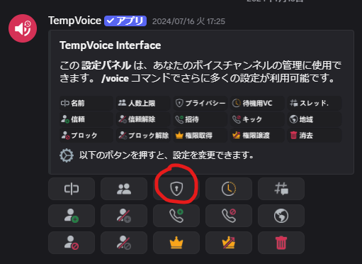
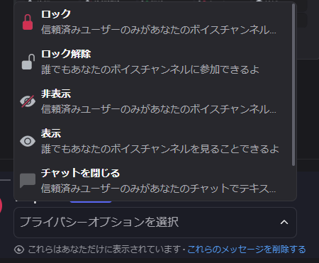

**TempVoice**というBOT、ご存知ですか？

https://TempVoice.xyz/ja

日本語圏では全然話題になっていないこのBOTですが、**一時的な通話部屋**を作ることができるすごいやつです。

しかもこれ、サーバーの管理者じゃなくても通話に参加できる人、できない人、人数などを自由に変更できます。かなり自由度が高く、特に中～大型（50人以上ぐらい）のコミュニティでとても使い勝手がいいです。

## 【注意】コミュニティサーバーでは早めに入れたほうがいい

Discordには「コミュニティサーバー」というものがあります。これをオンにするとチャンネルの表示・非表示（フォロー）を、参加者が自在にオンオフできるようになります。

コミュニティサーバーだと参加時にデフォルトでいくつかのチャンネルをフォローしますが、**参加後にチャンネルを増やすと自動でフォローしない=チャンネルを作っても気づかれない**という現象が発生します。

そのため、追加が遅くなった場合はお知らせチャンネル的なところでカテゴリーをフォローする方法（後述）を作ってあげましょう。

## 入れ方

やり方は2段階です。

1. BOTを招待する
2. BOTが使うカテゴリーを選択する

これだけです。

## 使い方

まず、「通話の作成」に入ります。

そうすると、勝手に通話が移動するはずです。

これで、新しくできた**一時通話チャンネル**に飛びます。0人になると勝手に消滅しますが、今後行った設定はずっと引き継ぎます。

### 通話の編集

通話の設定変更は、「通話の編集」チャンネルで行います。通話に入っている状態じゃないと効果がないため、入りっぱなしで行いましょう。

それぞれのボタンの役割は書いてあるとおりそのままです。

### よくある設定

#### 通話の名前を変えたい

ここを押すだけです。

ただし、**短時間に何度も変更できません**。特に誤字に注意。

#### 許可制の通話にしたい（許可してない人は、そもそも通話が見えないようにしたい）

まず、「プライバシー」を押します。

その後、 書いてある説明まんまですが、「プライバシーオプション」から「ロック」を選びます。

この状態だと誰も通話に入れないため、続けて「信頼」ボタンを押して招待したい人を選んでください。

なお、この状態だと通話には入れないものの「通話をしている」というのは見えます。「非表示」にすると、信頼した人以外にはバレないようにできます。

#### 嫌いなやつを通話に参加できなくしたい

…この使い方ができてしまうので、あんまり小規模なサーバーや中学生ぐらいの若い子が集まるサーバーに入れるのはおすすめできません。いじめの温床になりますからね。

しかし、「あいつマジでうるさいから来てほしくない」みたいなことはそこそこあると思うので、使い方はちゃんと紹介します。「ブロック」を押してユーザーを選ぶだけです。Discordのブロックじゃなくて、TempVoiceのブロックですよ。

#### ◯人だけの秘密通話にしたい

「上限人数」から上限をつけるだけでOKです。

### 注意︰管理者（通話の移動権限）を持っている人は非表示・入室不可を貫通できる

これはDiscordの仕様なのですが、人数上限やBANは「通話の移動」権限を持っている人は**貫通できます**。どうしても極秘の話をしたいときはDM通話したほうがいいと思います。

ただし、「チャンネルの管理」を持っていなければすべてのチャンネルが見えるわけではないので、そもそもチャンネルが見えない「許可制通話」でどうなるのかは知りません。多分見えないと思います。

## 簡単ですわ〜〜〜！！！

というように、超簡単に通話部屋を作ることができます。これで「3人用通話」とか「秘密の通話部屋」とか「お砂糖」とかいちいち作らなくても良くなるというわけですね。

TempVoice、ぜひ使ってみてください。超便利ですよ。

https://TempVoice.xyz/ja