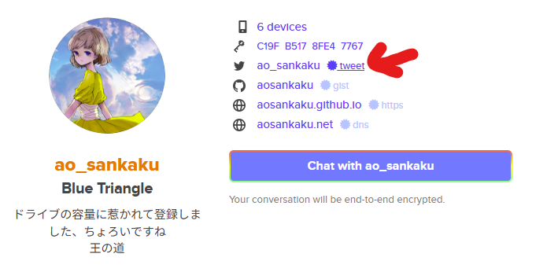

Misskeyには、時々**Keybase Saltpack**という謎の文字をおいている人たちが存在します。どうしてこんな物があるのか、そもそもコレは何なのかについて簡単に説明していきます。

## Keybaseとは？

https://keybase.io

そういうアプリ（サービス）です。暗号化系のあれそれを提供したり、ドライブやチャットなども提供したりしています。

Keybaseは、謎に250GBもの巨大ストレージを無料で我々に押し付けてきます。このためだけに登録するのもアリだと思います。

「Keybase」というサービスは聞き慣れないかもしれませんが、この会社は**Zoom**に買収された子会社です。オンラインミーティングのZoomですよ。

### Saltpackとは

Saltpack自体はKeybaseの独自謎暗号化技術ではなく、一般公開のアルゴリズムによるものです。

https://saltpack.org

## Keybaseを使った本人確認の意義

SNSで「力道山」というアカウントを作成したとしても、それが本当にあのプロレスラーの力道山であるとは限りません。同様に、Misskeyで「与謝野晶子」という名前で活動している人が、著名な歌人である保証もありません。

ここでKeybaseとの連携が意味を持ちます。Keybaseで作成した「力道山」アカウントと、Misskeyの「与謝野晶子」アカウントを紐付けることで、「このMisskeyアカウントの持ち主は、Keybase上のこのアカウントも所有している」という情報を公開できます。

さらに、Keybaseアカウントが他の信頼できるプラットフォーム（例えば、フォロワー数の多いTwitterアカウントや長年の活動歴があるRedditアカウントなど）と連携していれば、「Keybaseの力道山は、影響力のあるTwitterの与謝野晶子と同一人物である可能性が高い」という推測が可能になります。**多くの外部アカウントと連携することが、Keybaseによる本人確認の信頼性を高める鍵**になるんです。

## Keybaseで何ができる？

### 署名ができる

Keybaseの重要な機能の一つに、デジタル署名があります。Keybaseアカウントの秘密鍵を用いてテキストに署名することで、特定の文字列がそのKeybaseアカウントによって作成されたことを証明できます。

しかし、Keybaseアカウント自体が本当にその人を表しているのか、第三者には判断できません。そこで重要になるのが、アカウント連携の機能です。

### アカウント連携ができる

というわけで、Keybaseに結びつけるアカウントの連携を増やしていく必要があります。例えばTwitter（旧X）の場合、仕組みはこうです。

1. Keybaseにログインする
2. 署名鍵による署名の入った指定文字列をツイートする
3. Keybaseがそれを確認する
4. 認証完了！

…という流れです。これにより、少なくとも「Keybaseの認証文字列をツイートした人＝そのTwitterアカウントの持ち主」ということになります。

https://twitter.com/ao_sankaku/status/1652739626086576128

ちなみにこれは私の署名入りツイートです。これを消さない限り、このアカウントはKeybaseと紐づきます。

### 「アカウント連携」はすべて手動

アカウント連携は、例えばTwitterのアプリやGitHubのログイン認証のようなシステムではなく、手動でファイルやテキストを上げる必要があります。

少し不便ですが、逆に言えばこれにより**誰でも検証できる形でKeybaseの認証を確認できます**。例えば、上のリンクの私のツイートはKeybaseから辿れるのですが、これはいつでも誰でも確認できます。



https://keybase.io/ao_sankaku

## KeybaseでMisskeyアカウントの所有を証明しよう

というわけで、ここまで「下準備」です。過去にTwitterをやっていた（今やっていてももちろんOKです）ならそれを連携し、自分のサイトを持っていたりするならそれも連携しちゃいましょう。連携すればするほどKeybaseアカウントの信頼度は上がります。

しかも、KeybaseアカウントからTwitterやサイトのデータを操作しているわけではないので**危険性0**です。断言できます。

### MisskeyはTwitterと同じ方法で認証できない

ここで、Misskeyユーザーが「Keybase Saltpack」なる謎の文字列を公開している理由が浮かびます。**Keybaseは、Misskeyの認証に対応していない**のです。

Keybase純正の認証であれば、

```
Keybaseアカウントの持ち主
↑所有　所有↓
Twitterアカウントの持ち主
```

が証明できます。MisskeyはKeybase側が認証に対応していないため、

```
Keybaseアカウントの持ち主
↓署名による証明
Misskeyアカウントの持ち主
```

という一方通行の認証になります。

ここでKeybaseが「自称・力道山」だったらなんの説得力もありません。他方、Keybaseアカウントの身元がしっかりしている（＝活動実績のあるアカウントと紐づいている）ならば**一方通行の認証でも問題ない**、というわけです。

### 署名をしよう

長々と書きましたが、署名は簡単です。

https://keybase.io/sign

ここに

```
myaccount@misskey.example.com は俺のアカウントです！！！！！！
```

と書きましょう。IDや文面は変えてください。

#### なぜ適当な内容ではいけないのか

別に署名すれば本人性が証明できるのだから、

```
レターパックで現金送れ
```

を署名してもいいじゃないか、と思うのはマズいです。

なぜなら、この署名は一方通行なため、「『レターパックで現金送れ』を力道山が署名した文字列」から分かる情報は、この字面以上のものはありません。

これが本人性の証明になるなら、例えば私（筆者）がこの「署名付きの文字」を**コピペしてプロフィールに載せてしまえば、それで私＝力道山のなりすましが完成する**、ということになってしまいます。なので、適当な文字列を署名してもMisskeyアカウントの有効性は証明できないのです。

署名するテキストには、必ず「このアカウントは自分のものである」という文字列を入れましょう。

## まとめ

**適当な署名文字列をおいてプロフィールに載せても、なんの証明にもなりません！**

私が言いたいのはそれだけです。気をつけましょう。