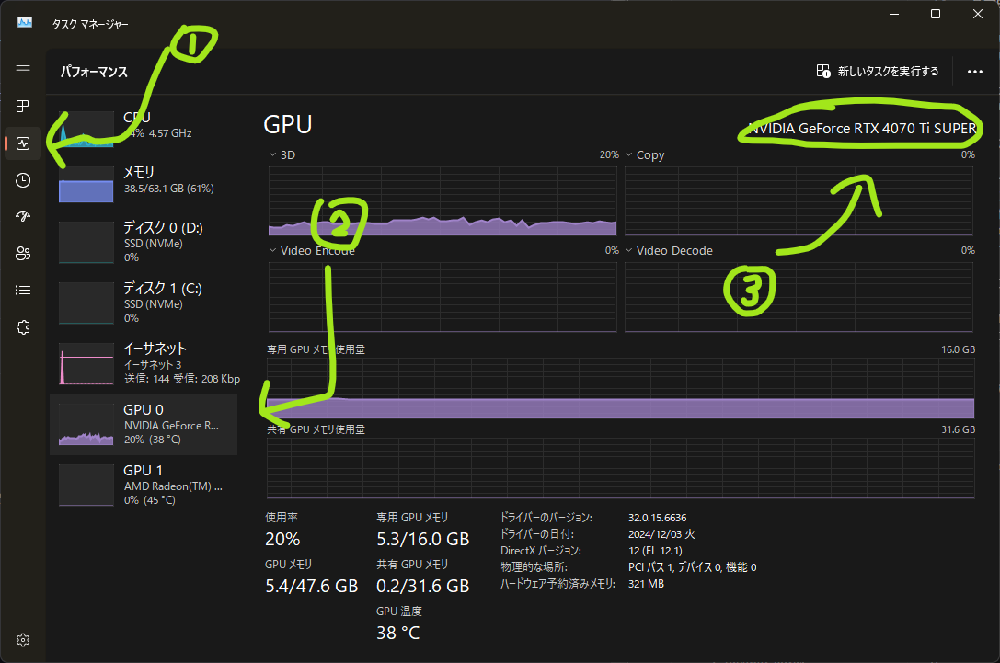
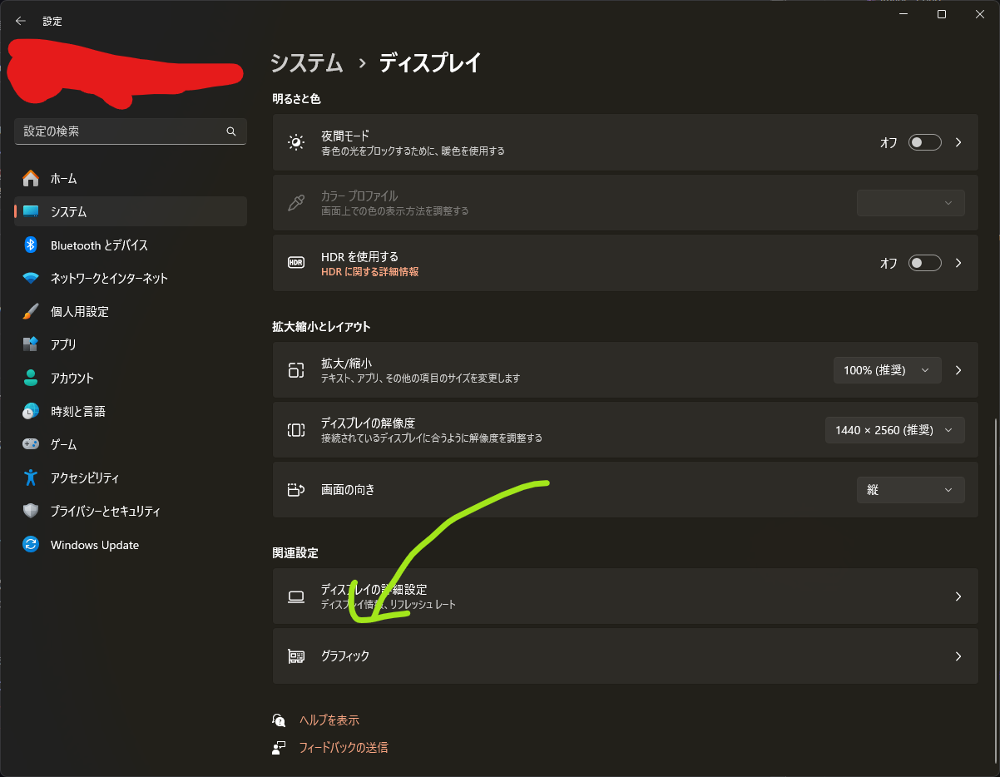
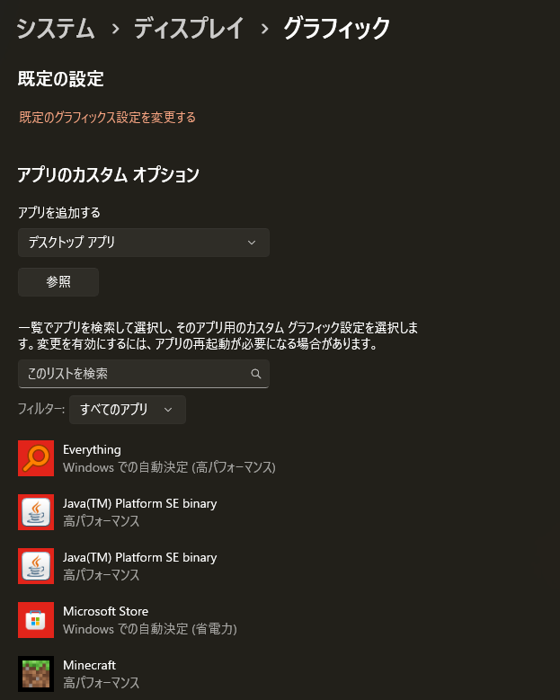
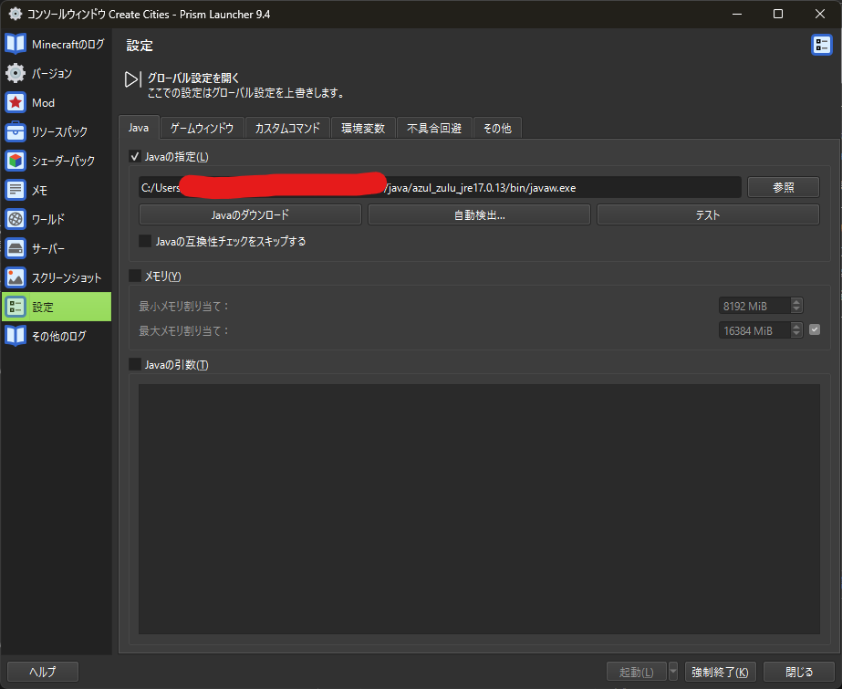
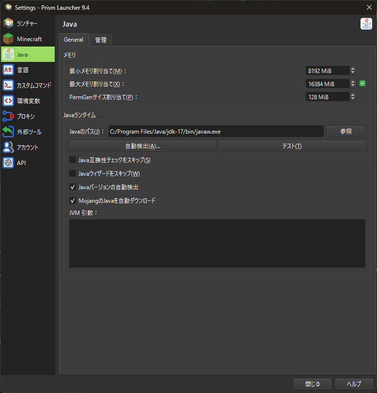
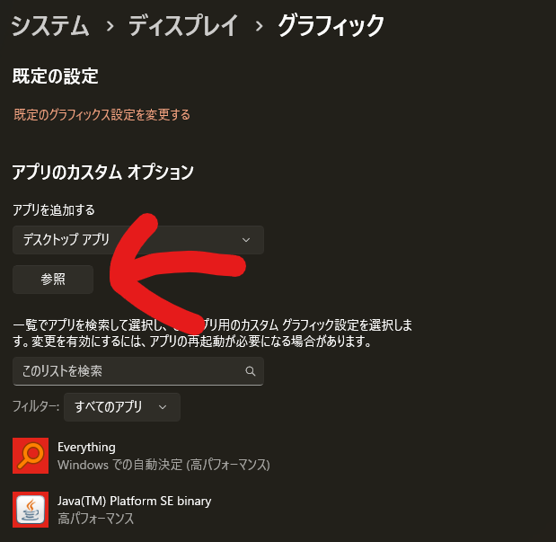
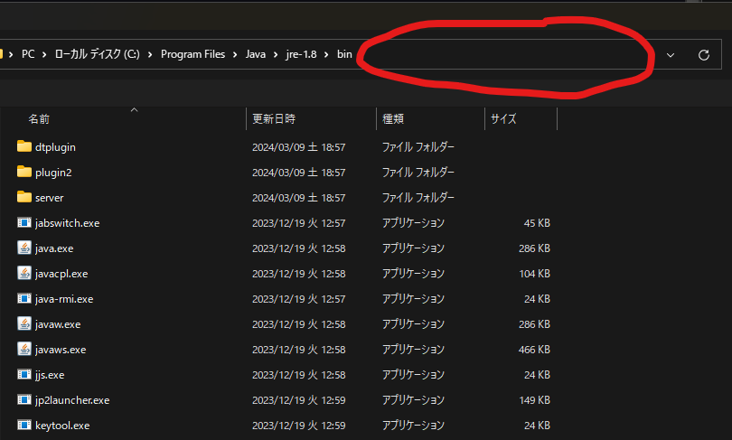
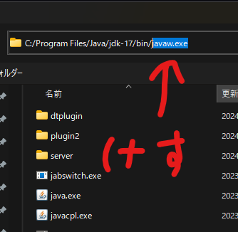
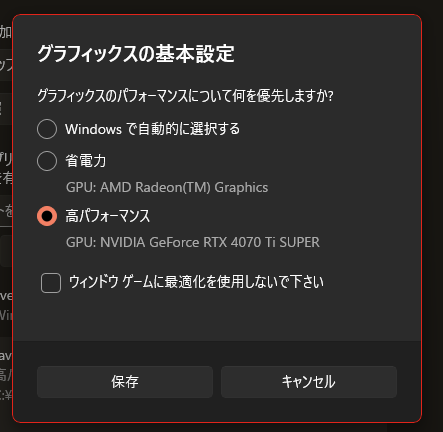

マイクラは、実は結構特殊なゲームです。それだけに、「ちゃんとグラボが使えてないんだけど」という問題が起こりがちです。

今回は「グラボを使っているか確かめる」と「グラボでマイクラが動くように指定する方法」を見ていきます。

## グラボを使っているかどうか確かめる

基本的に、ゲーミングパソコンはもちろんモノにもよりますが

- CPUに内臓のグラフィック（弱い）
- GPUのグラフィック（強い）

の2つが同時に動いていることがあります。この事自体は問題ないのですが、マイクラは自動的にこの2つを使ってくれるとは限りません。特に、カスタムランチャー（公式の「Minecraft Launcher」以外）を使っている場合はなおさらです。

確認方法は簡単で、

- マイクラを開きながら
- タスクマネージャーを開く
- 左側の「パフォーマンス」を押す
- 「GPU0」「GPU1」の2つの表示があることを確認する
- グラフが大きい方のGPUの名前を確認する

GPUの名前を確認するときに、

- 「NVIDIA」「Intel Arc」「RX」のどれかが書いてあれはGPUです。
- 「Intel UHD」「Iris Xe」「AMD Radeon(TM) Graphics」と書いてあれば、それはCPU内臓のグラフィック（弱い）です。

そして、マイクラ起動中にGPU側のグラフが大きくなっている（使用率が高い）場合は正常です。そのままお帰りください。

そうではない方（内蔵グラフィックのほうが大きい人）は、ちょっと設定を変える必要があります。

### Windowsの設定を開く

Windowsの設定→「システム」→「ディスプレイ」→下にスクロール→「グラフィック」

を選択します。

そうすると、だいたいこんな画面になるはずです。

マイクラをGPUで動かすには、

- マイクラが動いているexeファイルである**javaw.exe**を探し出し
- 「参照」ボタンからそこに行き、「高パフォーマンス」に指定する

必要があります。

### Prism Launcherのjavaw.exeの調べ方

この記事ではPrism Launcherでのやり方について説明します。それ以外を使っている方は気合でなんとかしてください。

起動構成を選択し、右クリックするか右のメニューから「編集」を押します。

ここにパスが入っている場合、この文字列をコピーします。

入っていない場合（グローバル指定の場合）は、Prism Launcher本体の設定を参照します。

この「javaのパス」をコピーしてください。

javaw.exeのパスが分かったら、「アプリのカスタム オプション」のところにある「参照」ボタンを押します。

そうすると、こんな画面が出ます。

そうしたら、この上のところの空白部分をうまいことクリックし、コピーした文字列を貼り付け、**javaw.exeの部分は削除**してEnterを押しましょう。

そうしたら目的のフォルダが開けるので、「java**w**.exe」を探して右下の「追加」を押してください。java.exeではありません。java**w**.exeです。

追加できたらその追加したアプリをWindowsの設定でクリックして、この画面を出します。

あとはおわかりですね。

## 感想

Prism Launcher側でこれも自動でやってくれるようになんないかなあ…