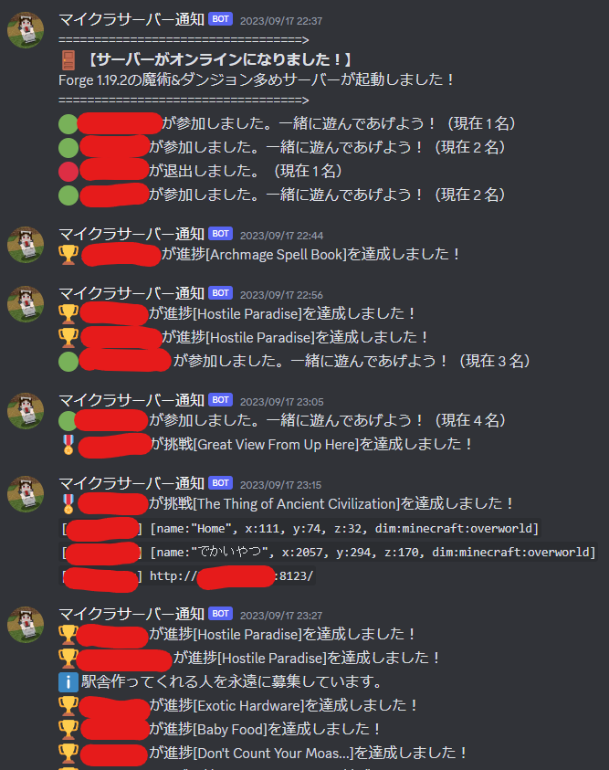

嘘つきました。正確には作っていません。超大幅な改良を加えました。

# 簡単に使えるサーバー通知BOTがほしい！
## サーバー参加者のモチベの問題
最近、訳あってマイクラサーバーを開いたり閉じたりしています。

参加者視点では、「今サーバーに人がいるのかどうか」というのは結構重要だったりします。やっぱり人がいるときのほうが「行きてえなあ…行きましょうよ」ってなりやすいですからね。しょうがないですね。

しかし当然のことながら、マイクラサーバー自体にはそういう通知をしてくれる機能などありません。プラグインならあります。

https://www.spigotmc.org/resources/discordsrv.18494/

でも、多様なバージョンを使用していたり、MODサーバーなどを使っていたりすると常に使えるとも限りません。そのため、**どんな環境でも使えるものを**…と開発をはじめました。

## 要件
技術の選定に当たり、以下を重視しました。
- batまたはshでないこと
  - 単純にUbuntuとWindowsで交互に互換性がありません。基本的にはUbuntuで動かすとは思いますが、デバッグの容易さや個人が自宅でポート開放して小さいサーバーを開く状況を考えると、OSに依存せず動かせるものが理想です。
- バニラ、Forge、Fabric、プラグインサーバーのいずれでもうごく普遍的（ユニバーサル）で独立（スタンドアロン）なスクリプトであること
  - BOTではこれは不可能です。また、BOT作成の手間も結構あります。正直言って小規模サーバーを作るためだけにBOTを作成するのは結構だるいです。
- Webhookを使用すること
  - これができるとDiscordでの通知が簡単になります。BOT作成の手間もいらず、スマホからでも多分できると思います。

## 方法
具体的に、マイクラのログを取得するのは面倒に見えます。しかし、いくつかの方法で取得することはできそうです。

1. マイクラサーバーの標準出力を受け取り、それを元に処理を行う
  - ブログを書いている今思いついたアイデアなのですが、[ありました](https://qiita.com/yutake27/items/033155608d64eac0adc2)。
  - こっちで作ってみてもいいかもしれない…というかこっちのほうが断然簡単じゃない？あーしくった……😫
2. マイクラ標準のログを利用する
  - マイクラは「latest.log」というファイルを都度出力します。これを監視して通知に加工してやろう、という算段です。

今回は2番を採用しました。まじでなんで1じゃなくてこっちを改造したんだろう。馬鹿じゃん。今度また2.0として気が向けば作り直しますが、あまりのショックに作らない可能性があります。萎えた。

## あった
ひとまず「Discord minecraft サーバー 通知」とか、そんな感じで適当なキーワードで検索したら出てきました。コレです。

https://qiita.com/somakai_sumasi/items/6dc76c5eaabe53c8118e

https://github.com/somakai-sumasi/Send-Minecraft-notifications

しかし、大量のバグや問題点がありました。

- latest.logは1行ずつ更新するとは限らないため、複数行更新すると一気に意味がわからなくなる
- サーバーの起動、閉鎖に関するログが流れなかった
- `README.md`が充実していないために、使い方がPythonを知らないとよくわからない

ということで、これを超大規模改修して、実用に足る水準まで上げました。



実用するとこんな感じです。中々でしょう？

## 改造した内容
https://github.com/AoSankaku/Send-Minecraft-notifications#send-minecraft-notifications%E6%97%A5%E6%9C%AC%E8%AA%9E%E8%AA%AC%E6%98%8E

ここにすべてを置いてきました。使い方から変更点まですべて書いてあります。つまりこの記事はただの宣伝用です。ハハハハ。

## まだ残っている問題点

### 死亡メッセージが正確に取得できない

死亡メッセージは、非常に力技で取得しています。それは、

- システムメッセージで、
- プレイヤー名の右に「died」や「was」が続くもの

を機械的に判定して拾っているからです。バニラであればおそらく漏れませんが、MODで死亡理由が新しく増えたりすると正直わかりません。

### ごく一部のプレイヤーの死亡ログが取得できない

例えば、初期設定だと「ChunkTaskScheduler」「STDOUT」「Simple_Harvest」さんのsayコマンド経由のチャットは届きません。

…こんな名前の人はおそらく皆さんの友人知己にはいないと思いますが、まあ一応です。

### 日付をまたぐと、メッセージ送信までにラグが発生する

日付をまたぐと、メッセージが届くまでにラグが生じます。

### ライセンス

このスクリプトには超重大な問題点があります。フォーク（コピー）元が**ARRライセンス**（すべての著作権を保有するAll Rights Reservedのこと）です。

そのため、このスクリプトはいつ公開が止まってもおかしくありません。

…と思っていたのですが、ちょうど1ヶ月前にライセンスの更新があり、MITライセンスになりました。

https://github.com/somakai-sumasi/Send-Minecraft-notifications?tab=MIT-1-ov-file

もしかすると、私が勝手にフォークして魔改造していることに気づいたのかもしれません。気まぐれかもしれませんが、非常にありがたく思います。

懐の深いお方です。以下にその方のプロフィールを貼っておきます。

- Github：https://github.com/somakai-sumasi
- Twitter（旧X）：https://twitter.com/somakai_sumasi

## 気軽に使ってみてね！

特にこれを使うのに許可などは必要ありません。勝手に使ってください。使い方はすべてREADME.mdに記してあります。

https://github.com/AoSankaku/Send-Minecraft-notifications#send-minecraft-notifications%E6%97%A5%E6%9C%AC%E8%AA%9E%E8%AA%AC%E6%98%8E

マイクラサーバーのディレクトリに行き、

```cmd
git clone https://github.com/AoSankaku/Send-Minecraft-notifications.git
```

って打ってから、Windowsであればダブルクリックして、UbuntuであればScreenなどで別枠起動すればOKです。初期設定などはリポジトリをご覧ください。2回書くのは面倒です。

「おい！バグあるやんけ！」と思ったら、遠慮なく修正してもらってOKです。MITライセンスですから。知識のある方は、よろしければPRなどしていただけると助かります。
