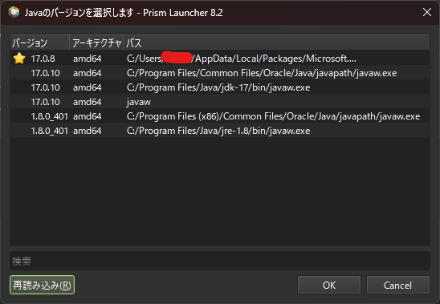
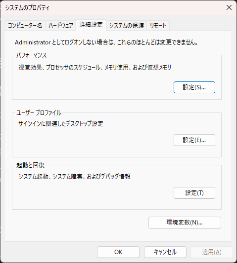
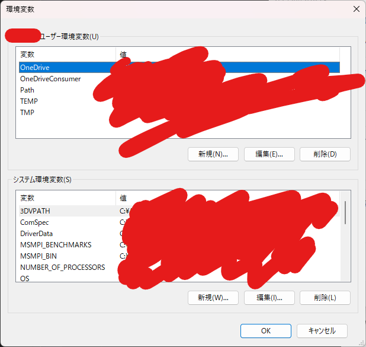
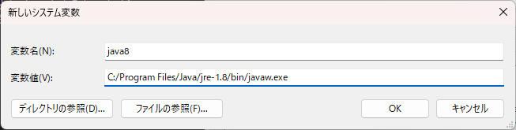
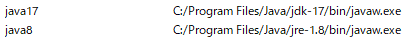

いくら「マイクラ サーバー java 切り替え 方法」で探しても目的の記事が見つからない、そこのあなたに向けた記事です。ちゃんと「Java本体のバージョン」を切り替える方法を説明します。

1.12のサーバーで遊んだり、他方最新版でも遊ぶことがあるという人にまさにおすすめです。

Windows向けの記事ですが、多分Ubuntuでも類似の方法でいけます。

## 前提

Javaは、Java8とJava17を**両方**入れておいてください。「どっちが先/後」かは問いませんが、強いて言うならよく使う方を後に入れたほうがいいでしょう。

万が一両方とも入っていないのであれば、[この記事](../how_to_install_mods_for_friends/#javaはどこから入れるの)から入れてください。

## 「環境変数」というもの

マイクラサーバーをWindowsで開く変態の方々であれば、**環境変数**という単語自体は聞いたことがあると思います。

実は、この環境変数は**batファイルから読み出すことができます**。

そのため、今からやることを簡単にまとめれば、

1. java8とjava17をそれぞれ環境変数に登録し、
2. `bat`ファイルにそれを記して読み出す

というものになります。

これにより、古いバージョンのマイクラサーバーを開くためだけにJavaの再インストールを一々しなくて良くなります。

## Javaの場所を確認する

環境変数にJavaの場所を登録するためには、当然Javaの場所を知らなければなりません。いくつか方法があります。

### 上のリンクから入れた場合

インストール時に場所を勝手に変更していなければ、Java8のパスは

```
C:/Program Files/Java/jre-1.8/bin/javaw.exe
```

Java17のパスは

```
C:/Program Files/Java/jdk-17/bin/javaw.exe
```

です。

ちなみに、「JDK」というのは「Java Development Kit」のことです。「JREじゃないんか！？」となるかもしれませんが、JDKにはJREが入っていますので全く問題ありません。JRE17を入手するためには非常に面倒な会員登録の手間がかかるため、JDKを入れるほうがおすすめです。

### Prism Launcherから確認する

Prism Launcherには、Javaの場所を自動検出する機能があります。適当に「自動検出」をポチッと押すだけでいけます。



ここに一つだけ「javaw」という`C:/NantokaKantoka`で始まらない異色のパスがあります。**こいつがまさに環境変数です**。これを今から手動設定します。

## 環境変数を設定する

**重要：環境変数は追加すること自体は問題ありませんが、間違えて既にあるものを変更したり削除してしまうと、他のアプリが正常に動作しなくなることがあります。操作は慎重に行ってください。失敗しても私は責任を負うことができません。**

最初に、環境変数設定ウィンドウを開きます。Windows11の方は「Windowsキー」を押したあとに「env」と入れると「システム環境変数の編集」という物が出てくるので、それを選択します。未だにWindows10の方は知りません。[自分でググってください](https://qiita.com/ryo-sato/items/e24c81eca6ffe9db3fb0)。



この画面が開けば成功です。右下の「環境変数」を押します。



こんなのが開けば成功です。「ユーザー環境変数」でも多分動きますが、「システム環境変数」に追加したほうがユーザーをまたげて楽だと思います。



「新規」を押して、ノリで追加していきましょう。名前は好きなものをつけてください。

このとき、**スラッシュ（/）はバックスラッシュ（\）に必ず書き換えてください。これを忘れると認識しません。**（1敗）



こんなふうになればOKです。右はJavaのパスが異なる場合は、各自指定してください。

ちなみに、環境変数を設定することを業界用語で「pathを通す」といいます。詳しく知りたい方や、この記事でわからなかった方はご自分でも調べてみてください。

## 起動ファイルから環境変数が読めているかテストする

```batch:name=test.bat
echo %java17%
pause
```

と書いて、動くか確かめます。「java17」の部分を他の名前にした人は、その名前を入れてください。最後に「pause」を入れないとすぐに画面が消えるので注意。

```batch
C:\Program Files\Java\jdk-17bin\javaw.exe
```

と出れば成功です。なお、

```batch
ECHO は ＜ON＞ です。
```

と出た場合、上に太字にした「スラッシュをバックスラッシュにする」を忘れています。直してください。環境変数を選んで「編集」を押せば簡単に編集できます。

## マイクラ起動コマンドを打つ

マイクラサーバーの起動に必要な最小限の命令は、

```batch
java -jar <サーバーファイル名>
```

です。この「java」は、当然デフォルトの場所を示しているため、書き換えてやる必要があります。

やり方は非常に簡単で、

```batch
"%java8%" -jar minecraft_server.1.12.2.jar
pause
```

```batch
"%java17%" -jar minecraft_server.1.12.2.jar
pause
```

と打つだけ。

`%java8%`で環境変数を読み込み、`""`で囲うことで`%java8%`の中身を文字列として認識させています。まともなプログラミング言語であれば「%java8%」という文字列になると思うのですが、バッチはよくわかりませんね。

### エラーについて

上記コマンドを実行すると、

```
java.io.IOException: ハンドルが無効です。
	at java.io.FileInputStream.readBytes(Native Method) ~[?:?]
	at java.io.FileInputStream.read(FileInputStream.java:276) ~[?:?]
	at java.io.BufferedInputStream.read1(BufferedInputStream.java:282) ~[?:?]
	at java.io.BufferedInputStream.read(BufferedInputStream.java:343) ~[?:?]
	at sun.nio.cs.StreamDecoder.readBytes(StreamDecoder.java:270) ~[?:?]
	at sun.nio.cs.StreamDecoder.implRead(StreamDecoder.java:313) ~[?:?]
	at sun.nio.cs.StreamDecoder.read(StreamDecoder.java:188) ~[?:?]
	at java.io.InputStreamReader.read(InputStreamReader.java:177) ~[?:?]
	at java.io.BufferedReader.fill(BufferedReader.java:162) ~[?:?]
	at java.io.BufferedReader.readLine(BufferedReader.java:329) ~[?:?]
	at java.io.BufferedReader.readLine(BufferedReader.java:396) ~[?:?]
	at net.minecraft.class_3176$1.run(class_3176.java:89) ~[server-intermediary.jar:?]
```

と出ると思います。これはマイクラサーバーの動作に支障がないため、**無視して大丈夫**です。

それよりも、「Done (数字s)! For help, type "help"」と出ているかを確認してください。こちらが出ていれば成功しています。これが出ていない場合、他の原因で失敗しています。

## 備考（PowerShellの場合）

PowerShell（拡張子が「.ps1」）の場合は若干やり方が異なります。

環境変数を呼び出すときは、

```batch
echo %環境変数名%
```

ではなく、

```powershell
echo $ENV:環境変数名
```

のように記述します。読み出すところを書き換えてください。それ以上の詳しいやり方は知りません。

## ぼやき

この記事を書くために実際にサイドサーバーを入れて調べてみたのですが、両方とも`java -jar server.jar`で起動してしまいました。つまり、この記事は少なくとも私にとって全く意味がない物になってしまっています。どうして…

しかし役に立つ人もいるかも知れないので、この記事は書いて残しておくことにします。

## 参考文献

https://qiita.com/ryo-sato/items/e24c81eca6ffe9db3fb0