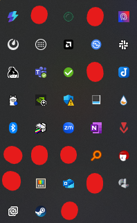
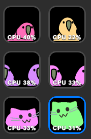

**PartyParrot**といえば、一昔前に流行った例のコイツです。

ちなみに、こいつはBoredParrotです。今更こいつに注目することになったのには理由があります。

## Streamのデックボタンあまりがち問題

StreamDeck、便利な端末だと思います。ですが、使いこなせません。もうこれ以上割り当てる機能がないのアタシ。

見て下さいよ、このすがすがしいスカスカ具合。これは2ページ目ですが、1ページ目もまあ似たようなもんです。

### パクる

https://forest.watch.impress.co.jp/docs/serial/yajiuma/1251932.html

こないだまでこいつを入れていたのですが、私のタスクトレイはもうこれでもかというぐらいパンパンなのでいれる場所がありません。

というわけで、これをStreamDeckでパクｒ…パクることにしました。

### できた

というわけで、これが完成品です。

置くものがないので縦に6個置きました。アニメーションフレームとCPU使用率にばらつきがあるのは、ボタン追加時間に差があるからです。多分再起動とかしたら揃います。

### 機能

#### 1. CPU使用率を反映

パクｒ…パクリ元と同様、速度は**PCのCPU使用率と連動する**ようになっています。PCが重い処理をしている時はPartyParrotも必死に首を振り、アイドル状態の時はゆったりと動きます。かわいいね。

#### 2. ボタン一つでキャラクター切り替え

このままだとStreamDeckのボタン機能が腐るので、**表示されるPartyParrotの種類を切り替えられる**ようにしちゃいました。自分の発想力が怖いぜ。

- デフォルトPartyParrot
- 横に動くやつ
- BlobCatRainbow
- リアルカカポ

から切り替えられます。リアルカカポは比率がちょっとおかしくなっています。ゆるして。

### ダウンロード

https://github.com/AoSankaku/cpu-partyparrot/releases

せっかくなのでここからぶちこんでください。人生で初めてGitHub Release使った。

ここからダウンロードできます。ダウンロードしたものをダブルクリックしたら、StreamDeckが勝手に開くと思います。これはオープンソースで自動ビルドしたものなので大丈夫だと思いますが、普段は知らない人のプラグインは入れないようにしましょうね。

リアルカカポのライセンス周りを整えたらマーケットプレイスにも載せてもらおうかなと思っていますが、今のところめんどくさいので未定です。めんどくさいので。

---

## 開発裏話

開発裏話もなにも、このプラグインは**99％AI製**です。動けばいいんだよ動けば！！！！！

StreamDeckSDKはただでさえ情報が少ないのに、ドキュメントが貧弱で、しかも適当に入れたサンプルプラグインはC++だったのに今回はTypeScriptでした。調べようがないッス！

そもそも本体も高いからね、しょうがないね。

## 見ろ

*   [CultOfThePartyParrot](https://cultofthepartyparrot.com/)
*   [CultOfThePartyParrot](https://cultofthepartyparrot.com/)
*   [CultOfThePartyParrot](https://cultofthepartyparrot.com/)
*   [CultOfThePartyParrot](https://cultofthepartyparrot.com/)
*   [CultOfThePartyParrot](https://cultofthepartyparrot.com/)
*   [CultOfThePartyParrot](https://cultofthepartyparrot.com/)