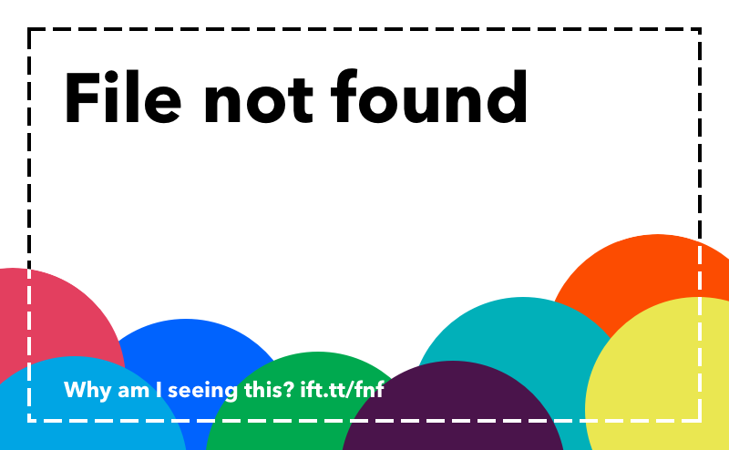
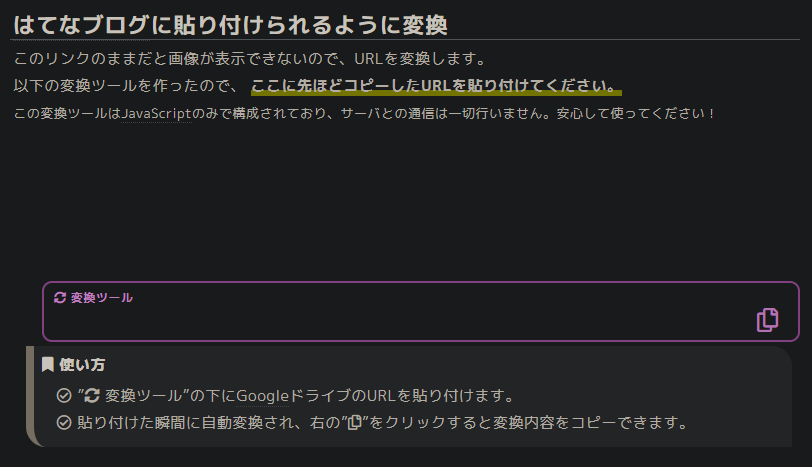
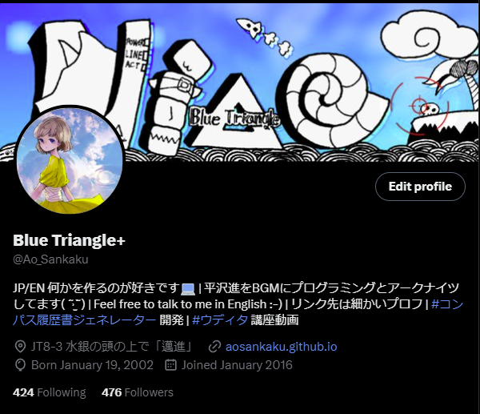

## 注意（更新日：2024/03/18）

IFTTTはTwitter（旧X）において、プロフィール画像及びbio（概要欄）の自動更新機能を停止しました。

メールは来ているのですが、何故かサイトや公式Twitter（旧X）での告知はまだ無いようです。謎。

これに関して私が投稿した記事がこちらにあります。

[【お知らせ+近況】Twitter（旧X）のプロフィール画像自動更新を停止します](../abandoning_profile_pic_update/#いままで)

自動更新については、代替手段なども特に思いあたりません。せっかくなので、Misskeyに行きましょう。楽しいですよ。Webhookなども簡単に使えます。

## プロフィール画像がデフォになる

ある日突然、IFTTTでプロフィール画像が全く更新できなくなりました。  
更新自体はできるんですが、プロフィール画像がこれになってしまうんです。



画像引用元：https://help.ifttt.com/hc/en-us/articles/115010361748-Why-is-there-a-File-not-found-image-on-my-post-

Google Driveから画像を引っ張ってきているのですが、「File not found」という画像になります。個性的っちゃ個性的ですが、真ん中を切り取るために真っ白けっけになります。あまりに没個性。

今回はこれを直していきます。

## プロフィール画像を自動で更新したい！
ありがたいことにプロフィール画像を複数の人に描いてもらうことができて、「どれか一つに決めるなんて私にはとても。。。。。。」という状態になっていました。

そういうわけで、自動的にプロフィール画像が変わるようにしました。これが2019年ぐらいの出来事です。懐かしい。

<blockquote class="twitter-tweet"><p lang="ja" dir="ltr">自動プロフィール画像更新 at April 28, 2019 at 12:01AM <a href="https://twitter.com/hashtag/NewProfilePic?src=hash&amp;ref_src=twsrc%5Etfw">#NewProfilePic</a> <a href="https://twitter.com/hashtag/ifttt?src=hash&amp;ref_src=twsrc%5Etfw">#ifttt</a></p>&mdash; Blue Triangle+ (@Ao_Sankaku) <a href="https://twitter.com/Ao_Sankaku/status/1122153743259262978?ref_src=twsrc%5Etfw">April 27, 2019</a></blockquote> <script async src="https://platform.twitter.com/widgets.js" charset="utf-8"></script>

until検索をかけた感じでいうとおそらくこれが最古です。伝説の始まり。

## IFTTTとプロフィール画像更新
ところで、世の中にはIFTTTという「サービスとサービスを繋げて自動化させてあげるヨ！」なサービスがあります。便利ですね。  

しかし、[有料化がいきなり発表](https://izuki.net/ifttt-upgrade/)されました。しかも**月10ドル**。青天の霹靂でした。

※現在は値下げ＆プランが分岐しており、一番高いプランで**月5ドル**です。流石に利用者が少なかったのでしょうか（笑）

「無料だよ！！」とユーザーを引き込んでおきながらいきなり無料版ユーザーの首を絞める経営戦略は**最低**だと思いますが、便利さには抗えず課金をして使い続けています。

プロフィール画像のアップデートは正常に動いています。つまり、問題部分は**画像のURL**で間違いありません。

そうと分かれば早速直しにいきましょう。

## 原因
Google Driveで画像やファイルを共有すると、こんな見た目になります。
```
https://drive.google.com/file/d/1234AbCd5678DeFg9012HiJk/view?usp=sharing
```
かつてはこのURLにリンクすればAPIが画像を返してくれていたようなのですが、現在は不可になっています。これが原因で画像を読み出せなくなっていたのですね。

## 力技（画像の直リンクを取得する）
ブラウザの開発者ツール（F12かCtrl+Shift+I押したら出てくるアレ）から無理やりURLを取得する方法です。

1. Google Driveを開く
1. フルサイズの画像を開く
1. F12を押す
1. 画像の生URLゲット！

もちろんこの方法はよくありません。

* 画像のURLが将来的に変わると取得できなくなる
* めんどくさい
という欠点があります。

それとこのツイートを見てください。

<blockquote class="twitter-tweet" data-conversation="none" data-lang="ja"><p lang="ja" dir="ltr">IFTTTってやつで自動更新してるんだけど、なぞに画像の読み出しができなくなってめんどくさくなってきた <a href="https://t.co/xQ7Cde3aDz">pic.twitter.com/xQ7Cde3aDz</a></p>&mdash; Blue Triangle+ (@Ao_Sankaku) <a href="https://twitter.com/Ao_Sankaku/status/1654813746328645632?ref_src=twsrc%5Etfw">2023年5月6日</a></blockquote> <script async src="https://platform.twitter.com/widgets.js" charset="utf-8"></script>

**URLが長すぎ**。これではメンテナンスが大変です。別の方法を考えましょう。

## 解決へ
そしてこのブログに行き着きました。

https://3z1k.hatenablog.com/entry/2021/01/19/210000

このサイトに変換ツールなるものがあり、ありがたく使わせてもらいました。



ここにGoogle Driveの共有用URLを貼り付けると、
```html

```
のような感じで、変換してくれます。手動で変換するのは面倒だったので、素晴らしいツールです。

そしてこのURLをIFTTTに貼り付ければ…！



**大成功**。問題解決！

ところで、この画像URLに実際にアクセスしてみると**とんでもない長さのURLにリダイレクトされます**。こちらももしかしたら将来使えなくなったり…？

## 今気づいた
ところで、IFTTTには課金プラン導入と同時に「フィルター」機能が実装されました。

<blockquote class="twitter-tweet" data-conversation="none"><p lang="zxx" dir="ltr"><a href="https://t.co/0vg1nlqT7m">pic.twitter.com/0vg1nlqT7m</a></p>&mdash; Blue Triangle+ (@Ao_Sankaku) <a href="https://twitter.com/Ao_Sankaku/status/1659902818583715841?ref_src=twsrc%5Etfw">May 20, 2023</a></blockquote> <script async src="https://platform.twitter.com/widgets.js" charset="utf-8"></script>

これを使うと、「火曜日は実行しない」とか、「3で終わる日だけ実行する」とかができます。  
**変数の変換や操作もできます**。

あれ…？

画像の共有URLをこの形式に自動変換するスクリプトを組めばよかったのでは…？

## 完全なる余談
ブログにリンクを張ったときにカードが出るようにしたいです。見た目がいいので。そのうち実装します。