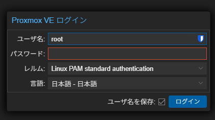

## 結論

ユーザー名は「root」でログインしてください。その後パスワードを入れるように求められますが、入力しても見えません。それが普通です。

## 解説

おそらくこの記事にたどり着いた人は、（VPSなどをいじったことがあったとしても）Linux系のCliを使ったOSに触れるのが初めてだと思います。私もそうでした。

なので、Proxmoxインストール後に「ログインできないんだけど？？？？？？？？？？？？？？？？？？？？？？」となりました。自然なことです。

（たぶん）Linux系のOSでは、初期ユーザーかつ特権を持っているのは`root`ユーザーです。なので、「root」と「最初に設定したパスワード」でログインすれば入れるはずです。がんばってね。

### 入れたパスワードは見えない

「root」と入れてEnterしたあと、CLIの場合はパスワードを求められます。このとき、入力したパスワードは**見えません**。

仕様です。ちゃんと入力はできています。私は手元にあったのがチャタリングを起こすキーボードだったので、死ぬほど苦労しました。勘弁してほしい。

## ちなみに

サブタイトルに書いたとおりですが、「Proxmox VE ログイン」も同様です。

## 参考文献

https://forum.proxmox.com/threads/pve-login.112838/