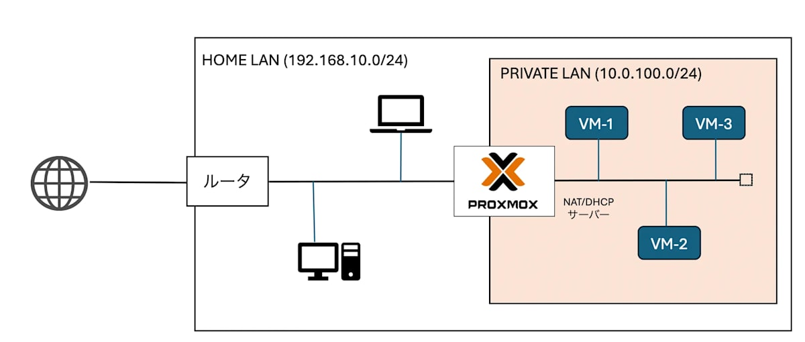
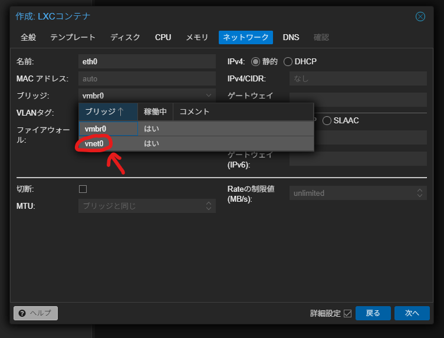
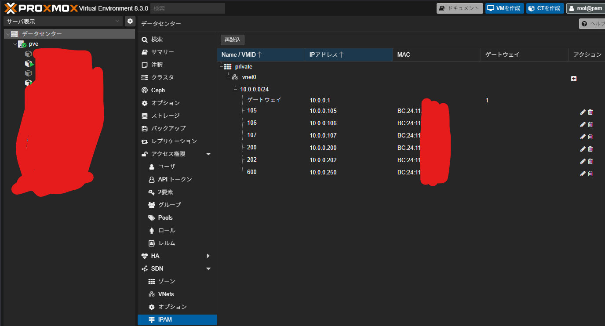
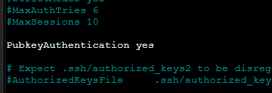

Proxmox、使ってますか？私はこの間AIにサーバーを破壊されたりしましたが、なんとか元気に動かしています。

さて皆さん、Proxmoxで作ったVMやCTにSSHするときどうしていますか？私は以前、ルーターに入ってMACアドレスから手動でIPアドレスを割り当てていました。この方式には問題点があります。

- **ルーターが壊れたらデータが吹っ飛ぶ**：当たり前です。もう一度MACアドレスをいちいち入れる必要があります。
- **再起動しないと設定を反映しないルーターがある**：私の場合はコレに該当しました。地獄です。毎回ネット切れますからね。
- **ちゃんと管理しないとIPが衝突する**：手動でやってるんだから当たり前です。

というわけで、解決していきます。

## 概説：SNATとJumper SSHで楽に接続したい！

これからやることについて概略を説明します。



引用元：https://zenn.dev/haru_iida/articles/proxmox_nat_dhcp

この図のように、「VMやCTのアクセスにProxmoxを経由して、振り分けてもらう」ということを実現します。これにより、ルーターがある日突然火を吹いてもProxmoxに設定が残っているので大丈夫というわけです。

また、おうちのLANとProxmox内のLANを分離できるためいくらCTが増えても大丈夫です。IPの衝突を気にする必要もありません。

そういうわけで、やっていきましょう。ここからは「SNATの設定」「Jumper SSHのConfigの作成」の2つに分けてお送りします。

## SNATの設定

### ちょっと待って！SNATって何！？

よくわかりませんでした。いかがでしたか？

というわけにもいかないので、ちゃんと調べました。

https://e-words.jp/w/SNAT.html

NAPTやIPマスカレードと同じ意味ですが、静的NAT（Static Nat）の略語でもあるようです。

ちなみに、NAPTは「同じIP宛の通信をポート番号基準で自動的に割り振る」みたいなやつですが、あまり深く考えなくても大丈夫です。

最初の画像を見てもらった分かる通り、「まずはProxmoxにこんにちはして、そこから宛先のVMやCTに向かう」ので、NAPTが必要になるのは当たり前っちゃ当たり前です。

### SDNとは

もう一つ、抑えておきたい用語があります。**SDN**です。

これはなんということもないですが、ソフトウェア定義型ネットワーク（Software Defined Network）の略です。Proxmoxでこれから作るNAPTはルーターそのものではないので、なんかこう、いい感じになるんだと思います。語彙力と知識が足りません。以下はAI（Gemini）に丸投げした回答です。

> SDNはSoftware Defined Networkの略で、ソフトウェアによってネットワークを柔軟に制御・管理する概念です。ProxmoxのSDN機能を利用することで、仮想ネットワークの構築やルーティングの設定をGUIやCUIから簡単に行うことができます。今回設定するSNATも、このSDN機能の一部として提供されています。

らしい。すごい（小並感）

### 作業開始

解説したいところですが、すでに画像付きの記事がたくさんあるので略します。これ見てやってください。

https://zenn.dev/haru_iida/articles/proxmox_nat_dhcp

単に全略するとこの記事の存在意義がないので、ここからは「この作業が全部終わり、楽にSSH接続したいときのやり方」を説明していきます。でもその前に、VMやCTのIP割当方法について説明します。

また、今後VMやCTを作るときには「vnet0」につなぐのをお忘れなく。じゃないと従来の方法でしか接続できません。



IPアドレスは、あえて「DHCP」にしておきましょう。理由はすぐに分かります。

### IP割り当て

データセンター→SDN→IPAMに行きます。



この「10.0.0.XXX」はダブルクリックで変更できます。CTごとにIPを指定するのではなくDHCPにしていると、ここから一括指定できるので楽というわけです。

---

これで、

**（自宅PC）→（ProxmoxのNATなんだかSDNなんだかよくわからんやつ）→（目的のVMやCT）**

という流れは完成しました。

一つ注意として、この`10.0.0.XXX`のアドレスは、もちろんProxmoxの内部からしか認識できないプライベートIPです。なので、いきなりお使いのWindowsなどからSSHしても届きません。そのため、このままだと「proxmoxのシェルにSSHして、さらにそこからCTにSSHする」という手順を踏むことになります。面倒なので、楽していきましょう。

## Configの作成

さて、ここまででSNATの設定とかは終わりました。

しかし、このままだと**VMやCTにSSHするのがめんどくさくなった**だけで終わってしまうのです。

configファイルを作って解決していきましょう。

### （オプション）ユーザーの作成

別にやらなくても大丈夫です。ただし、これをしない場合は`root`ユーザー経由でジャンプすることになり、なんとなく気持ちが悪いので私は一応やりました。以下は`jumper`というユーザーを作成する体で進めます。

**proxmoxのログインユーザーとは別**なので気をつけてください。pveのシェルからユーザーを作成します。

```bash
adduser jumper
```

特権ユーザーである必要はありません。ジャンプのみに使うので適当で大丈夫です。

そうしたら、

```bash
nano /etc/ssh/sshd_config
```



`PubkeyAuthentication yes`になっていることを確認したら、公開鍵を作りましょう。

次に、権限を確認しながら変更もしていきます。ファイルやディレクトリがなければ適当に作成してください。

```bash
mkdir -p /home/jumper/.ssh
chmod 700 /home/jumper/.ssh
touch /home/jumper/.ssh/authorized_keys
chmod 600 /home/jumper/.ssh/authorized_keys
ls -ld /home/jumper/.ssh/authorized_keys
```

`ls -ld`のくだりは、所有者が`jumper`になっていればOKです。

### 公開鍵の作成

一度proxmoxのホストマシンにSSHでユーザー名は`jumper`、パスワードは`jumper`のパスワードでログインします。そうしたら、nanoでもvimでも好きなものを使って`.ssh/authorized_keys`に公開鍵をはっつけてください。終わったら`exit`を忘れずに。

### Configの作成

接続元がWindowsの場合、`C:\Users\ユーザー名\.ssh`の中に`config`（拡張子なし）というファイルを作成することで、SSHの接続を楽にできます。

以下のファイルは、`C:Users\ユーザー名\.ssh\pve\jumper`に`jumper`の公開鍵がある前提で進めています。

```
Host proxmox-jumper
  HostName 192.168.1.160
  User jumper
  IdentityFile ~/.ssh/pve/jumper
```

`192.168.1.160`は、ご自分のProxmoxホストのIPアドレスにしてください。

これができたら、一度ターミナルから

```bash
ssh proxmox-jumper
```

で接続できるか見てみてください。接続に成功したら、次に進みましょう。

### Configの追記

やることは簡単です。

```
Host sample
  ProxyJump proxmox-jumper
  HostName 10.0.0.XXX
  User ユーザー名
  Port 22（変更してるならそのポート番号）
  IdentityFile ~/.ssh/path/to/公開鍵
```

のような文字を、configの下にひたすら付け加えればOKです。HostNameには、IPAMで設定して確認したIPアドレスを入れてください。

これだけで、今後は

```bash
ssh sample
```

さえ入れれば一発で目的のサーバーにこれまで通り到達できるはずです。

これで、これまでと全く変わらない使い勝手でIPの管理が楽になりました。やったぜ。よい自宅鯖ライフを。

## 参考文献

https://zenn.dev/haru_iida/articles/proxmox_nat_dhcp

https://internet.watch.impress.co.jp/docs/column/shimizu/1585271.html

https://qiita.com/Shinobu_Inokawa/items/ce8c087fc38749e2ddda