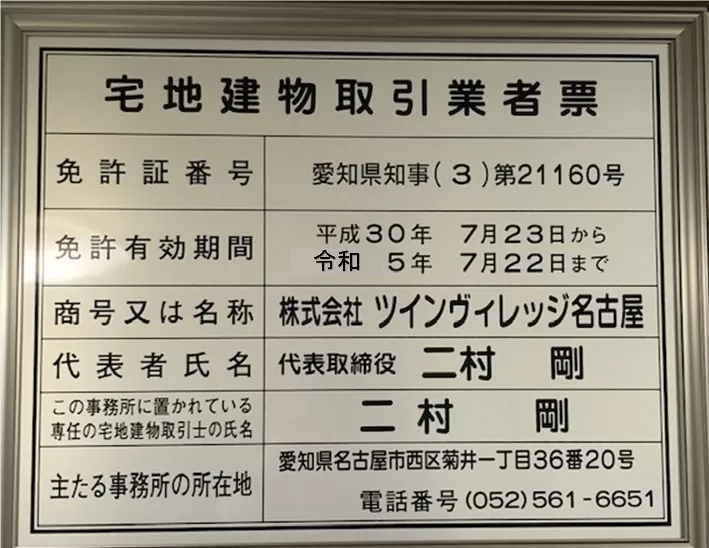

このページでは、友人向けに「これから親元を離脱する人・逃げる人向けのアドバイス、知っておくべきこと」をまとめています。

なぜか私の身の回りで、一人暮らしを始める人のみならず親元から逃走する人が多発しています。これぞ社会の闇、という感じがします。私個人は家出をしようと考えたことすらない家出レベル0のよわよわ戦士なのですが、なぜか時々相談を受けます。不思議なものです。

毎回新規に1から説明するのが正直疲れてきたのと、ヌケモレがあると相手に迷惑がかかってしまうため一度まとめてみることにしました。今後はこの記事の内容を自己引用したり、直接読んでもらったりしながらアドバイスができればと思います。

一人暮らしをする人にとっても、不動産、自炊、携帯回線のくだりは参考になると思います。家出をしない方は飛ばし飛ばし読んでください。

```toc
```

## はじめに―生活保護から逃げるな

生活保護は、日本国民すべてが保有する権利です。

実家から逃げるのに、例えば「売れる貴金属がある」「60万のデスクトップパソコンを持って出る」という余裕がある人などいないと思います。そのような人から、生活保護制度はお金を盗んだりすることはありません。

家出をした先で、就職を手伝ってくれる人脈があるわけでもないのなら、生活保護は絶対に受給するべきです。「恥ずかしい」などとためらっている場合ではありません。無理に見栄を張って借金をし、ブラックリストに乗って自己破産をして官報に載るよりよっぽど「恥ずかし」くありません。

### 「住所がないと生活保護を受けられない」は嘘

冷静に考えてもらえばわかると思うのですが、「住所がなければ生活保護を申請できない」のであれば、ホームレスの人相手にまともな生活保護の運用など出来はしません。

しかし、嘘をついているわけではありません。「住所がなければ、生活保護の**受給は**できない」というのが正確な表現であり、職員は嘘をついているだけです。

### 扶養照会について

生活保護の審査に当たり、扶養照会というものがあります。これは要するに「兄弟や家族には扶養義務があるので、該当する人が扶養できるのであれば支給しない」という趣旨のものです。

ただし、ここ数年で例えば「虐待から逃げてきた」というケースに対応するため、聞き取りなどが行われるように運用の変更がありました。詳しくは以下の記事をご覧ください。

https://tsukuroi.tokyo/2021/04/20/1551/

私は生活保護受給の専門家ではないため、基礎的なことしか言及できません。それでも、受給のハードルが下がったことを知っていただければ幸いです。

## STEP1　お家探し

まずは住処が必要です。

### 基礎知識

「基礎知識」では、そもそも不動産契約ってな〜に？というところから解説します。流石に知っている、という方は飛ばしてください。

これから、あなたは不動産の借主として、貸主との間で不動産賃貸契約を締結します。不動産業者は、貸主（家主）に代わってあなたに物件を紹介したり、内見を案内したりする役割を持っています。

### 入居時

家を借りるには、大体初期費用として家賃の3倍前後のお金がかかります。その中でも、特に違法ではないものを列挙します。

- 不動産業者に払う仲介手数料
  - 家賃の100％（家主=貸主と共同で負担する場合、50％）が上限と決まっています。これを超えれば明らかにアウトです。
- 敷金
  - 貸主に預けておくお金です。何もなければ退去時に全額帰ってきます。借りた家に傷をつけたりしてしまったときなどは、退去時に敷金から損害額を引いた分が返ってきます。
- 礼金
  - 家主にプレゼントするお金です。~~因習~~慣習として残っています。
  - 悪徳な不動産業者は、嘘の礼金を書いていることがあります（もちろん、不動産業者にポッケナイナイです）。
- 前家賃
  - 入居時に、1〜3ヶ月分の家賃を払うように求められることがあります。
- 火災保険料
  - 「火災保険」という名前ですが、割と色々な保証があります。詳しくは後ほど。

コレ以外の金額を提示された場合、まずは「おかしいぞ」と疑ってください。ここに載っていないお金でも、あなたが契約書にサインしてしまうと取り消すことはできなくなります。

入るとおかしい費用には、例えば

- クリーニング/清掃代行/除菌/コーティング/抗菌　など
- 消化器、浄水器、害虫駆除

などがあります。会社によっては必須となっていることもありますので、後述する**相見積もり**を大事にしましょう。

### 退去時

退去するときに、あなたは**原状回復義務**を負います。ただし、これは「借りる前の状態に完全に戻しやがれ」という意味ではありません。「普通にまともに生活をしていたら、起きないはずだった損害はちゃんと弁償しろ」というものです。例えば、普通に生活していてできた床の傷などの修理費は払う義務がありませんが、ゴミを放置したせいでカビが生えたり、コンロの掃除をサボったせいでギットギトになっている場合などは、それを清掃するためのお金を払う義務があります。

### 国や都が出しているガイドライン

https://www.juutakuseisaku.metro.tokyo.lg.jp/juutaku_seisaku/tintai/310-4-jyuutaku.htm

東京都住宅政策本部は、「賃貸住宅トラブル防止ガイドライン」というPDFファイルを発行しています。

https://www.mlit.go.jp/jutakukentiku/house/torikumi/honbun2.pdf

また、国土交通省も「原状回復をめぐるトラブルとガイドライン（再改訂版）」というものを出しています。

ここには様々なことが書いてあります。

#### 【入居時】

- クリーニング代は法的根拠がないため、消臭スプレーを一発撒いて終わりになることもあるため拒否したほうがよい
- あらかじめカーペットやカーテン、電灯がある場合は勝手に廃棄したり交換してはいけない

#### 【退去時】

一部を例として列挙します。詳しくは、「賃貸住宅トラブル防止ガイドライン」の14ページ～をご覧ください。

- 普通の生活で生じる傷（例：家具をおいたことによるフローリングの痕、経年劣化による摩耗が発生したドア）の修理費は原則貸主負担
- 経年劣化により、通常生じる損傷は原則貸主負担
- 鍵交換費用は、わざと壊したりしていない場合原則貸主負担
- 樹木の剪定（枝を切ったりして管理すること）は、原則貸主負担
- 引越作業で壁に傷をつけてしまった場合、原則借主負担
- キッチンやトイレの消毒は、原則貸主負担

部屋を借りる皆さんには、「善管注意義務」というものが発生します。これは、「善良なる管理者の注意義務」の略です。これは説明が若干難しい概念なのですが、簡単に言えば「常識で考えて、損害が起きそうなものは事前に予防しよう」ということです。例えば、

- 引越時に、不注意で壁に家具をぶつけ、壁に傷をつけたりへこませたりした
- 飲み物をこぼし、フローリングや備え付けのカーペットにカビを生やした

といった場合は「善管注意義務違反」となり、借主（あなた）がお金を払う義務が生じます。

「原則貸主負担」というのは、「退去時にサインをさせることで借主負担にさせることができる」という意味です。絶対にサインをしないように気をつけてください。裁判になった場合正当に勝てます（相手にメリットがない）ので、臆することはありません。

### やるべきでないこと

以下、家を探すときに、やるべきでないこととやるべきことを列挙します。

不動産業者は、ありとあらゆる手であなたからお金をむしり取ろうとしてきます。身の着のまま逃走してきたあなたにそのようなことをする者は、外道にほかなりません。断固として抵抗するために、正しい知識をつけましょう。

なお、以下の項目は不動産Gメン滝島さんの影響を色濃く受けています。動画を見たほうが早いかもしれません。

#### ネットで家を探して満足してはいけない

ネットで出ている求人というのは、全体の家で少数です。「こんな相場なんだ」という参考程度にとどめておくのをおすすめします。

#### 不動産会社の広告を鵜呑みにしてはいけない

不動産業者は、**囮広告**という手口を使って顧客を呼ぶことがあります（犯罪です）。

具体的には、「この物件いいな」と申し込んだときに、「あ～、この物件もう売れちゃってまして～、でもこの物件なら空いてますよ」という方法で他のものに誘導する手口です。

#### 意味を理解せずに、定期借家契約の物件を借りてはいけない

実は、賃貸は貸す側視点だと好きなときに解約させることができません。ただし、定期借家契約（期間の定めがある契約）の場合は、貸主はいかなる理由であっても退去を命じることができます。

それを知ったうえで住むなら問題ありませんが、知らない場合は避けるのが無難です。

#### 契約違反をしてはいけない

二人で住んではいけない物件に二人で住んだり、ペット不可の物件でペットを飼わないようにしましょう。法律は基本的に消費者の味方ですが、こういうことをやってしまうと突然敵になります。きをつけましょう。

#### 外国人が所有する物件は絶対に借りてはいけない

**どんな手を使ってでも回避してください。いきなり多額の税金が降りかかり、地獄を見ることになります。**

#### プロパンガスはできるだけ避ける

※実際にこの記事を読んで引っ越しをした友達に情報をもらって追記しました（2024/07/02）。

https://kakaku.com/gas/propane/

プロパンガス（LPガス）は、上記サイトにも書いてあるように人間がガスを運ぶことで運用しています。そのため、都市ガスよりも大幅に高くついてしまいます。料金が大体**1.8倍近く異なる**のも最悪なところです。

更に悪いことに、プロパンガスは価格体系が非常にわかりにくく、計算が困難です。

https://www.propane-npo.com/electricity-gas/useful/electric-propane.html

ところが、オール電化のほうが高くなるという試算もあるようです。選べる場合は可能な限り都市ガスを選んで、そうではない場合はオール電化またはLPガスを選ぶのがいいかもしれません。

地域にもよりますが、2024年現在はどんどん電気代が高騰しています。「どっちもどっち」な時代になるのも遠い話ではないのかもしれません。

ただし、都市ガスは**災害時に復旧が遅い**という特大デメリットもあります。ただし、「とりあえず逃げる」にあたって賃貸は引っ越しができるので、あまり考えなくてもいいかもしれません。

#### どうしてもプロパンガスしかない場合、会社名を調べておく

※実際にこの記事を読んで引っ越しをした友達に情報をもらって追記しました（2024/07/02）。

プロパンガス会社は、本当にピンキリです。法規制の動きはあるようですが、2024年7月時点ではまだ施行にはなっていないようです。

`youtube:https://youtube.com/embed/AIW-ydGtQmk`

https://f-mikata.jp/rosette-273/

「設備代を料金に上乗せする」というまさに外道な行いもまかり通っているようです。恐ろしい。

大家さんなどを介して業者に詰めれば、下がることもある…らしいです。（匿名掲示板なので程々に参考にしてください）

https://question.realestate.yahoo.co.jp/knowledge/chiebukuro/detail/10152931330/

ところで、ガスボンベは自分で設置することもできるとかできないとか…

https://www.propane-npo.com/column/cts042.html

### やるべきこと

#### 火災保険には入ると良い

参考：

https://liberaluni.com/fire-insurance

火災保険は、家具に対しても補償が聞きます。名前が非常に紛らわしいですね。

ただし、不動産会社から直接提案を受けた火災保険への加入は慎重になりましょう。ちなみに、火災保険業者を不動産会社が指定することは一概に違法とは言えないようです。

https://www.homes.co.jp/cont/rent/rent_00273/

#### 相見積もりをするとよい

不動産業者は、大抵適当な名目を付けて謎の手数料を上乗せしています。これを防ぐために、不動産の相見積もりをすることは有効です。つまり、複数の不動産業者に同時に頼むのです。

バレれば心象は悪いですが、違法でもなんでもなく、そもそもを言えば**知識がないあなたを騙そうとしてくる先方が明らかに悪い**です。堂々としていれば大丈夫です。

#### 内見時に、傷や汚れの写真を撮るとよい

内見時には、最初からある傷や汚れの写真を取っておきましょう。メモも取るといいですね。

なぜこんなことをするのかといえば、やっておかないと退去時にいちゃもんを付けられて修理費をむしり取られるからです。抜かりなくやりましょう。

「原状回復をめぐるトラブルとガイドライン（再改訂版）」の4、5ページには、**内見時チェックリスト**もあります。印刷して持っていきましょう。

#### 水を流してみるとよい

誰も住んでいなくても、水は通っています。少し流してみて、普通に流れるかどうかを見ておきましょう。

水回りの快適さは生活の快適さに直結します。確認しておくのがおすすめです。

#### 信用できる地域の不動産業者を探すとよい

不動産業者は、可能であれば現地で視察をしましょう。

不動産免許番号を見れば、新しい不動産屋か古い不動産屋かがわかります。



引用元：

https://www.twin-village.jp/blog/detail/20220118102217/

この免許番号が古ければ（数字が大きければ）、長く続いている良い不動産屋の可能性が高いと言えると思います。

### 【番外編】賃貸のインターネット回線について

不動産会社や建築関係の人間は、電気配線について詳しかったとしてもIT関係は無知だと思ったほうがいいです。

快適なインターネット環境が必要な場合は、自分であらかじめ知識をつけておく必要があります。以下に、簡単に「避けておくべきもの」と「確認しておいたほうがいいこと」を書いてみます。

なお、以下では一貫して道路の例えを用います。「道路」や「速さ」の話はそういう文脈で理解してください。

#### 【結論】「地域名　回線事業者名」で調べる

「みんそく」というサイトがあります。

https://minsoku.net

みんながインターネットの回線速度を測定し、アップロードしています。これを見れば、だいたい「どこの地域はどこの会社が速い」ということがわかります。

**回線事業者のネットの速度は、地域に依存します。** ある地域では「ゴミ」と評判の回線でも、特定の地域に絞ればそうでもなかったり、またその逆もありえます。評判や噂ではなく、数字で比較して検討しましょう。

ちなみに、このサイトはモバイル回線速度についても測定結果がある程度載っています。暇なら見てみてもいいかもしれません。

#### IPv4よりもIPv6に対応しているとよい

突然ですが、インターネットの通信は道路に喩えて表現することがあります。IPv6は、IPv4の回線と比べて道路が79228162514264337593543950336倍広く、快適です。この数字は冗談ではなく、2の96乗の値です。

#### PPPoEよりもIPoEに対応していると良い

参考：

https://www.nttpc.co.jp/column/network/pppoe_ipoe.html

PPPoEでは、インターネットに接続するためにチェックポイントを通る必要があります。このチェックポイントに利用者が大量にいると、当然混雑します。

IPoE方式は、チェックポイントを通らず直接インターネットに接続できるため速く楽で、混雑の心配も低いです。

#### VDSLよりもLAN配線方式よりも光配線方式の方が良い

参考：

https://notoken.hatenadiary.com/entry/2020/09/22/154035

IPv6やPPPoEは技術の規格的な話でしたが、こちらは物理的な話です。

VDSLというのは、簡単に言えば電話回線を使ってネットを届ける技術です。もちろん遅いです。できるだけ避けましょう。

#### Arteriaは絶対に避けろ

オタクの間では遅いことで有名です。避けましょう。

#### Softbank Airは使うな

説明不要ですね。

#### ブーストオプション等があるプロバイダは契約するな

※実際にこの記事を読んで引っ越しをした友達に情報をもらって追記しました（2024/07/02）。

https://kirarico.net/memo/1822/

この記事にあるように、最近は「高速通信オプション」という手口でお金を払わせようとする回線事業者があるようです。一概に「詐欺」とは言えないかもしれませんが、警戒心を持って確認するようにすると良いでしょう。

#### 最悪楽天がある

最悪インターネット回線が絶望的でも、俺達にはどれだけ使っても2980円（税抜）の楽天モバイルがあります。

私の逸般人オタク友達は、月に17TB使っていてBANを喰らいませんでした。みなさんが24時間4Kの動画を垂れ流したとしても、大したことはありません。堂々としていましょう。

ただし、エリア確認だけはしっかり行ってください。なお、オタクによればこの地図には一部誇張があるとのことです。実際に確認をすることをおすすめします。

https://network.mobile.rakuten.co.jp/area/

ただし、この確認作業を万が一忘れてしまっていても、8日間キャンセルという制度が利用できます。「一回使ってみる」というのは十分アリです。

https://www.nojima.co.jp/support/faq/21516/

## STEP2　仕事探し

私は職を探す専門家ではないので詳しくは書きませんが、少しだけ知識を書いておきます。

### ハローワークは、出す側の手数料が無料

https://www.hellowork.mhlw.go.jp

ハローワーク（公共職業安定所）は、掲載側が手数料無料です。

これによって何が起こるかというと、求人サイトに広告掲載するための掲載料をケチる会社が紛れているということです。当然いい会社もいくつもありますが、「ハロワだから安全」という保証はどこにもありません。

### インディードは「ただの求人検索エンジン」である

たまにとんでもない求人が混ざっていることがあります。最近は特に増えてきたようです。探す時は、ちゃんと掲載元を確認しましょう。

ちなみに、ハローワークの求人もインディードで探すことができます。

### 求人広告と内容が異なっていると違法

求人広告と、労働条件通知書（面接通過後に受け取る契約書）の内容が異なっている場合は違法です。ハローワークなどに異議を申し立てることができます。

### 業務委託に気をつけろ

業務委託で仕事を受けると、個人事業主という立場になり、確定申告が必要になる場合があります。

将来的に個人事業主（自営業者）になりたい場合や、複式簿記の知識がある（またはこれから学ぶ気がある）場合は、そういった選択肢を選んでもいいでしょう。そうでもない場合は、家出をして足場が不安定な状態であえて選ぶべき選択肢では決してないと思います。極力避けてください。さもなくば、税金で痛い目を見ることになります。

### 「派遣はやばい」のか？

おそらく家出をするような状況の人の場合は、「特定の業務において、一定期間の実務経験がある」、すなわち中途採用の対象になることは難しいでしょう（もちろん人によります）。

「派遣はやばい」と一概に言えるものではありません。通常のアルバイトとの違いを理解し、契約状況を理解したうえで適切に使えば、ちゃんと指示通りの時給が入ってきます。

ただし、業種によっては専門知識が身につかず、転職などができなくなってしまうことにも気をつけなければなりません。「結局自分はどんな仕事をしたいのか」ということを意識したうえで検討すべきことです。

## STEP3　生活基盤（設備編）

家と仕事が揃いました。次は生活をしていきましょう。

### 設備投資を怠ると金が飛ぶ

洗濯機という便利グッズがあります。これの設置をケチると、もれなく金欠に陥ります。

食洗機という便利グッズがあります。これの設置をケチると、1ヶ月単位で見ればものすごい時間を無駄にしてしまいます。

このように、「買えば手間が減るもの」は、最初は痛手かもしれませんがそれでも買うべきものです。むしろ将来的に払う合計金額が減るので、友達から借金してでも買うべきものだと思います。

長期的に見れば、洗濯機や食洗機にかけたコストや時間は確実に回収できます。贅沢品だと思わず、真っ先に取り揃えましょう。

## STEP4　生活基盤（食事編）

この章は丸ごと省略します。なぜかというと、参考にした本と内容が丸かぶりになるからです。

https://www.amazon.co.jp/dp/B08CQCTN8R

発達障害がなくても非常に役に立つものです。料理セクションの内容だけでも、十分買う価値があります。是非買いましょう。

あえて付け足すならば、リュウジのバズレシピとけんた食堂をチャンネル登録し、料理のモチベを高めていきましょう。

https://www.youtube.com/@ryuji825

https://www.youtube.com/@oi_ken

変なプライドを持たず、雑に作れて美味しいレシピを持っておくと節約になるだけでなく人生が豊かになります。

## STEP5-1　生活基盤（お金編・一般）

次はお金の話です。

### 家計簿がつけられない人へ

私は、よほど几帳面な性格でもなければ、家計簿をつけるのは**無理**だと思っています。デジタルでも同じことです。

それではどうすればよいか。簡単です。**1枚クレジットカードを作り、すべての決済を可能な限り集約**してください。これをするだけで、全自動家計簿（ポイント、公的料金自動支払い機能付き）の爆誕です。

https://aosankaku.net/blog/cashless_todo_nottodo/

#### 署名はちゃんとしよう

クレカの裏側の署名はちゃんとしておきましょう。

ちなみに、あれは本名じゃなくても日本語じゃなくてもいいらしいです。不思議ですね。

参考元：

`youtube:https://www.youtube.com/embed/utq0YGUdyiI`

## STEP5-2　生活基盤（お金編・税金等）

### 怖くない所得税

所得税は、低所得者にとっては微々たるものです。そのため、ほとんど気にしなくて大丈夫です。

### 恐怖！社会保険料（年金）

年金というとお年寄りが受け取る老齢年金ばかりイメージすると思いますが、例えば事故で重い障害が残って働けなくなってしまった人に対する**障害年金**や、他にも**遺族年金**といった制度などもあります。そのため、滞納は得策ではありません。

年金は、どうしても納付が難しいときは猶予申請ができます。こういうものは**滞納してから猶予してもらうのは難しい**ので、早めにやっておきましょう。

https://www.nenkin.go.jp/service/kokunen/menjo/20150428.html

必ず全額免除になるとは限りませんが、一部でも免除してもらえればありがたいです。

### 使いこなせ！健康保険料

これから親の扶養を外れるということは、保険証が変わるということです。

日本は国民皆保険制度を採用しているため、「俺は加入しないぜ」という選択肢はありません。必ず入りましょう。

職が決まっている場合は別ですが、そうでない場合は国民健康保険というものに加入することになると思います。私個人はこの制度についてそこまで詳しくないため、詳しくは役所等で相談してみてください。

## 絶対に関わってはいけない組織

世の中には残念なことに、家出をして不安定な人を食い物にする最低な会社が複数存在します。しかし、このような事実上反社会的な勢力は名前を出すとスラップ訴訟に踏み切るというウジ虫のような性質を持っているため、特徴のみを列挙することとします。

こういった組織は例えば、生活保護で暮らしている人を囲い込み、逃さないようにして、生活保護のお金の一部を資金源とすることで自分の活動の費用に当てているなど非常に卑劣です。

「生活保護　サポート」などで検索したくなる気持は良くわかりますが、

- その相談先がどのような評判の団体なのか
- その団体の母体、代表者の所属政党など

は必ず確認しておきましょう。今の環境から逃げたくて行動しているのに、また他人の悪意に閉じ込められてしまっては台無しです。

## STEP5-3　通信費と携帯回線

固定回線の話はすでにしたため、このセクションでは携帯電話回線の話をします。

なお、携帯電話回線の状況は割と頻繁に変わります。この記事の内容が最新でない可能性は十分にありますので、ご自身でも調べてみてください。

### 安さ重視ならLINEMO

https://www.linemo.jp/process/

3GB990円のシンプルなプランです。ポイント還元なども時々やっています。時期によっては、実質半年無料で使えたりもします。

### 容量（コスパ）重視ならpovo

https://povo.jp/support/guide/sim/

買うトッピングは「150GB（180日間）」一択です。それ以外はお得になりません。長期的に家を開けるなどする場合は、その時だけ使い放題を買いましょう。

### 固定回線代わり・電話が多いなら楽天

https://network.mobile.rakuten.co.jp/guide/procedure/

上記でも書きましたが、固定回線代わりに無限に使いたいなら楽天一択です。

ただし、楽天は未だに**地下鉄や商業施設で繋がりにくい**というデメリットを抱えています。地下鉄での移動が主になる方は、サブ回線として他のものも持っておきましょう。

### 店には行くな

「端末値引きを目当てに行く」のでなければ、余計な手数料を取られ、営業マンにとって一番都合のいい回線を契約させられて終わりです。

料金体系は、ネットですべて見ることができます。自分で調べて、自分で契約しましょう。何も難しいことはありません。それぞれの公式サイトは、ちゃんとやり方をすべて書いています。

## 結局、死ななければなんとでもなる

日本にいる限り、理不尽に襲われて死ぬ確率も、食事が取れずに死ぬ確率もぐっと低いものです。難しいとは思いますが、まずは楽観的になることが一番大事だったりします。

工夫でお金を浮かせて、豊かな生活を送ることができるように頑張っていきましょう。
