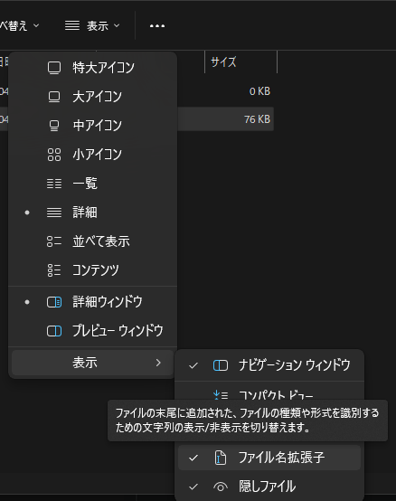
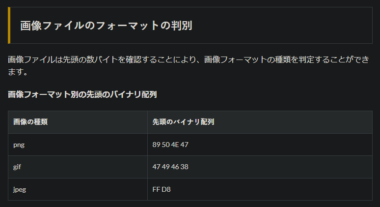
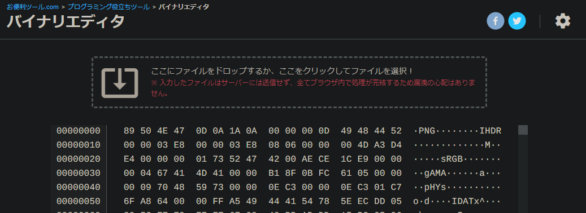

## 結論

```
C:\Users\今のユーザー名\AppData\Roaming\Microsoft\Windows\Themes
```

を、エクスプローラーで開きます。

そうすると中に、`TranscodedWallpaper`という名前の拡張子なしファイルが入っています。これをコピーすればOKです。ただし、このままでは「ただのファイル」のため、画像としてパソコンが認識してくれません。



まだ拡張子を表示していないひよこの皆さんは、こちらで拡張子を表示します。そうしたら、`適当な名前.png`とでもリネームしておけばOKです。「画像」として認識してもらえればいいので、厳密なデータ操作をしないのであれば、別に`すきななまえ.jpg`でも大丈夫です。

## これ、画像の形式は何？

この謎の物体の画像形式、気になりますよね。調べてみました。

そもそも、画像の種類はどうやって判別するのか適当にググると、



https://www.t3a.jp/blog/web-develop/check-picture/

とのことでした。さて、バイナリデータなどどのように読み出すのでしょう。と思っていたら、

https://www.oh-benri-tools.com/tools/programming/hex-editor

こんなサイト見つけちゃいました。突っ込んでみましょう。



モロに`.PNG`と書いてあります。こんなにモロに書いてあるもんなんですね。

私の場合は元画像が`.png`だったために、この様になっているだけかもしれません。面倒なので検証しませんが、jpg画像を選択して背景にした場合は結果が`jpg`になるかも…？