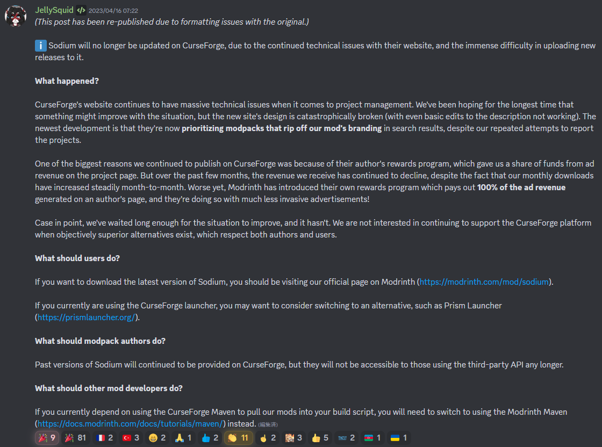
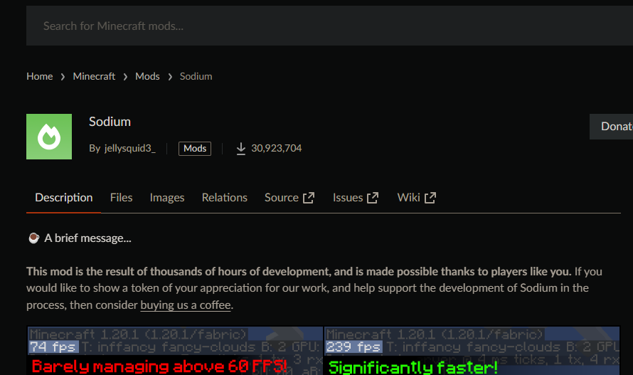
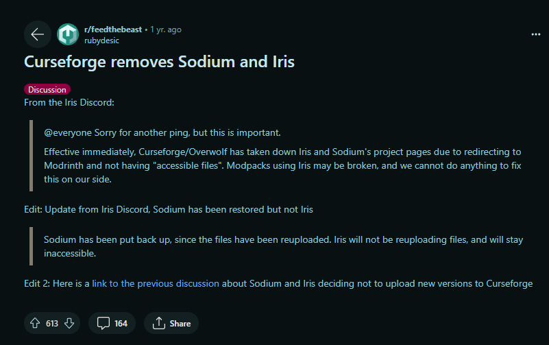
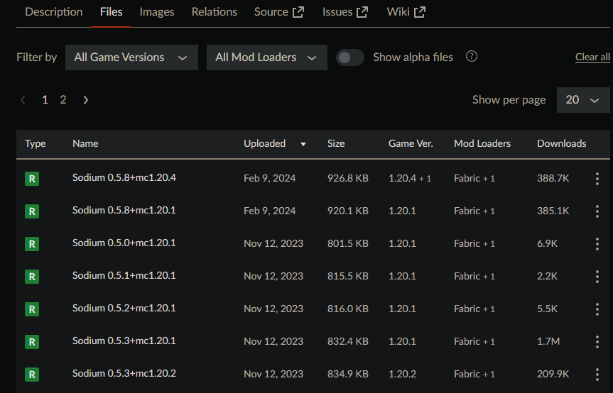
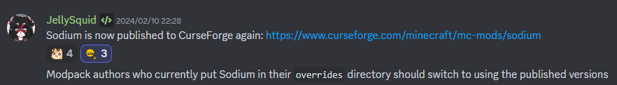
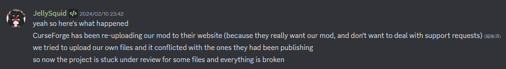

たまたま投稿日がエイプリルフールですが、嘘ではありません。

## Sodiumは長らくModrinthにのみいた

このアナウンスは、2023年の4月頃から出ていたものです。

<blockquote class="twitter-tweet">
CurseForgeのSodiumのページで、こんなものが表示されてしまう日が来るなんて思っていなかった &quot;Sodium is no longer available on CurseForge!&quot;ですか... これからは、Modrinthからダウンロードする時代になるのか... <a href="https://t.co/ca2c3SVNWe">pic.twitter.com/ca2c3SVNWe</a>
&mdash; 🐻白くまさん🐱 (@abc_kuma1025) <a href="https://twitter.com/abc_kuma1025/status/1648944930172325889?ref_src=twsrc%5Etfw">April 20, 2023</a></blockquote> 

このトゥートが示すように、CurseForgeには「SodiumはもうCurseForgeで配布しないよ！」とはっきりと書いてありました。

### 原因

この投稿が理由の説明となっています。乱雑に要点をまとめると、

- CurseForgeは技術的な問題が多いし、全然改善してくれない
- それどころか、Modpackを通じて**我々のブランドを侵害している**
- でも最大の理由は、Modのダウンロードは増えてるのに、CurseForgeの報酬プログラムの金額が減っていることだよ
- その点、Modrinthは現代的な上に、広告収入から**100％の報酬をくれる**から、嬉しいね

…とのことらしいです。

ちなみに、似たような理由でModrinthのみで配布を行うMod作者も増えました。

### CurseForgeから表示が消えている？

今日（2024/04/01）見に行ってみたのですが、この表示が消えていることに気づきました。

一体何があったのでしょうか。

### CurseForge側の規制だった

引用元：https://www.reddit.com/r/feedthebeast/comments/12oopaq/curseforge_removes_sodium_and_iris/

このRedditの投稿によれば、CurseForgeは「Modrinth（外部ダウンロードサイト）への誘導リンクを記載した」ことと「『利用可能な』Modのファイルを適切に設定していない」ことを理由にSodiumとIrisの公開を止めてしまった、ということです。

### 11月から更新していた

更新履歴を見てみると、11月からModの更新をしています。この頃から、更新ストップを取りやめたように見えます。

### 控えめなアナウンスがあった

Discordを探してみたところ、控えめなアナウンスが見つかりました。

これはSodiumの開発者であるJellySquidさんとCurseForge上で、なにか合意があったりしたわけではありません。

そのため、あまりJellySquidさんも快く思っていないようで、この件について大きく宣伝をしていません。上のスクリーンショットも「announcements」などの重要そうなチャンネルではなく、「dev-sodium」という普段は開発に関する雑談が主流のチャンネルに流れたものです。

### ちなみに―CurseForgeは、勝手にSodiumをアップデートしていた

この発言の内容が事実だとすれば、CurseForgeは**勝手に**Sodiumをアップロードして、更新していることになります。

しかも、そんなことをしたせいで**作者自身がアップデートを行うことが不可能**になっています。この状況はひどい。

Sodiumは言わずとしれた大人気Modのため、CurseForge側もSodiumのダウンロード、そしてページへのアクセスと広告収入が欲しいのだと思います。結構とんでもないことしますね。

## 結論：我々はどうするべきか？

**可能であれば、ModrinthからSodiumをダウンロードしましょう**。そうすることで、JellySquidさんが多くの報酬を受け取り、開発者の方の意に沿う事ができます。

公式ダウンロードリンクはここです。

https://modrinth.com/mod/sodium

他のModについても、できるだけModrinthからダウンロードしたほうがいいかもしれません。私も、個人的にできるだけModrinthからModを入れるようにしています。使いやすいですし。日本語に対応していないのが玉に瑕ですが…

## 付記

上記のDiscordのスクリーンショットは、すべて[Sodiumの公式Discordサーバー](https://caffeinemc.net/discord)から引用したものです。