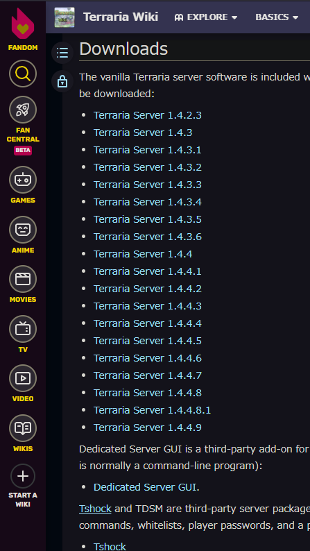

## UbuntuでTerrariaのサーバーを開きたい

誰でも一度は思うはずです（そんなことはない）。

というわけで、やっていきます。

### 想定読者層

この記事は、

- Ubuntuの基本がそれとなくわかり、
- VPSや自宅Ubuntu鯖でTerrariaのサーバーを開こうとしている方

を対象にしています。

そもそもゲームサーバーを開くのが初めて、という方は「？」という単語が出てきたときに、逐一調べながら読むようにしてください。

### 【手順1】ufwで使うポートを開ける

Terrariaサーバーがデフォルトで使用するポート番号は**7777**です。良い番号ですね。

とはいえ、デフォルトで適当に開放していると、ツールを使った探知に引っかかりやすくなり、攻撃に繋がる可能性があります。変えておくのが無難でしょう。変えても攻撃を受けるときは受けますが、何もしないよりはマシです。

これまたUbuntuを使うような人であれば知っているでしょうが、使ってはいけないポート番号や、範囲から外れる番号も存在します。間違っても「334」とか「114514」とかは使わないようにしましょう。

使うポート番号を決めたら、ufwを使っている場合はそのポートを開けます。ufwの基本がわからない人は、[諦めてください](https://gihyo.jp/admin/serial/01/ubuntu-recipe/0076)。

```sh
sudo ufw allow 7777/tcp
sudo ufw reload
```

できたら、ufw statusで確認しましょう。

```sh
sudo ufw status
```

### 【手順2】wgetでテラリアのサーバー実行ファイルを持ってくる

テラリアのサーバーファイルは、無料で入手できます。

Ubuntuをいじるような変態の皆様ならご存知のことだとは思いますが、一応説明を。

**wget**は、「俺様の代わりにお前が手動でファイルをダウンロードしてこいコマンド」です。`wget <何かしらのダウンロード直URL>`のようにすると、そこからファイルを取ってくることができます。

一度お手元のマシーンでダウンロードしてsftpで上げてもいいですが、こうすると二度手間にならずに済みます。

まだ入っていない方は、インストールを行っておきます。Ubuntuの例です。他のOSを使っている方は、自分で調べてください。

```sh
sudo apt install -y wget
```

入っているかどうかは以下のコマンドで確認できます。最初からUbuntuにはwgetが入っていたような気がしなくもありません。

```sh
wget
```

wgetが使えるようになったことを確認したら、適当にcdやmkdirをして作業場所を作っておきましょう。別にどこでも構いません。

そうしたら、このfandomにアクセスしてURLを確認します。

https://terraria.fandom.com/wiki/Server#Downloads



この様になっていますので、クリックしてダウンロードするのではなく、青文字を右クリックしてURLをコピーします。適当に最新版を選んでおけば大丈夫だと思います。

そうしたら、以下のようなコマンドを打ってください。URLの部分はもちろん、コピーしてきたものです。

```sh
wget https://terraria.org/api/download/pc-dedicated-server/terraria-server-1449.zip
```

### 【手順3】解凍する

私はUbuntuでも（なんとなく）7zipを使っています。まだ入っていない方は、以下のコマンドで導入しておきましょう。ちなみに、wgetの他にもcurlでもいけるっぽいですが、wgetのほうが楽にかけます。

```sh
sudo apt install p7zip-full
```

そうしたら、取ってきたZipファイルの中身を解凍します。

```sh
7z x ダウンロードしてきたファイル名.zip
```

場所を指定する場合、-dオプションで指定します。

```sh
7z x ダウンロードしてきたファイル名.zip -d /dokodemo/iiyo
```

すぐに解凍が終わります。

Ubuntuの場合、解凍したフォルダの中にある`Linux`フォルダを使用します。他のフォルダは不要なので、削除してOKです。

Linuxのままだと邪魔なので、mvしておきましょう（任意）。

```sh
mv ./できたフォルダの名前/Linux ./好きなフォルダ名/.
```

調べていて知ったのですが、この`./好きなフォルダ名/.`の右にある「/.」は、「ディレクトリ直下の」という意味で、「そこに【好きなフォルダ名】という名前のフォルダが無かったときに作る挙動にする」働きがあるようです。私が実際に試したわけではないので、勘でいい感じに、初心者の方は調べながら、頑張って好みの場所に移動させてください。

### 【手順4】configファイルを作る（省略可）

Terrariaサーバーを起動するに当たり、configファイルを作っておきましょう。なお、この手順を省略しても正常に起動します。

上のフォルダ内にcdし、適当なテキストファイルを作りましょう。律儀に`serverconfig.txt`とか名付けてもいいですが、ゲーム用サーバーですので自分がわかれば`sc.txt`とかでもいいんじゃないでしょうか。長ったらしいのは嫌いなので、今回は`sc.txt`と名付けた体でいきます。

そうしたら、

```sh
vim sc.txt
```

とでも打って編集画面を起動します。

以下のような項目を打っていきましょう。必要な項目だけ設定すればOKです。項目の順番はどうでもいいです。ワールド名などは適宜変更してください。

```
worldpath=./worlds
maxplayers=16
port=7777
```

特に、**手順1でポート番号を「7777」以外に変更した場合は、必ず「port」を変更してください。**

それぞれの項目については、以下のサイトなどを参考にしてください。他にも割といっぱい項目があります。

https://k0ta0uchi.hatenablog.com/entry/2016/10/20/160622

なお、私が適当に起動したときはconfigを完全に作り忘れていたのですが、ワールドデータがなぞのばしょに消えてしまいました。選択肢が出たりして、しっかりと存在はするのですが、場所が全然わかりません。良い子の皆さんは、しっかりと保存先ディレクトリを決定しておきましょう。

### 【手順5】サーバー起動binに対して権限を付与する

これを忘れると「Permission Denied」と出て何もできません。

```sh
chmod 744 TerrariaServer.bin.x86_64
```

このコマンドにより、`TerrariaServer.bin.x86_64`のファイル権限が「744（読取、書込、実行）」になるようです。今回始めて知りました。マイクラサーバーではこのようなことはしなかった気がします。不思議なものです。

このコマンドは1回実行すればOKです。また、このあとに場所を移動しても消えません。

### 【手順6】テスト起動する

ここまで来たらいよいよテスト起動です。以下のコマンドを入れます。

```sh
./TerrariaServer.bin.x86_64 -config ./cf.txt
```

ワールドファイルを特に指定しなかった場合、選択画面や作成画面（英語）が出てくると思います。そうなれば成功です！

### 【手順7】楽に起動できるようにしておく

このサーバーは、開いた人がサーバー（テラリアサーバーではなく、黒い画面）から切断してしまうと勝手に閉じてしまいます。不便なので、screenを使って楽に起動・かつ開きっぱなしになるようにしておきましょう。

screenが入っていない人は、あらかじめ入れておいてください。本番環境でサーバーをうんちゃらかんちゃらするのには向いていないらしいですが、ゲームをするだけであれば全く問題ありません。


```sh
sudo apt install screen
```

私は、`run.sh`として以下のファイルを作成してあります。**意味を理解してから実行できるようにしてください**。相対パスのため、どこから実行しても動くわけではありません。必要であれば絶対パスに書き換えるなど、各自工夫して使ってください。

```sh:title=run.sh
#!/bin/sh

screen -S terra -X quit

screen -dmS terra
sleep 3

screen -p 0 -S terra -X stuff './TerrariaServer.bin.x86_64 -config ./sc.txt\015'
```

これをあらかじめおいておけば、あとはこのファイルが有る場所に移動して`sh run.sh`と打つだけで自動起動です。`exit`で黒い画面から切断・退出してもサーバーが落ちることはありません。

screenの基本操作や動作は各自ググってください。ただ、以下の基本操作を覚えておけば困ることはないと思います。

- `screen -r スクリーン名`でスクリーンにアタッチ（入室）
- screen内にいるとき、Ctrl+A→D　でデタッチ（退室）
- screen内にいるとき、Ctrl+A→X　でKILL（強制終了、確認あり）
- `clear`でログの消去（Screenは画面が結構バグりやすいです）
- screen外にいるとき、`screen -S スクリーン名 -X quit`でscreen終了

## 最後に―パスワードとポート番号変更のススメ

パスワードは毎回入力する手間があります。「パスワード」とかしこまらずに、「合言葉」ぐらいで捉えると良いと思います。

ちなみに、パスワードは変に複雑にするよりも、とにかく長いほうが攻撃に強いです。

ポート番号についても、基本的には変えておくことを推奨します。サーバー単位を狙った攻撃やポートスキャンは防げませんが、それでも幾分かはマシになるはずです。

## ローカルのワールドを移す方法

ローカルで遊んでいるテラリアのワールドをサーバーにぶち上げる方法については、別の記事にしました。こちらをご覧ください。

[【Terraria/Ubuntu(Linux)】サーバーにローカルのワールドを引っ越す方法](../terraria_upload_local_world/)

## 参考文献

- https://nllllll.com/ubuntu/ubuntu-wget-install/
- https://vpslife.server-memo.net/ubuntu_terraria_install/
- https://ararabo.jp/2019-07-21/?p=9713
- https://qiita.com/nasuB7373/items/f46fe8dc7ffc7a26b249