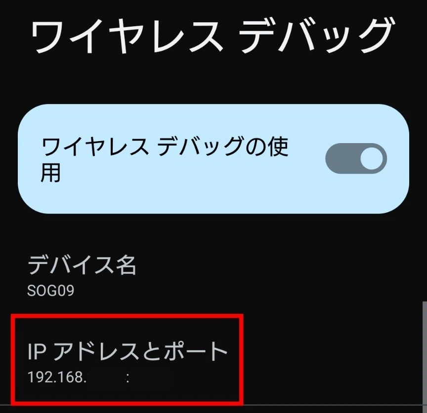
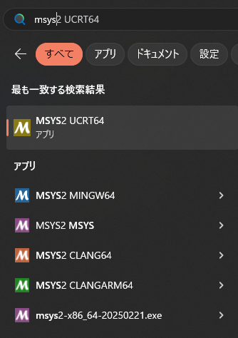
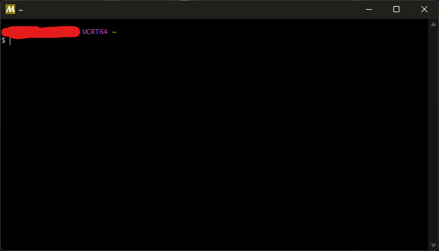
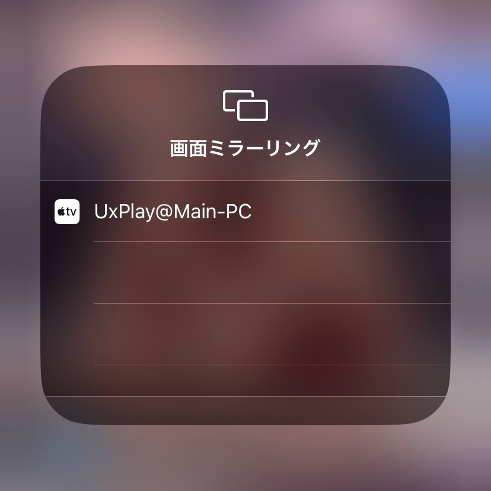

## 注意

この記事の内容は、すべて無料でできる代わりに**かなり上級者向け**です。時間が有り余っているか、どうしてもやむを得ず無線で画面共有したい人のみ読んでください。

また、AndroidとiOSでやり方が異なります。自分にあったところを読んでください。

この記事は、Windowsに特化して説明しますが、Linuxでもだいたい動作します。需要があれば書くかもしれませんが、検証環境がないので英語を読みながらご自身で試してみてください。

## Androidのやり方

音声共有が必要ない場合は、Vysorを入れてください。それで終わりです。ずっと簡単です。

https://www.vysor.io

めんどくさい人は課金すれば音声も入るらしいです。ちなみに、遠隔操作にも対応しています。

---

音声も欲しい場合は、**Scrcpy**というものを入れます。

https://forest.watch.impress.co.jp/library/software/scrcpy/

窓の杜（まどのもり）でも紹介のあるツールなので安心ですね！ちなみにオープンソースです。

https://github.com/Genymobile/scrcpy

USBデバッグを有効にしてゴニョゴニョすれば行けるのですが、普通に詰まったので書き残しておきます。

### Scrcpyの基本的な使い方

基本の使い方は以下のとおりです。

#### 共通手順（有線・無線）

1. Android端末で、[開発者モードとUSBデバッグを有効にする](https://developer.android.com/studio/debug/dev-options?hl=ja#enable)
2. [ScrcpyをGitHub Releasesからダウンロード](https://github.com/Genymobile/scrcpy/releases)する
3. `scrcpy.exe`または`scrcpy-console.bat`をダブルクリックする

有線だとこれだけで行けるはずです。このとき、無線だと99％エラーになります。どの端末に繋げばいいのかわかりませんからね。しょうがないですね。

#### 無線接続

1. 同じWi-Fiに接続する
2. Android側の**ワイヤレスデバッグ**をONにする
3. 「IPアドレスとポート」を確認する
4. `open_a_terminal_here.bat`をダブルクリックする
5. `scrcpy --tcpip=192.168.XXX.YYY:ZZZZ`をいれる（`XXX`と`YYY`は実際のIPアドレス、`ZZZ`はポート番号）

IPアドレスは192ではなく172から始まったりすることもあります。画面に見えたママを入れてください。



引用元：https://note.com/mirumoru/n/nd71e0afdda56

どっちもWi-FI環境下にあれば、これで行けるはずです。

#### 同じネットワークだけど違う方法での接続

PCが有線でスマホが無線であり、厳密には同じWi-Fiではない場合は以下の手順にも従う必要があります。私の環境はこれに該当しました。

1. 一度だけUSBでAndroid端末とWindowsをつなぐ
2. `open_a_terminal_here.bat`をダブルクリックする
3. `adb kill-server`と`adb start-server`を続けて行う
4. Android側のUSBデバッグとワイヤレスデバッグをONにする
5. `adb devices`と入れ、端末が認識しているかどうかを確認する
6. 認識していたら、`adb tcpip 5555`と入れる
7. USBケーブルを引っこ抜く
8. 「IPアドレスとポート」を確認する
9. `adb connect XXX.XXX.XXX.XXX:5555`といれる（`XXXX`はIPアドレス）
10. `scrcpy`といれる

これでできるはずです。いやー、手間。

もともとUSBデバッグがONになっている場合、デバイスとの接続がうまくいかないことがあります。オンオフしてみたり、最悪端末を再起動して様子を見ましょう。

### 自動化するスクリプト

というわけで、10手間を踏むのはめんどくさいのでAI（Gemini）くんにコードを生成してもらいました。

これを`kidou.ps1`とでも書いて保存すれば、ダブルクリックでCLIの指示に従って接続できます。ただし、scrcpyのadbではなく、普通にADBが入っていることが前提となっています。`adb`となっているところを`./adb`にすれば行けるかもしれませんが、未検証です。自己責任でお試しください。

ADBはここから導入できます。

https://developer.android.com/tools/releases/platform-tools?hl=ja

```powershell
# scrcpy wireless connection script

# Set console code page to UTF-8 for proper character display
# This command sets the console's active code page to UTF-8 (65001).
# It's crucial for PowerShell to correctly interpret UTF-8 characters in the script.
chcp 65001 > $null

# Try initial scrcpy launch
Write-Host "scrcpyの初期起動を試行しています..."
# Attempt to run scrcpy. If it successfully launches, the script will wait for it to close.
# If it fails to launch (e.g., no device found, adb not running), it will exit immediately with an error code.
./scrcpy --audio-source=playback --audio-dup

$scrcpyExitCode = $LASTEXITCODE

# Check the exit code of the initial scrcpy attempt
if ($scrcpyExitCode -eq 0) {
    # If scrcpy exited with a success code (0), it means it launched and was closed by the user.
    Write-Host "scrcpyが正常に起動し、終了しました。スクリプトを終了します。"
    exit # Exit the script completely
} else {
    # If scrcpy exited with a non-zero code, it indicates a failure to launch.
    Write-Host "scrcpyの初期起動に失敗しました（終了コード: $scrcpyExitCode）。無線接続プロセスを開始します。"
    Write-Host "詳細なエラーについては、上記のscrcpyの出力をご確認ください。"

    # Function to check for connected devices
    function Check-AdbDevices {
        param (
            [switch]$RestartAdb = $false
        )
        if ($RestartAdb) {
            Write-Host "adbサーバーを再起動しています..."
            adb kill-server | Out-Null # Stop existing adb server quietly
            adb start-server | Out-Null # Start new adb server quietly
            Start-Sleep -Seconds 2 # Give the server a moment to start
        }

        Write-Host "接続されているデバイスを確認しています..."
        $output = adb devices | Out-String
        Write-Host $output

        # Count lines that indicate a connected device (excluding the header and empty lines)
        # This regex matches lines that end with ' device' preceded by any characters,
        # ensuring only actual device entries are counted.
        # It also handles 'List of devices attached' header line.
        $deviceCount = ($output | Select-String -Pattern "\s+device$" | Measure-Object).Count
        
        return $deviceCount
    }

    # 1. Start adb server (if not already running, the initial scrcpy attempt would have tried this)
    # This is redundant if scrcpy already started it, but harmless.
    Write-Host "adbサーバーを起動しています..."
    adb start-server

    # 2. Display connected devices and handle no device found
    $initialDeviceCount = Check-AdbDevices

    if ($initialDeviceCount -eq 0) {
        do {
            Write-Host ""
            Write-Host "==================================================="
            Write-Host "デバイスが見つかりませんでした。USBケーブルでデバイスを接続し、"
            Write-Host "開発者向けオプションで「USBデバッグ」が有効になっていることを確認してください。"
            Write-Host "==================================================="
            Write-Host ""
            Read-Host -Prompt "デバイスを接続したら、Enterキーを押してください。"

            $currentDeviceCount = Check-AdbDevices -RestartAdb
        } while ($currentDeviceCount -eq 0)
    }

    # Prompt user for confirmation before proceeding.
    Read-Host -Prompt "デバイスがリストに表示されていることを確認したら、Enterキーを押してください。"

    # 3. Set adb to TCP/IP mode on port 5555
    Write-Host "adbをTCP/IPモード（ポート5555）に設定しています..."
    adb tcpip 5555

    # Instruct user to unplug USB cable for wireless connection.
    Write-Host ""
    Write-Host "==================================================="
    Write-Host "       USBケーブルをコンピュータから抜いてください。       "
    Write-Host "==================================================="
    Write-Host ""

    # Wait for user to unplug the cable before continuing.
    Read-Host -Prompt "USBケーブルを抜いたら、Enterキーを押してください。"

    # 4. Prompt for device IP address and validate input
    # The script asks the user to input the Android device's IP address and re-prompts if invalid or empty.
    do {
        $ipAddress = Read-Host -Prompt "AndroidデバイスのIPアドレスを入力してください (例: 192.168.1.100)"
        if ([string]::IsNullOrWhiteSpace($ipAddress)) {
            Write-Host "エラー: IPアドレスが無効または空白です。もう一度入力してください。" -ForegroundColor Red
        }
    } while ([string]::IsNullOrWhiteSpace($ipAddress))

    # 5. Connect to the device wirelessly via adb
    Write-Host "デバイスに無線接続しています: $ipAddress..."
    adb connect $ipAddress

    # Prompt user to confirm successful connection and provide troubleshooting tips if it fails.
    Write-Host ""
    Write-Host "接続が成功したことを確認してください（通常は 'connected to $ipAddress' と表示されます）。"
    Write-Host "接続に失敗した場合は、IPアドレスが正しいか、デバイスの「開発者向けオプション」で「ワイヤレスデバッグ」が有効になっているかを確認してください。"
    Write-Host ""

    # 6. Start scrcpy (after establishing wireless connection)
    Write-Host "scrcpyを起動しています..."
    # --audio-source=playback is used to transfer device audio on Android 11+
    # --audio-dup is used to play audio on both scrcpy and the device simultaneously.
    # The script assumes 'scrcpy' executable is in the current directory or system PATH.
    ./scrcpy --audio-source=playback --audio-dup

    # Wait for scrcpy to exit before the script concludes.
    # The script typically continues when the scrcpy window is closed.
    Read-Host -Prompt "scrcpyウィンドウが閉じたら、Enterキーを押してスクリプトを終了してください。"

    Write-Host "スクリプトが完了しました。"
}

```

### おまけ：音について

scrcpyで音をスマホからだけ出したい場合、そういうコマンドがあったと思いますが、分かりませんでした。ごめんぬ。

上のスクリプトではどちらからも音が出る設定ですが、スマホからだけ音を出したい（PCは無音にしたい）場合、サウンドの出力先を音が出ないモニターや仮想オーディオデバイスにすると音が消滅します。お試しあれ。

https://www.monoists.com/entry/how-to-use-vb-cable

### 参考文献

https://note.com/mirumoru/n/nd71e0afdda56

---

## iOSのやり方

scrcpyの時点で結構地獄ですが、本番はここからです。

まず前提知識として、iOSにはAirPlayという画面転送（配信）機能があります。本来はテレビとかに付いてるやつです。

iOSで画面をWindowsに配信したい場合、理論上は**AirPlayサーバーをWindowsマシン上に置けばOK**ということになります。やってみましょう。

### UxPlayの導入

https://github.com/FDH2/UxPlay

このリポジトリを使用します。

scrcpyは最初から実行可能ですが、UxPlayを使うためには**自前でビルドする必要があります**。多分Appleのせいです。めんどくさいですが、必要なのは初回のみです。

というわけで、以下の手順（公式手順を日本語にして簡易化したもの）に従ってください。

1. Bonjour SDKをダウンロードします。[Softpedia](https://www.softpedia.com/get/Programming/SDK-DDK/Bonjour-SDK.shtml)から会員登録無しでダウンロードできます。Appleの開発者アカウントがあるなら[Apple](https://developer.apple.com/download/all/?q=Bonjour%20SDK%20for%20Windows)から入れてもいいと思います。
2. MSYS2なる謎のアプリを[ここ](https://www.msys2.org/)から入れます。
3. Windowsキーを押してアプリ検索したら、こんな感じになっているはずです。



4. この中から**MSYS2 UCRT64**を選択し、起動します。違うものを選ぶと何も起きないので気をつけてください。
5. Unix系っぽいターミナルが開きます。



6. 以下のコマンドを打ちます。何故かコピペできないので、頑張って誤字のないように手打ちしてください。（最大の地獄ポイント）

```bash
pacman -S mingw-w64-ucrt-x86_64-cmake mingw-w64-ucrt-x86_64-gcc
```

7. （オプション）このままだと、UxPlayのフォルダがどこにできるかわからない（おそらく`C:Users`直下にできます）ので、`cd`（現在のフォルダ移動）したい人は適当に`mkdir`したり`cd`してください。
8. `pacman -S git`と打って実行します。
9. `git clone https://github.com/FDH2/UxPlay`と打って実行します。
10. `cd UxPlay`と打って実行します。もしもエラーになったら、`ls`を実行してそこにあるフォルダを確認し、フォルダ名を見つけて`cd`してください。
11. 以下のコマンドを1行で打ちます。またコピペ不可です。がんばってください。

```bash
pacman -S mingw-w64-ucrt-x86_64-libplist mingw-w64-ucrt-x86_64-gstreamer mingw-w64-ucrt-x86_64-gst-plugins-base
```

12. `mkdir build`と`cd build`を順番に実行します。
13. `C:Program Files/Bonjour SDK`にBonjour SDKが入っていることを確認してください。
14. `cmake ..`と`ninja`を順番に実行します。もしも`cmake`でエラーが出た場合、以下のどちらかなので原因を突き止めて解決してください。
  - `pacman`から始まるコマンドの何処かを誤字った
  - MSYS2ターミナルを再起動する必要がある
15. 現在いる`build`ディレクトリ（フォルダ）の中に「uxplay.exe」があるはずです。`ls`で確認してください。

ここまでのものは初回だけです。

### 起動

**MSYS2 UCRT64を起動した状態で**以下の操作をしてください。exeファイルをダブルクリックしたり、Windowsのターミナルから実行しても動きません。

起動するときはビルドしたディレクトリにCDして、

```bash
./uxplay
```

のように打ちます。音はPCから鳴ります。

画質などの指定もできるらしいです。

```bash
./uxplay -s 1280x720 -fps 60
```

iOS側からこんなふうに見えれば成功です。



引用元：https://zenn.dev/sim1222/articles/7981b0b7c2e2fb

毎回MS何とかを起動するのが面倒ですが、それさえ超えてしまえばという感じです。自動化とかできないんかね。

### 参考文献

https://qiita.com/ht164/items/f978db3dd862f27b6e70

https://note.com/bruteforce_diy/n/n08483574ca78

## 終わりに

どうしても無料でやりたい人だけ頑張ってやってみてください。コマンドラインが前提なのでかなりハードルが高いです。