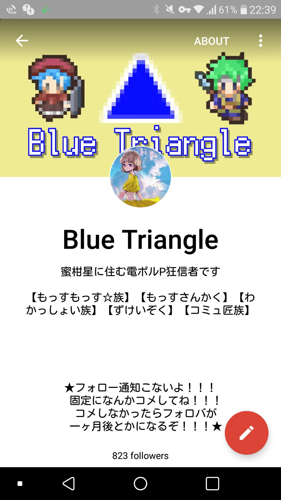
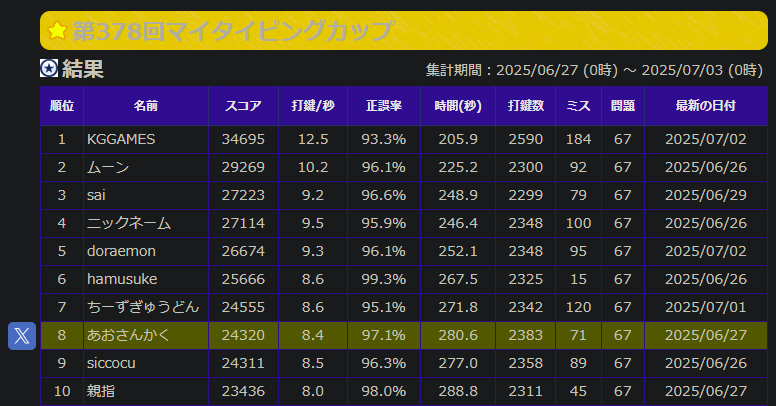

# ようこそ

最終更新日：2025/07/03

<!--
【くだらないお知らせ】  
もしもあなたが裏アカウント特定サービスの調査員なら、[この声明文](/blog/s-toku)をご一読ください。重大なプライバシーの侵害行為を、私は一切許容しません。
-->

## 簡単な自己紹介
Blue Triangleと名乗っています。省略して「ぶるとら」と呼んでもらうことが多いです。  
学生で英語や外国語を中心に勉強をしています。趣味でプログラミングもしています。このホームページは[このテンプレ](https://github.com/sungik-choi/gatsby-starter-apple#readme)をパクって自分好みに改造しました。  
アークナイツと平沢進が好きです。

ちなみにぐぐたす(Google+)難民です。将来の夢は自由でぐぐたすライクなSNSを作って安住することです。  
最近はよくわからないくせにWeb3やCryptoの勉強をしています。

いいねやリアクションの連打、リプ歓迎です。どんどんやってください。

## Brief Self-Introduction
I'm Blue Triangle, an upper-intermediate English speaker.  
I developed a web application named "#Compass resume generator" with HTML, CSS, and JavaScript.  
Also I used to create games using Woditor(Wolf RPG Editor).  
I love Susumu Hirasawa and his songs. I play Arknights and I'm completely into their music!!

All my profiles below are written in Japanese, but feel free to ask questions, contact me in English or Japanese, and follow me on Twitter :-)

(I can't talk in English so fluently and naturally since I'm still in the middle of learning. I'm not sure if you know what CEFR means, but please note that I'm certified to be at the level of CEFR B2)

## 基本プロフィール
* HN：Blue Triangle（あおさんかく）
* 呼称：ぶるとら、あおさんかく、あおさん等（好きに呼んでください）
* 性別：図形なので存在しません🤔
* 年齢：お酒が飲める年です
* 職業：色々やっているとしか言えない

### 使ったことある技術

#### Web系フロント

* HTML
* CSS
* JavaScript
* TypeScript
* React
* MUI
* styled-component
* Gatsby
* GraphQL

#### バックエンド

* GAS

#### バージョン管理

* Git
* GitHub

#### その他

* Python
* Markdown

（特定が怖いので全部は書いていません）

## 趣味とか

### 開発（プログラミング）  
公開作品としては[#コンパス履歴書ジェネレーター](/blog/cps_resume_introduction/)を開発しました。普段は作りたいものがあるときに気まぐれで作るスタイルです。

このサイトはめんどくさかったのでテンプレートを拝借しましたが、いつか1からReact+Gatsbyでホームページ作ってみたいですね…

### 動画編集
ウディタ講義や、気が向いた時に他の動画も作成しています  
最近は忙しいのでお休みしています（順調に行けば春頃に復活したい）

### タイピング

マイタイピングでランカーだったことがあります。

ランキングURL：https://typing.twi1.me/cup/id/1/no/378

あとは寿司打で18700円ぐらい吸引できます。タイピングチョットデキルを目指しています

### アークナイツ
マゼラン、ヴァルカン、カーネリアン、ビーズワクスが好きです、かわいい、褐色は正義

### マインクラフト
プレイ歴8年経過してようやくバニラでエンドラ倒しました（一人でとは言ってない）  
一応コマンド勢で、アドオンも作ります  
MODも少し改造したことあります

### 音楽
好きなアーティストを掘り下げて聴くスタイルです

#### 【好きなアーティスト】
平沢進（ソロ、核P）、歩く人（Pedestrian）、koyori、西島尊大（Ravenworks）、yukkedoluce、n-buna、MARETU、HarryP、OrangeStar、Guiano（敬称略）

#### 【特に好きなアルバム】
「現象の花の秘密」「ホログラムを登る男」「賢者のプロペラ」「Gipnoza」「Sim City」「変弦自在」「回=回」「救済の技法」「Nostalgic Lover」「Youthfull」「月を歩いている」「花と水飴、最終電車」「ENDEAVOUR」「未完成エイトビーツ」

#### 【少しかじった】
Eddy、ピノキオピー、niki、ダイナミック自演ズ、ジグ、P-MODEL

## 尊敬している人（敬称略）

他己紹介が苦手なので、肩書と名前だけ列挙します。順番に意味はありません。
* 西成 活裕
  * 東京大学先端科学技術研究センター教授
  * http://park.itc.u-tokyo.ac.jp/tknishi/nishinari.html
* 堀元 見
  * 衒学者
  * https://ken-horimoto.com/profile/
* 山﨑 圭一（ムンディ先生）
  * 公立高校教員、YouTuber
  * https://mundisensei.com/profile/
* 我ら人民が最大限に尊敬し敬愛する偉大なるみりんくゃん御大同志
  * 逸般人（専門知識量が異常）
  * 専門分野はモバイル通信
  * でもモバイル通信以外も詳しい、素敵
  * https://twitter.com/ymag_h
* これんじ
  * 一般人（中学生エンジニア）
  * https://misskey.systems/@korange
* 上で上げたアーティスト全員

## 地雷

### 歌い手とそれに準ずる人が歌唱する作品全般
生理的に無理です  
セルフカバー、自分で作曲したもの、公式アレンジ、結成したグループ内での作曲歌唱は可　※ヨルシカに飽きた前科があります

### ポップス（音楽のジャンル）
J-POP自体は興味がないだけで嫌悪はしていません
ただしXXXX XXXXXXとかXxxxxxxxXXxxxxみたいな声/作風の曲は大嫌いです

### 趣味嗜好の押し付け
私は過去に、女装をするように迫られて大変不愉快な思いをしたことがあります。
こういったものに限らず、__思想や趣味の押しつけは最悪ですので（私以外にも）絶対にしないでください。__

## フォローバック基準

Twitter（旧X）のみならず、MisskeyおよびMastodonにもこの規定を準用します。

### 繋がりたい人

こんな人と繋がりたいです！喜んでフォロバします👍
* 元から知り合い
* ゲームの趣味が合う人（特にMinecraft、#コンパス）
* 趣味ぷよぐらまー（特にフロントエンド、Web系）

### 知り合いなのにフォロバが来ない場合

知り合いの場合は、99％フォロバしています。来ない場合は忘れているので、急かしてください。ただし、ほとんど使っていないところではフォロバが1年以上遅れるかもしれません。

### 繋がれないかもしれない人

以下に一つでも当てはまる人はフォローを __返さない__ ことがあります。当てはまらない場合にフォローを返すことを確約するものではありません。

ほとんどの項目はこのページを読んでくれるような人なら当てはまらないと思います。ただし、**知り合いには原則適用しません。**

* 宣伝を主とするアカウント（自作ゲーム・作品等を除く）
* 地雷に当てはまる投稿が日常的にある人
* 何らかの主張や攻撃を行うことを主とするアカウント
* 知り合い以外で、以下のいずれかに当てはまる人
  1. アカウント作成から3日が経過していない人（ただしTwitterやMisskey.ioのようなLTLが存在しない、または機能していないサーバーまたはリモートフォローの場合に限る）
  2. 活動のない人、具体的には以下のすべてに当てはまる人
     1. 手入力の投稿が週に8回以下程度の人
     2. 手入力の投稿数が合計25件以下の人
     3. リアクションやいいねの件数が週に20回以下の人
  3. フォロー数がフォロワー数の1.4倍を超えており、かつフォロバ目的ともとれる人
  4. 趣味趣向が全く合致しない人

### ブロックする人

以下に当てはまる人はこちらからブロックする場合があります。ただし、インプレゾンビや詐欺師などは自明なので省いています。

* 私をブロックしている人、またはしていた人
* 地雷を積極的に踏んでくる人
* コンパス履歴書ジェネレーターの利用者で、レイアウト上の正当な理由なく、生成した画像の上部あるいは下部、またはその両方を意図的に削除する人
* 広告を発信する、またはしていたアカウント
* 私を騙す意図があることが明らかな人
